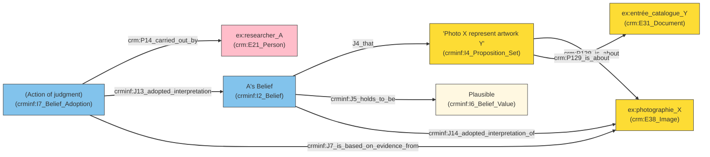

The starting point of this question is the color-coded table I made in 2017 to show in plain text, in the table what were the epistemic class of the data: black for "verified," blue for "uncertain," gray for "missing," struck through for "historically obsolete." That visual table serves as an anchor, but the goal is to turn these colors into queryable patterns in a knowledge graph.

<figure>

<figcaption>Couleur code in Conservation Report. Figure : Zoë Renaudie</figcaption>
</figure>

- Black = verified
- Grey = missing
- Blue = uncertain
- Strikethrough = historically valid, now obsolete

## Assertion 

<figure>

<figcaption>meta-presentation of the metadata schema(s) Schema : Anais Guilhem</figcaption>
</figure>

Cidoc Crm rely on `E13 Attribute Assignment`. An attribute is never simply attached to an object; it is assigned during a specific event, by a named actor, at a dated moment, for a stated reason. That event itself becomes an entity in the graph, one that can be cited, contested, or replaced. E13 alone documents that a value was asserted. It says nothing about how confident we are in that value, or about what happens when two actors disagree not on the classification but on the fact itself. For that we need to use CRMinf. 

===vvvvvv===

## Fuzziness and belief


*I see an object (`crm:Human-made_Object`, a cup) in an exhibition photograph, and I believe it corresponds to a catalogue entry ("antique cup"), but only plausibly, not with certainty.*

E13 can record that I asserted this identification. It cannot record how sure I am, or let a second researcher hold a different degree of certainty without contradicting the first. Standard CIDOC-CRM does not allow a truth modifier ("maybe") to be attached directly to a property. CRMinf's solution is a second reification, on top of the first: turning the proposition into a first-class object, so that belief and its truth-value can be attached to it. Two researchers can then hold contradictory beliefs about the same fact without creating any inconsistency in the graph; the belief itself becomes a documented fact: "Researcher A believes the identification is plausible."

CRMinf distinguishes the proposition (I4), the belief (I2/I12), and the truth value (I6). Here, "plausible" is a fuzzy-logic value, `I6_Belief_Value`. 

<figure>


</figure>

prefix crm:     <"http://www.cidoc-crm.org/cidoc-crm/">   
prefix crminf: <"http://www.ics.forth.gr/isl/CRMinf/"> 

## Lacunae and Opacity

| State    | What happened                     | Class                           |
| -------- | --------------------------------- | ------------------------------- |
| Verified | a value was sought, and asserted  | `E13_Attribute_Assignment`      |
| Lacuna   | a value was sought, and not found | `Negative_Attribute_Assignment` |
| Opacity  | a value is known, and withheld    | `Withheld_Attribute_Assignment` |

Fuzzy belief addresses part of the problem: it documents what we know poorly. Two cases remain that CRMinf does not cover, and neither is a matter of degree of belief, so the fix is not another CRMinf extension but a return to E13 itself, with two new subclasses:

- what we failed to find out,
- what we are not allowed to say.

### Lacunae

The first case is familiar to anyone who has done museum documentation work: hours of research, and nothing. In *Feux pâles*, this is an object visible in an exhibition photograph, never identified. Documenting that as a simple empty field loses something essential: the cell is not empty out of negligence, it is empty as a documented finding. The CIDOC-CRM SIG has itself been working on this distinction since 2019, and Velios, Meghini, Doerr, and Stead proposed, in 2023, a formal extension, **negative typed properties**, to document this kind of confirmed absence. 
My solution, not a property but a class `Negative_Attribute_Assignment` takes the event-based route instead.

```turtle
ex:Negative_Attribute_Assignment a owl:Class ;
    rdfs:subClassOf crm:E13_Attribute_Assignment ;
    rdfs:label "Negative Attribute Assignment"@en,
               "Assignation d'attribut négative"@fr ;
    rdfs:comment "Records a search having been carried out for the value of a property, and having found none." .
```

### Opacity

The second case connects back to the fictionalism I opened with, but it is no longer a narratological matter, it is a question of documentary governance. What I want to document is that a named actor, at a given date, chooses not to disclose a value, or to disclose it only under condition. `Withheld_Attribute_Assignment` carries that decision. Making the condition explicit in the model opens the possibility, for downstream infrastructure, of actually enforcing it.

These two classes close the loop opened by fuzzy belief: uncertainty, absence, and opacity become three distinct. What remains is to see how these four decisions, taken together, answer the four questions posed at the outset.

```
ex:Withheld_Attribute_Assignment a owl:Class ;
    rdfs:subClassOf crm:E13_Attribute_Assignment ;
    rdfs:label "Withheld Attribute Assignment"@en,
               "Assignation d'attribut retenue"@fr ;
    rdfs:comment "Records a known value having been deliberately withheld by a named actor, optionally under a stated condition of access." .
```

## Exemple feux pâles


# --- Objet : Scarabattolo ---
ex:scarabattolo_remps a crm:E22_Human-Made_Object ;
    rdfs:label "Scarabattolo (trompe-l'œil, Domenico Remps)"@fr .

# --- Proposition : "ex:scarabattolo_remps est un E22_Human-Made_Object avec ce label" ---
ex:prop_scarabattolo a crminf:I4_Proposition_Set ;
    rdfs:label "ex:scarabattolo_remps est un E22_Human-Made_Object avec le label 'Scarabattolo (trompe-l'œil, Domenico Remps)'"@fr ;
    crm:P129_is_about ex:scarabattolo_remps .

# --- Acte d'attribution de l'information ---
ex:act_zoe_2017 a crm:E13_Attribute_Assignment ;
    crm:P140_assigned_attribute_to ex:scarabattolo_remps ;
    crm:P141_assigned "E22_Human-Made_Object" ;
    crm:P14_carried_out_by ex:zoe_renaudie ;
    crm:P4_has_time-span ex:date_2017 ;
    crm:P17_used_specific_object ex:rapport_conservation .

# --- Acteur : Zoë Renaudie ---
ex:zoe_renaudie a crm:E21_Person ;
    rdfs:label "Zoë Renaudie" .

# --- Source : Rapport de conservation ---
ex:rapport_conservation a crm:E31_Document ;
    rdfs:label "Rapport de conservation" ;
    crm:P4_has_time-span ex:date_2017 .

# --- Date : 2017 ---
ex:date_2017 a crm:E52_Time-Span ;
    crm:P82a_begin_of_the_begin "2017-01-01T00:00:00"^^xsd:dateTime ;
    crm:P82b_end_of_the_end "2017-12-31T23:59:59"^^xsd:dateTime .

```
graph LR
    classDef obj fill:#fddc34,stroke:#333;
    classDef prop fill:#fddc34,stroke:#333;
    classDef act fill:#82c3ec,stroke:#333;
    classDef actor fill:#ffbdca,stroke:#333;
    classDef doc fill:#c8e6c9,stroke:#333;
    classDef time fill:#ffccbc,stroke:#333;

    scarabattolo["ex:scarabattolo_remps<br/>(crm:E22_Human-Made_Object)"]:::obj
    prop["ex:prop_scarabattolo<br/>(crminf:I4_Proposition_Set)"]:::prop
    act["ex:act_zoe_2017<br/>(crm:E13_Attribute_Assignment)"]:::act
    zoe["ex:zoe_renaudie<br/>(crm:E21_Person)"]:::actor
    rapport["ex:rapport_conservation<br/>(crm:E31_Document)"]:::doc
    date["ex:date_2017<br/>(crm:E52_Time-Span)"]:::time

    prop -->|P129_is_about| scarabattolo
    act -->|P140_assigned_attribute_to| scarabattolo
    act -->|P14_carried_out_by| zoe
    act -->|P4_has_time-span| date
    act -->|P17_used_specific_object| rapport
```