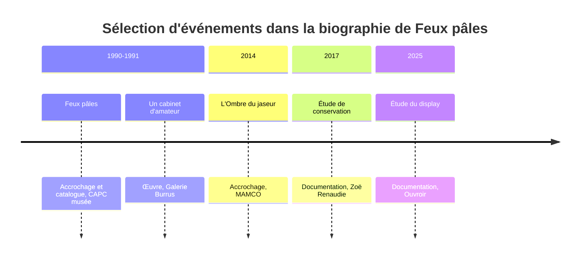
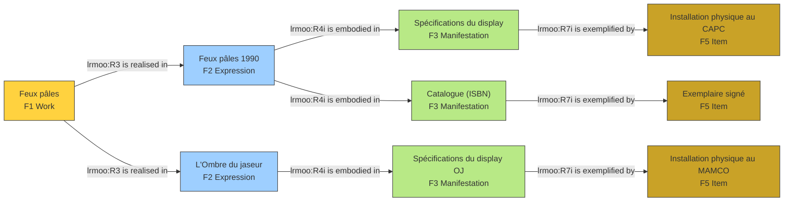
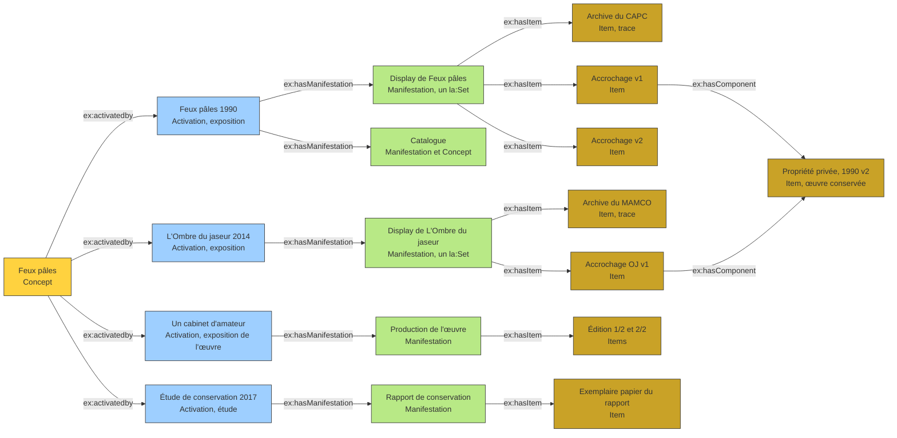
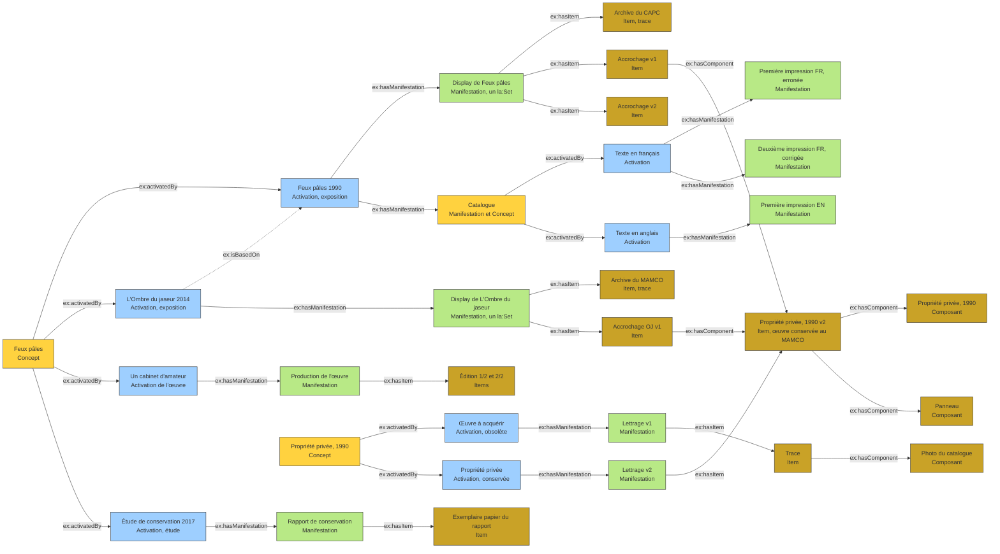

Cet article se concentre sur les activations de l’exposition. J’emprunte le terme à mon mémoire de 2017[^1], où il désigne tous les moyens de rendre public un bien culturel, au sens de l’implémentation chez Goodman : une publication dédiée, une présentation des archives ou une transposition de l’exposition. Chacune de ces activations ne forme pas un nouvel état de référence, mais engendre une augmentation de l’exposition-réseau et entre, à ce titre, dans la biographie du bien culturel. Documenter ces augmentations, c’est se donner les moyens de savoir ce qui a été activé, ce qui a été émulé et ce qu’il en reste aujourd’hui. Or les modèles de données disponibles, dont celui du MoMA dans Wikidata, décrivent les présentations successives d’un concept sans distinguer ce que chacune actualise. Il s’agit donc de structurer la donnée de l’activation elle-même, à partir du cas de Feux pâles (1990) et de ses transpositions, comme L’Ombre du jaseur (d’après Feux pâles) en 2014.

Pour ses expositions itinérantes, le MoMA propose dans Wikidata un modèle parent-enfant[^2]. Le parent est le concept de l'exposition, les enfants sont ses manifestations, c'est-à-dire chacune de ses présentations. Le modèle est simple et interopérable, et il fonctionne.

Il laisse toutefois dans l'ombre ce qui, pour une œuvre comme *Feux pâles*, constitue l'objet de la documentation : ce qui a été activé à chaque présentation, par quels moyens, et ce qu'il en reste aujourd'hui sous forme de traces, d'archives ou d'objets conservés. Je propose d'aller un peu plus loin, tout en restant compatible avec ce modèle.

## Le cas de *Feux pâles*

La biographie de l'œuvre alterne des présentations, des productions et des études documentaires.



## Premier essai : faire entrer l'exposition dans LRMoo

Mon premier réflexe a été de reprendre la chaîne bibliographique de LRMoo.

- **F1 Work** : le concept, *Feux pâles*.
- **F2 Expression** : le projet d'activation, c'est-à-dire un événement (l'exposition originale, *L'Ombre du jaseur*, *Un cabinet d'amateur*).
- **F3 Manifestation** : ce qui se manifeste (un accrochage, un catalogue, une œuvre).
- **F5 Item** : la documentation constitutive (plan, maquette, photographie, édition, œuvres exposées).



Quatre difficultés : 

1. **Une activation n'est pas un contenu informationnel.** 
F2 et F3 relèvent de l'informationnel, alors qu'un accrochage est un événement et un arrangement matériel. Les ranger sous F2 ou F3 force le sens.
2. **La hiérarchie est trop rigide.** 
Le catalogue est pour moi une manifestation de l'exposition, mais il possède aussi sa propre chaîne : un texte en français et un texte en anglais, plusieurs impressions (dont une première, erronée, et une seconde, corrigée), des exemplaires. Il est donc à la fois enfant et parent. Dans les définitions de FRBR, l'item visait les exemplaires bibliographiques porteurs de marques de propriété ou d'annotations. Le dispositif avait été pensé pour les œuvres multiples, et les catalogues en ont précisément besoin.
3. **« Composant » n'est pas un niveau.** 
Une œuvre exposée dans l'accrochage est elle-même un objet avec son histoire.
4. **Des fils traversent la chaîne.** 
*Propriété privée, 1990* est une œuvre qui a connu deux expressions au cours de l'expression : l'un obsolète, dont il ne reste que des traces, l'autre composé de deux éléments. L'oeuvre apparaît dans plusieurs accrochages et sa photographie figure dans le catalogue. Il ne se range sous aucune branche unique.

DOCAM propose d'ajouter des composants après l'item pour les oeuvres audiovisuelles :

Je préfèrerais que les items puissent être composés d'item. 

## Activer : l’implémentation selon Goodman

Pour suivre mon raisonnement, il faut accepter que *Feux pâles* soit une œuvre au sens de Nelson Goodman, qui n'est pas définie par l'imitation de la réalité ni par l'émotion qu'elle procure, mais par sa fonction au sein d'un système symbolique. 

Le terme d’activation prolonge la notion d’implémentation chez Nelson Goodman[^3]. Dans « L’implémentation dans les arts »[^4], Goodman distingue la réalisation, qui consiste à produire l’œuvre, de l’implémentation, qui consiste à la faire fonctionner (Goodman 1996 [1984], p. 55). Un roman est achevé lorsqu’il est écrit, mais il ne remplit sa fonction que publié. Une toile stockée dans un magasin ou une pièce jouée dans un théâtre vide restent dans le même cas. Publier, exposer ou représenter devant un public sont des moyens d’implémentation, et c’est ainsi, écrit Goodman, que les arts entrent dans la culture. Une œuvre fonctionne dans la mesure où elle est comprise, c’est-à-dire où ce qu’elle symbolise, et la manière dont elle le symbolise, est discerné et affecte la façon dont nous organisons le monde (p. 55).

Trois aspects de cette conception orientent la modélisation.

L’implémentation inclut tout ce qui permet à l’œuvre de fonctionner, y compris les tentatives imparfaites, comme encadrer un tableau bien ou mal (p. 55). Elle comprend, pour une gravure, le montage, l’exposition, la promotion et la distribution (p. 56). Elle se prolonge au-delà de la réalisation par le commentaire et la critique (p. 57). Cette extension rend légitime de traiter comme des activations de même rang une exposition, un catalogue, une présentation d’archives ou une étude.

Dans les arts d’exécution, elles sont entrelacées, puisque le premier fonctionnement de la pièce a lieu lorsqu’elle est jouée devant un public (p. 56). L’implémentation peut commencer avant que la réalisation soit achevée, la précéder ou s’y substituer (p. 57-58). Il en découle qu’une activation doit être datée pour elle-même, indépendamment des items qu’elle produit ou dont elle dépend.

L’implémentation peut faire fonctionner une chose comme art. La fonction peut sous-tendre le statut (p. 58), de sorte qu’une œuvre ne fonctionne pas toujours esthétiquement, et qu’une chose qui n’en est pas une peut fonctionner comme une œuvre. Cela rejoint l’idée, développée dans mon mémoire, que chaque activation entre dans la biographie du bien culturel sans former un nouvel état de référence.

Grâce au nouvel ouvrage de Alessandro Arbo et Roger Pouivet (2026), je découvre que Nelson Goodman en viendra lui-même au terme d'activation en 1992[^3].

Appliquée à Feux pâles, cette lecture traite l’exposition comme l’œuvre, et ses présentations successives comme autant d’implémentations : la présentation de 1990, le catalogue, la transposition de 2014 (avec ses émulations), l’étude de conservation de 2017. Le modèle proposé ici en tire sa structure. Le concept est l’œuvre, l’activation est l’implémentation, la manifestation est ce qui en résulte et l’item en est la trace matérielle.

## Proposition : Concept, Activation, Manifestation, Item

Je propose de sortir de WEMI tout en gardant son inspiration. La chaîne devient :

**Concept → Activation → Manifestation → Item**, avec la possibilité qu'un item soit composé d'autres items.

- **Concept** : l'objet conceptuel de niveau 1 (œuvre, exposition, catalogue). C'est le parent du modèle du MoMA.
- **Activation** : l'actualisation d'un concept. Un type la qualifie (exposition, édition textuelle, étude de conservation, production de l'œuvre), exprimé par un vocabulaire SKOS plutôt que par des sous-classes, ce qui rend la liste extensible. J'ai écarté le nom « expression » parce qu'il importerait les contraintes de F2 et laisserait croire à une application de LRMoo. La correspondance avec F2 est déclarée par un simple lien de rapprochement (`skos:closeMatch`).
- **Manifestation** : ce qui se manifeste d'une activation, par exemple un display, un catalogue, une impression, un rapport, un lettrage. C'est l'enfant du modèle du MoMA.
- **Item** : l'état matériel ou la trace : un accrochage, une archive, un exemplaire, une édition numérotée, une œuvre conservée.
- **Composition** : « composant » devient une relation entre items (`ex:hasComponent`), non un niveau. Chaque accrochage étant un item distinct, sa composition est datée par construction, ce qui évite le problème de l'atemporalité de `crm:P46`.



## Un meshwork, non une arborescence

Ce second schéma reste pourtant une arborescence, alors que je veux montrer un *meshwork* : des fils qui traversent les niveaux au lieu de s'y empiler. Le catalogue et *Propriété privée, 1990* ne sont pas des sous-nœuds de *Feux pâles*. Ce sont des lignes qui croisent la chaîne des activations en plusieurs points :

- le catalogue est une manifestation de l'activation de 1990 et, en même temps, un concept dont les activations sont les textes français et anglais, puis leurs impressions et leurs exemplaires ;
- *Propriété privée*, 1990 est un concept dont une activation, obsolète, ne subsiste qu'en trace, et dont l'autre est conservée au MAMCO avec deux composants ; l'item conservé compose les accrochages où l'œuvre est exposée, et sa photographie figure dans le catalogue.

Chaque fil redevient concept de niveau 1 à chaque croisement.

*L’Ombre du jaseur (d’après Feux pâles)*, présentée en 2014, est une activation du concept *Feux pâles*, au même titre que l’exposition de 1990. Elle n’en est pas pour autant indépendante. Dans mon mémoire, je la décrivais comme une transposition qui prend appui sur l’exposition de 1990 sans la reproduire, avec des émulations qu’il importe de rendre visibles. Cette filiation ne passe pas par l’activation d’une activation, que le modèle exclut, mais par une relation directe entre deux activations. Une propriété dédiée, `ex:isBasedOn`, relie la transposition à l’activation dont elle part. Elle exprime la transposition et l’émulation sans faire de l’activation un objet activable : les deux activations activent le même concept, et l’une se fonde sur l’autre.

```turtle
ex:isBasedOn rdfs:subPropertyOf crm:P15_was_influenced_by ;
    rdfs:domain ex:Activation ; rdfs:range ex:Activation .

exd:OmbreJaseur2014 ex:isBasedOn exd:FP1990 .
```

Le rattachement à `crm:P15_was_influenced_by` est une hypothèse, à confirmer avec la version actuelle du CIDOC-CRM.



## Questions ouvertes

- Le catalogue est à la fois une manifestation et un concept, est ce que je peux déclarer les deux sans avoir de contradiction ? 
- Le modèle du MoMA devient une projection du mien, non son équivalent. Le concept de l'exposition *Feux pâles* correspond au parent, les manifestations correspondent aux enfants, et les activations n'ont pas de contrepartie directe : elles forment la couche supplémentaire. Comment faire en sorte que le modèle reste  rétrocompatible avec Wikidata tout en exprimant ce que celui-ci ne dit pas ? 
- Pour *Propriété privée, 1990*, l'état obsolète n'a plus d'objet, seulement des traces. Comment déclarer cette absence plutôt que de simplement l'omettre ? **cf les lacunes** 
- Est-ce que les activations, expressions d'une œuvre au sens de Goodman, peuvent être traités comme des activités (`crm:E7_Activity`) ? 


[^1]: Renaudie, Zoë. 2017. « Le monde de Feux pâles : l’exposition à l’épreuve de la conservation-restauration ». Mémoire de recherche, École Supérieure d’Art d’Avignon. http://hdl.handle.net/1866/40417.
[^2]: https://www.wikidata.org/wiki/Wikidata:WikiProject_Museum_of_Modern_Art/Resources * MoMA Linked Open Data Fellow Focuses on Exhibitions Data on Wikidata, This Month in GLAM Newsletter, October 2025. *Dorothy Howard. "Planting MoMA’s Traveling Exhibitions on Wikidata" [Lightning talk], October 19, 2025. WikiConference North America. * Samie Konet, "WikiProject Museum of Modern Art Traveling Exhibition Data Modeling", Pratt Infoshow, 2024
[^3]: dans Arbo, Alessandro, et Roger Pouivet. 2026. Les arts en action: l’activation esthétique à partir de Nelson Goodman. Aesthetica. Presses universitaires de Rennes. p.07 : "Au début de son article « L’art en action », le texte de sa conférence au Centre Pompidou, à Paris, les 27 et 28 mars 1992, lors d’un colloque intitulé « Nelson Goodman et les langages de l’art », Goodman en vint à passer de la notion d’implémentation à celle d’« activation ». C’est l’implémentation réussie. Moquant la recherche d’une définition réelle ou essentialiste de l’œuvre d’art, Goodman dit considérer « d’avantage les œuvres d’art comme des machines ou des personnes, c’est-à-dire des entités dynamiques qui ont souvent besoin d’être mises en marche, remises en marche et maintenues en fonctionnement ». L’activation fait fonctionner les œuvres d’art, artistiquement et esthétiquement. La réalisation de l’œuvre est l’affaire de l’artiste, et de tous ceux qui peuvent, à leur façon, y concourir, en particulier quand c’est une œuvre commune ou qui suppose le concours de plusieurs personnes. L’œuvre doit être aussi activée, et ce n’est que rarement l’artiste qui s’en charge." ref dans le texte : Les actes de ce colloque organisé par le Centre Georges-Pompidou, à l’initiative de Daniel Soutif, constituèrent le numéro 41 des Cahiers du Musée National d’Art Moderne, qui commençait avec le texte de Goodman. « L’art en action » a été réédité dans Esthétique contemporaine : Art, représentation et fiction, Jean-Pierre Cometti, Jacques Morizot et Roger Pouivet (dir.), Paris, Vrin, 2005, p. 143-157. Le texte sera cité à partir de cette édition.
[^4]: Goodman, Nelson. « L’implémentation dans les arts » [1984]. Dans L’Art en théorie et en action, traduit par Jean-Pierre Cometti et Roger Pouivet, 55-58. Paris : Éditions de l’éclat, 1996.