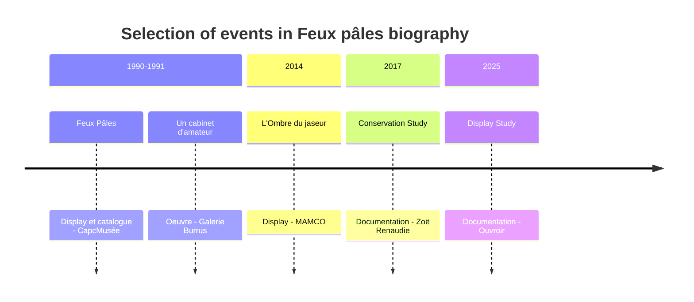
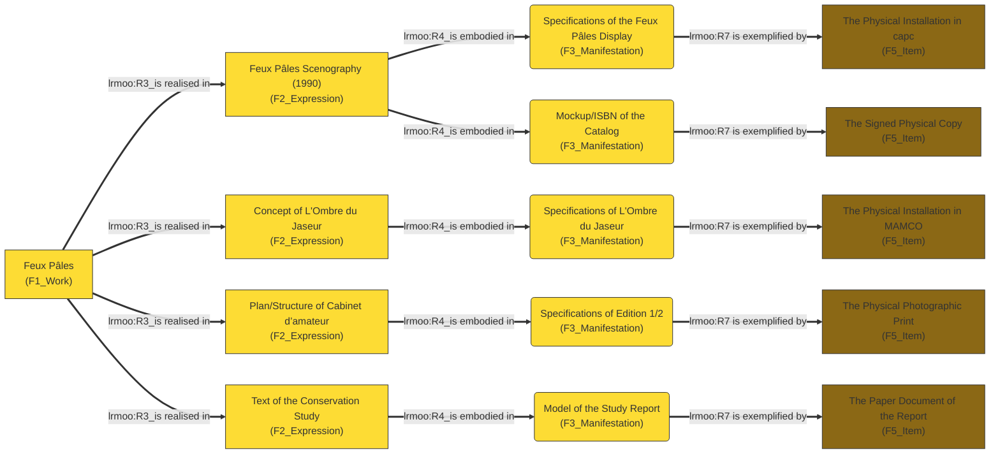
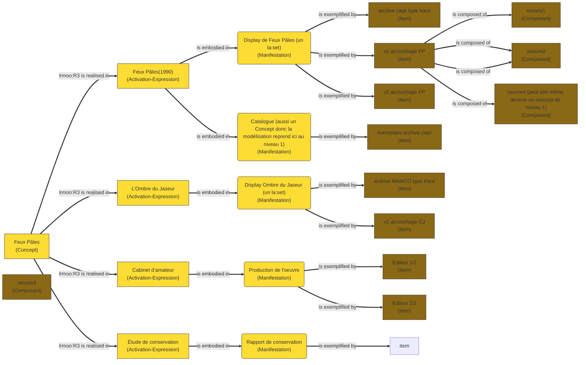
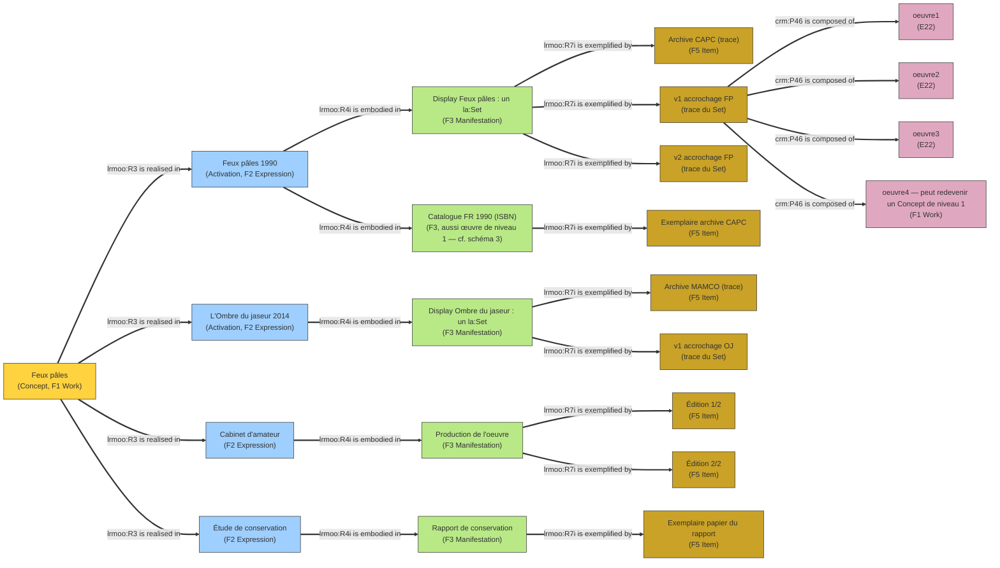
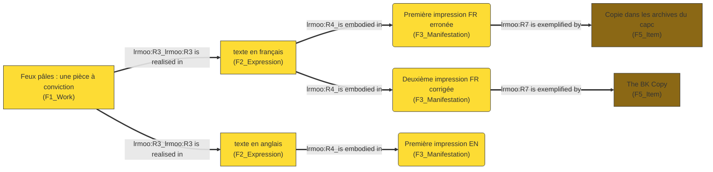
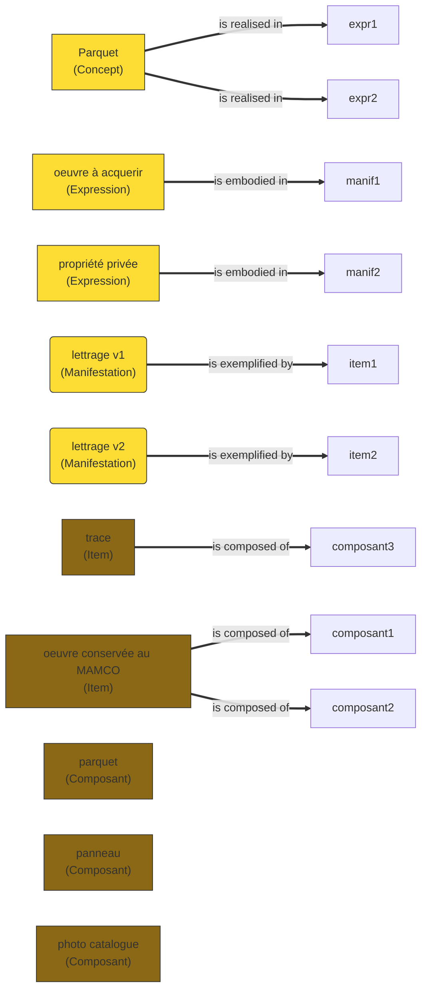
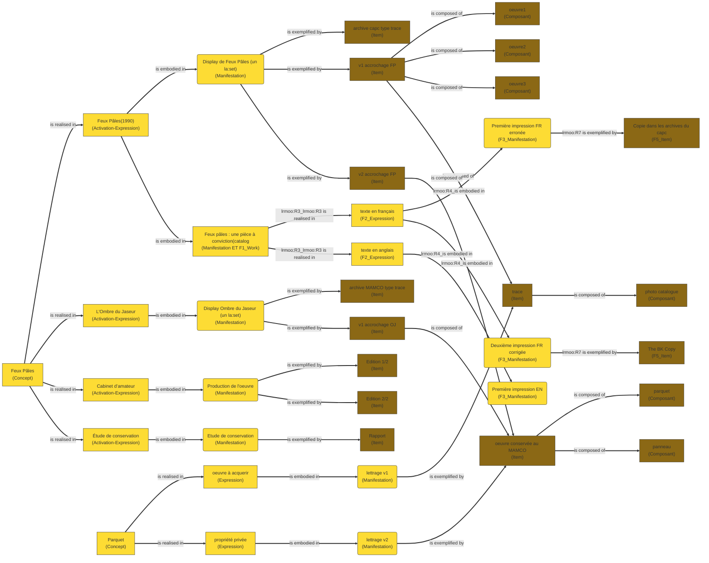

---
title: "Structurer la donnée de l'activation de l'exposition"
date: "2026-07-29"
updated: "2026-07-29"
categories:
  - ontology
  - activation
  - itinerance
  - lmroo
  - cidoc-crm
  - exhibition
  - moma
  - wikidata
  - feux-pâles
excerpt: ""

---

Le moma propose pour ses exposition itinerente une modelisation parent (concept) - enfant (manifestation) dans wikidata. 

Je propose qu'on puisse etre un peu plus complet



Ce que j'imagine moi

F1 WORK :  concept

F2 Expression : serait le projet d'activation, un evenement : expo originale, Ombre du jaseur, cabinet d'amateur

F3 Manifestation : ce serait ce qui se manifeste : un accorchage, un catalogue, une oeuvre

F5 Item : la documentation constitutive : le plan, la maquette, la photo, l'edition de l'oeuvre, les oeuvres exposées ? ou les display ? 

**Feux pâles** fits comfortably here as the Work, with each activation descending as an Expression, itself carrying a Manifestation that is a Set. But this neatness has a condition: you have to accept that **Feux pâles** is a Work in Goodman’s sense, and that its Expressions are its activations, whether or not Thomas directed them himself. If you accept that, the hierarchy holds. If you refuse it, the whole mapping collapses.

@todo reprendre definition de lmroo pour voir ce qui fonctionne et ce qui fonctionne pas. 

Exemple de Feux pales essai pour que ca rentre dans lrmoo



<figcaption>@prefix crm:     <"http://www.cidoc-crm.org/cidoc-crm/">   </figcaption>

<figcaption>@prefix la: <"https://linked.art/ns/terms/">   </figcaption>

<figcaption>@prefix lrmoo:   <"http://iflastandards.info/ns/lrm/lrmoo/"> .   </figcaption>

</figure>


la réparatition entre ce qui serait une expression, manifestation, item est discutable. Pour moi le catalogue serait soit une expression soit une manifestation. Dans les définitions de FRBR les items étaient plutôt destinés aux exemplaires bibliographiques qui pouvaient porter des marques de propriétaires, des annotations, etc.Mais ce dispositif était initialement pour les œuvres multiples et tu pourrais en avoir beosin pour les catalogues justement.

Le problème c'est que le concept du catalogue est pour moi une des manifestions de l'expression de l'exposition 

Ajout de composants comme docam

C'est trop rigide parce que moi je veux pouvoir déclarer qu'un parent est a la fois un enfant donc si on sort de ca mais avec une inspiration de lrmoo :




Catalogue à integrer dans la modelisation




composant4["oeuvre4 (peut elle même devenir un concept de niveau 1)\n(Composant)"]:::composant a ingré dans le shéma



Le schéma 2 reste une arborescence ; or ce qu'on veut montrer, c'est un meshwork : des fils qui traversent les niveaux WEMI au lieu de s'y empiler. Parquet et le Catalogue ne sont pas des sous-nœuds de Feux pâles — ce sont des lignes qui croisent la chaîne des activations en plusieurs points : le catalogue est inspiré par le concept et publié lors de l'activation 1990 ; Parquet est une œuvre-composant exposée dans l'accrochage v1, photographiée dans le catalogue, et conservée au MAMCO dans la réactivation 2014. Chaque fil redevient concept de niveau 1 à chaque croisement (récursivité).

Voila ce que je veux faire. comment exprimer ca ontologie partageable ? Qu'est ce qui pose probleme ? 



Pas sur pour composant en fait. Faut il déclaré que item peut etre composé d'item ? un peu comme on fait dans display

flowchart LR
    classDef concept fill:#ffd23f,stroke:#333
    classDef activation fill:#9ecfff,stroke:#333
    classDef manifestation fill:#b8e986,stroke:#333
    classDef item fill:#c9a227,stroke:#333

    FP1990["Feux pâles 1990<br/>Activation"]:::activation
    ACC["Accrochage v1<br/>Item"]:::item
    
    CAT["Catalogue<br/>Manifestation et Concept"]:::concept
    CFR["Texte en français<br/>Activation"]:::activation
    CEN["Texte en anglais<br/>Activation"]:::activation
    CI1["Première impression FR, erronée<br/>Manifestation"]:::manifestation
    CI2["Deuxième impression FR, corrigée<br/>Manifestation"]:::manifestation
    CI3["Première impression EN<br/>Manifestation"]:::manifestation
    
    PQ["Propriété privée, 1990<br/>Concept"]:::concept
    PA["Œuvre à acquérir<br/>Activation, obsolète"]:::activation
    PB["Propriété privée<br/>Activation, conservée"]:::activation
    PL1["Lettrage v1<br/>Manifestation"]:::manifestation
    PL2["Lettrage v2<br/>Manifestation"]:::manifestation
    PT["Trace<br/>Item"]:::item
    PM["Œuvre conservée au MAMCO<br/>Item"]:::item
    PC1["Propriété privée, 1990<br/>Composant"]:::item
    PC2["Panneau<br/>Composant"]:::item
    PC3["Photo du catalogue<br/>Composant"]:::item
    
    FP1990 -->|ex:hasManifestation| CAT
    CFR -->|ex:activates| CAT
    CEN -->|ex:activates| CAT
    CFR -->|ex:hasManifestation| CI1
    CFR -->|ex:hasManifestation| CI2
    CEN -->|ex:hasManifestation| CI3
    
    PA -->|ex:activates| PQ
    PB -->|ex:activates| PQ
    PA -->|ex:hasManifestation| PL1
    PB -->|ex:hasManifestation| PL2
    PL1 -->|ex:hasItem| PT
    PL2 -->|ex:hasItem| PM
    PM -->|ex:hasComponent| PC1
    PM -->|ex:hasComponent| PC2
    PT -->|ex:hasComponent| PC3
    
    ACC -->|ex:hasComponent| PM

## Exprimer le modèle dans une ontologie partageable

Pour que ce modèle circule, plusieurs choix de forme s'imposent.

- **Un profil d'application.** Un espace de noms propre dont les classes et propriétés sont des sous-classes et sous-propriétés de CIDOC-CRM, sans rien redéfinir. Une activation est ainsi une sous-classe de `crm:E7_Activity`, et `ex:hasComponent` une sous-propriété de `crm:P46_is_composed_of`.
- **Des vocabulaires SKOS.** Les types d'activation, de manifestation et d'item, ainsi que les statuts (obsolète, conservée), sont des schémas de concepts, reliés par `crm:P2_has_type`.
- **Pas de disjonctions.** Le catalogue est à la fois une manifestation et un concept. Si l'ontologie déclarait ces classes disjointes, un raisonneur OWL y verrait une incohérence. Les contraintes (absence de cycle de composition, cohérence des dates) sont donc exprimées en SHACL.
- **Des questions de compétence.** Par exemple : où **Propriété privée**, 1990* a-t-il été exposé ? Quelles activations sont obsolètes ? Quels catalogues documentent l'activation de 1990 ?

```turtle
@prefix ex:    <https://example.org/display/ns#> .
@prefix exd:   <https://example.org/display/data/> .
@prefix exv:   <https://example.org/display/voc/> .
@prefix crm:   <http://www.cidoc-crm.org/cidoc-crm/> .
@prefix lrmoo: <http://iflastandards.info/ns/lrm/lrmoo/> .
@prefix skos:  <http://www.w3.org/2004/02/skos/core#> .

ex:Activation rdfs:subClassOf ex:Activable, crm:E7_Activity ;
    skos:closeMatch lrmoo:F2_Expression .

ex:hasComponent rdfs:subPropertyOf crm:P46_is_composed_of ;
    rdfs:domain ex:Item ; rdfs:range ex:Item .

exd:ProprietePrivee, 1990ActivationB a ex:Activation ;
    crm:P2_has_type exv:production-oeuvre ;
    ex:activates exd:ProprietePrivee, 1990 ;
    ex:status exv:conservee ;
    ex:hasManifestation exd:ProprietePrivee, 1990LettrageV2 .

exd:ProprietePrivee, 1990LettrageV2 ex:hasItem exd:ProprietePrivee, 1990MAMCO .
exd:AccrochageV1 ex:hasComponent exd:ProprietePrivee, 1990MAMCO .
```

La question « où *Propriété privée, 1990* est-il exposé ? » se résout alors par un chemin : accrochage, composant, item de *Propriété privée, 1990*, manifestation, activation.

```sparql
SELECT ?accrochage WHERE {
  ?accrochage ex:hasComponent+ ?p .
  ?a ex:activates exd:Propriété privée, 1990 ;
     ex:hasManifestation/ex:hasItem ?p .
}
```

## Compatibilité avec le modèle du MoMA

Le modèle du MoMA devient une projection du mien, non son équivalent. Le concept de l'exposition *Feux pâles* correspond au parent, les manifestations correspondent aux enfants, et les activations n'ont pas de contrepartie directe : elles forment la couche supplémentaire. Une requête de construction suffit à produire le lien parent-enfant sans les activations.

```sparql
CONSTRUCT { ?concept ex:parentOf ?manifestation }
WHERE {
  ?activation ex:activates ?concept ;
              ex:hasManifestation ?manifestation .
}
```


## Questions ouvertes

- Le catalogue est à la fois une manifestation et un concept, est ce que je peux déclarer les deux sans avoir de contradiction ? 
- Le modèle du MoMA devient une projection du mien, non son équivalent. Le concept de l'exposition *Feux pâles* correspond au parent, les manifestations correspondent aux enfants, et les activations n'ont pas de contrepartie directe : elles forment la couche supplémentaire. Comment faire en sorte que le modèle reste  rétrocompatible avec Wikidata tout en exprimant ce que celui-ci ne dit pas ? 
- Pour *Propriété privée, 1990*, l'état obsolète n'a plus d'objet, seulement des traces. Comment déclarer cette absence plutôt que de simplement l'omettre ? **cf les lacunes** 
- Est-ce que les activations, expressions d'une œuvre au sens de Goodman, peuvent être traités comme des activités (`crm:E7_Activity`) ? 

- **Display et `la:Set`.** Un Set de Linked Art est de nature physique, alors que F3 est informationnel. Le typage du display reste à trancher.