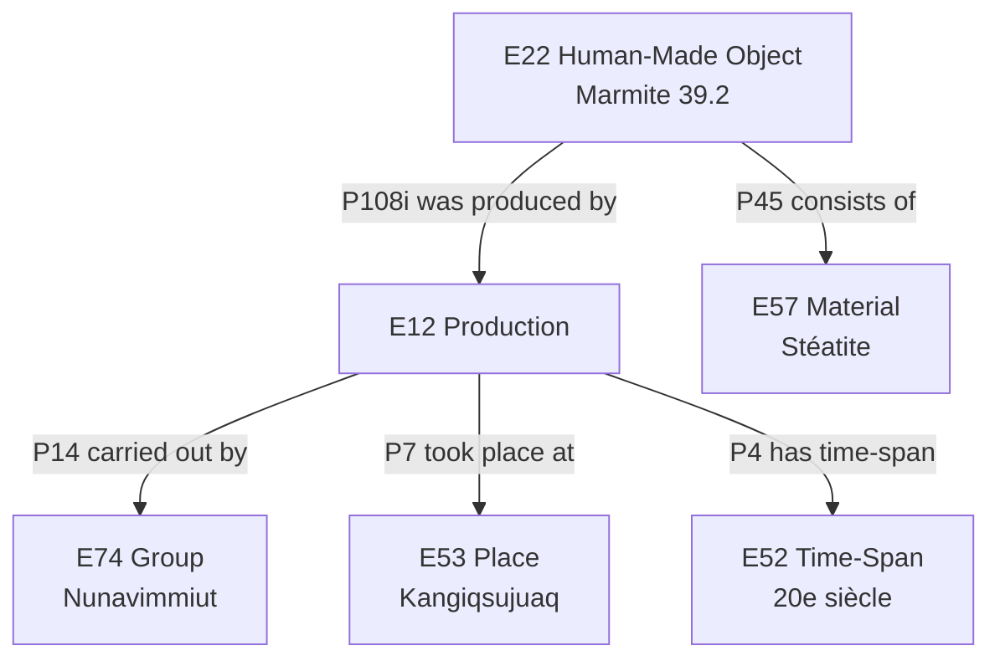

<style display="none">
.flex-1 {
  flex: 1;
}
.flex-1-5 {
  flex: 1.5;
}
#ouvroir {
  position: relative;
  right: 10%;
}
#cieco {
  max-width: 50%;
  position: relative;
	left: 5%;
}
#udem {
  margin-top: 0;
  postion: relative;
  bottom: 15%;
}
.reveal h3 {
  margin-top: 1em;  
  }

.reveal .logos {
  margin-top: 2em;
}
</style>


# Documentation des collections autochtones : enjeux éthiques et numériques
### Présentation du projet CollectiveAccess to LOD dans le cadre du partenariat LINCS

**Zoë&#0160;Renaudie**

**Séminaire de muséologie** Université de Montréal | Projet Forward Linking
25 juin 2026

<div class="logos" style="display: flex">
  <div class="flex-1">
    
  </div>
  <div class="flex-1">
    
  </div>
  <div class="flex-1">
    
  </div>
</div>

/** Notes **/

Je vais commencer par une question qui peut sembler triviale : à quoi sert une fiche d'oeuvre ?

On pourrait répondre : à identifier un objet, à le localiser, à le décrire. Mais cette réponse suppose que la fiche enregistre quelque chose qui préexiste à elle, quelque chose de stable, de donné. Or documenter, c'est aussi choisir. Choisir quoi nommer, dans quelle langue, selon quelle catégorie, avec quelle autorité. Et ces choix ne sont pas innocents.

===>>>>>>===

## Plan de la présentation

1. La non-neutralité de la documentation
2. Les vocabulaires contrôlés
3. Les cadres éthiques : OCAP, CARE et droit à l'opacité
4. Infrastructures alternatives : Mukurtu, Local Contexts
5. Étude de cas : Le projet CAD to LOD

/** Notes **/
Nous suivrons ce fil conducteur.
D'abord, nous déconstruirons l'idée que la base de données est un outil neutre.
Ensuite, nous verrons comment les classifications actuelles peuvent être violentes pour les objets autochtones.
Puis, nous explorerons les cadres politiques (OCAP, CARE) qui tentent de corriger le tir.
Nous regarderons les outils techniques qui existent déjà.
Enfin, nous plongerons dans le cœur de notre projet à l'Université de Montréal : la migration vers le Linked Open Data et les dilemmes que cela pose.

===>>>>>>===

## 1. La documentation n'est pas neutre

> Documenter, c'est choisir.

- **Hannah Turner**, *Cataloguing Culture* (2020)
- Les catégories sont des **héritages impériaux**, pas des outils neutres.
- **Conflit ontologique** :
  - *Musée* : Hiérarchies fixes, temps linéaire, objets isolés.
  - *Savoirs autochtones* : Holistiques, relationnels, responsabilités vivantes.

/** Notes **/
Hannah Turner, dans *Cataloguing Culture* (2020), montre comment les catégories appliquées à la culture matérielle ethnographique sont devenues routinières dans les institutions tout en perpétuant des structures impériales. Le registre de terrain, la base de données contemporaine, le logiciel de gestion de collection : ce sont des héritages, pas des outils neutres.

Le registre de terrain du 19e siècle et la base de données contemporaine partagent la même logique : classifier pour contrôler.
In Jones's view, dissociating documentation from objects comprises custodial neglect and is directly linked to potential risk. Although some of this practice is due to preservation concerns and requirements, cataloging limitations (related to both systems and taxonomies), and physical space constraints, Jones still makes a powerful argument for the primacy of context as the key element of artifactual value.

===vvvvvv===

<div style="display: flex; flex-direction: column; align-items: center; justify-content: center; height: 100%;">

  

<p class="text-small" style="margin-top: 20px; text-align: center;">
   Modèle conceptuel des systèmes de connaissances autochtones  
   (c) Sandra Littletree, Miranda Belarde-Lewis et Melissa Duarte
</p>

</div>

/** Notes **/
Au Canada, avec 630+ communautés des Premières Nations, Inuit et Métis, il n'y a pas de définition unique du savoir.
Mais un point commun émerge : le savoir est relationnel.
Nos systèmes muséaux, eux, isolent l'objet. C'est une incompatibilité structurelle.

===>>>>>>===

## 2. Les vocabulaires

Words Matter: An Unfinished Guide to Word Choices in the Cultural Sector - Ciraj Rassool

/** Notes **/

Les musées se basent sur des vocabulaires controlés commun et des systèmes de classification bibliothécaire et muséale. La Classification décimale Dewey, le Répertoire de vedettes-matière, les thésaurus Getty : ces outils ont été construits dans des contextes occidentaux et structurent implicitement ce qui peut être dit, ce qui peut être lié, ce qui peut être rendu visible. Les communautés autochtones y apparaissent souvent comme des sujets d'étude, dans le passé, dépourvues de souveraineté contemporaine.

===vvvvvv===

### L'exemple du « Véhicule à propulsion humaine » dans le CHIN

<div style="display: flex; flex-direction: column; align-items: center; justify-content: center; height: 100%;">

  

<p class="text-small" style="margin-top: 20px; text-align: center;">
Nomenclature pour le catalogage des objets de musée
</p>

</div>

/** Notes **/

**Exemple problématique présenté par Cara Krompotich lors d'une conférence ici à l'udem :** Porte-bébé haudenosaunee, possiblement Seneca, au Musée national du Danemark.

- Si forcé d’utiliser le formulaire : 
  - Cradleboard (porte-bébé) : bien
  - En remontant la hiérarchie : 
    - Child Carrier (porte-enfant) : vrai
    - Human Powered Vehicles (véhicules à propulsion humaine) : WTF ?!
    - Land Transportation T&E (équipement de transport terrestre) : WTF ?!
- Il faut aller dans l’arrière-plan pour voir la hiérarchie.

===vvvvvv===

## Le problème ontologique

**Dans la base de données (CIDOC-CRM) :**
- Classe : `E22_Human-Made_Object`
- Statut : Inerte, mesurable, classifiable.

**Dans la réalité autochtone :**
- Statut : **Ancêtre incarné**, être vivant, relationnel.
- Conséquence : La base de données **brise le tissu relationnel**.

> « Un objet n'existe que dans le réseau de relations qu'il entretient. »  
> Littletree, Belarde-Lewis & Duarte

/** Notes **/
Le problème est plus profond.
Pour nous, un masque est un objet fabriqué (E22).
Pour la communauté, c'est un ancêtre.
Le mettre dans une base de données, lui donner un ID unique, le séparer de son contexte pour le rendre "interopérable", c'est le tuer symboliquement.
Sandra Littletree et Miranda Belarde-Lewis parlent d'holisme ontologique : on ne peut pas comprendre l'objet isolément.

===vvvvvv===

## Une alternative : Le système Brian Deer

- Développé par **Brian Deer** (Mohawk de Kahnawá:ke) dans les années 1970.
- Adopté par la bibliothèque **Xwi7xwa** (UBC).
- **Principe** : Organisation par relations géospatiales et profils sociolinguistiques.
- **Différence majeure** : Le système se laisse transformer par la collection, il ne s'impose pas à elle.

/** Notes **/
Il existe des alternatives. Brian Deer, bibliothécaire Mohawk, a créé un système de classification dans les années 70.
Au lieu de classer par disciplines occidentales (Art, Religion, Histoire), il classe par relations entre les communautés et leurs territoires.
La structure doit servir la communauté, pas l'inverse.

Le bibliothécaire Brian Deer, membre de la communauté Mohawk de Kahnawá:ke, a développé dès les années 1970 un système de classification alternatif fondé sur une ontologie autochtone. Le système Brian Deer — adopté notamment par la bibliothèque Xwi7xwa de l'UBC, seule bibliothèque universitaire autochtone au Canada — organise les savoirs selon les relations géospatiales entre communautés et leurs profils sociolinguistiques, plutôt que selon des hiérarchies disciplinaires importées.

===>>>>>>===

## 3. Cadres éthiques : Gouvernance des données

### Le colonialisme numérique

- Extraction de données hors contexte.
- Circulation sans consentement.
- Mythe : « L'information veut être libre » (Kimberly Christen).
- **Réalité** : L'information implique propriété, contrôle et responsabilité.

/** Notes **/
Passons à la gouvernance.
La numérisation et l'ouverture des données sont souvent vendues comme de la démocratisation.
Mais pour les communautés autochtones, cela peut ressembler à une nouvelle forme d'extraction : le colonialisme numérique.
Kimberly Christen nous rappelle que l'information ne "veut" pas être libre. Cette phrase masque des enjeux de pouvoir.

===vvvvvv===

## Les principes OCAP® (Canada)

*Marque déposée du First Nations Information Governance Centre*

- **O**wnership (Propriété) : La communauté possède ses données.
- **C**ontrol (Contrôle) : Pouvoir de décision à toutes les étapes.
- **A**ccess (Accès) : Droit d'accéder à ses propres données.
- **P**ossession (Possession) : Contrôle physique affirmant la propriété.

> **Ce n'est pas technique. C'est politique.**

/** Notes **/
Au Canada, la référence est OCAP. Notez le symbole ®. C'est une marque déposée pour protéger l'intégrité des principes.
Propriété, Contrôle, Accès, Possession.
Cela lie la gouvernance des données à l'autodétermination des Premières Nations.
Ce n'est pas une question de paramétrage logiciel, c'est une question politique.

===vvvvvv===

## Les principes CARE (Global)

*Réponse aux principes FAIR (Findable, Accessible, Interoperable, Reusable)*

- **C**ollective Benefit : Les données doivent bénéficier aux peuples.
- **A**uthority to Control : Reconnaissance de l'autorité autochtone.
- **R**esponsibility : Obligation envers les communautés.
- **E**thics : Le bien-être prime sur l'ouverture.

/** Notes **/
Au niveau international, les principes CARE répondent aux principes FAIR de la science ouverte.
Les FAIR sont techniques. Les CARE ajoutent une dimension relationnelle et éthique.
Le bénéfice collectif et l'autorité de contrôle sont centraux.
Cela implique concrètement : consentement avant numérisation, partage des bénéfices, et droit de fermer l'accès à certaines données.

===vvvvvv===

## Le droit à l'opacité

> « Le droit à l'opacité. »  
> — **Édouard Glissant**

- **Tension** : Web ouvert (transparence totale) vs Savoirs autochtones (secret, sacré, saisonnier).

/** Notes **/
Je veux souligner une tension philosophique majeure : le droit à l'opacité d'Édouard Glissant.
Le droit de ne pas être compris, d'échapper à la transparence totale exigée par le web.
Certains savoirs sont saisonniers. Certains sont genrés.
Le Smithsonian a reconnu cela en 2019 : tous les contenus ne doivent pas être publics.
La documentation doit accueillir cette complexité, pas l'aplatir.

===>>>>>>===

## 4. Infrastructures alternatives

| Projet | Fonctionnalité clé | Impact |
| :--- | :--- | :--- |
| **GRASAC**  et **RRN** (Reciprocal Research Network) | Rapatriement numérique fédéré | Reconnexion des communautés avec leur patrimoine dispersé. |
| **Mukurtu CMS** | Accès différencié (clans, genres) | Espace numérique sûr ("sac" traditionnel). |
| **Local Contexts** | TK Labels (étiquettes sémantiques) | Les protocoles voyagent avec la donnée, même hors plateforme. |

/** Notes **/
Heureusement, des outils existent.
Le GRASAC GRASAC researchers from Indigenous communities, universities, museums and archives have worked together to locate, study, and create deeper understandings of Great Lakes arts, languages, identities, territoriality and governance.
Le RRN permet le rapatriement numérique : les communautés commentent les objets dans les musées du monde entier.
Mukurtu, dont le nom signifie "sac de protection", permet de restreindre l'accès selon les protocoles culturels (ex: visible seulement par les femmes).
Local Contexts crée des étiquettes qui voyagent avec la donnée numérique pour signaler les restrictions d'usage, même quand la donnée sort de son contexte d'origine.

===>>>>>>===

## 5. Étude de cas : Projet CAD to LOD


===>>>>>>===

## 5. Étude de cas : Projet CAD to LOD

### Contexte : Collection ethnographique UdeM

- **Collection** : ~4 000 objets (années 1960–1980), à visée pédagogique.
- **Provenances** : Innu, Inuit (Nunavimmiut, Inuinnait), Atikamekw, et bien d'autres.
- **Migration** : De *Virtual Collections* (FileMaker, Getty) vers **CollectiveAccess** (open source).
- **Objectif du projet** : Passer du web consultable → **Linked Open Data**.
- **Accessible** : [collectionethno.umontreal.ca](https://collectionethno.umontreal.ca)

/** Notes **/
Voici maintenant notre projet concret.
La collection est en ligne depuis la migration vers CollectiveAccess.
Mais "en ligne" ne veut pas dire "en LOD" : les données sont consultables par des humains, pas exploitables par des machines liées à d'autres jeux de données.
L'objectif du projet est d'explorer ce passage, et c'est là que les tensions éthiques deviennent visibles.

===vvvvvv===

### Le défi du Linked Open Data (LOD)

**Principes du LOD :**
1. Identifiants pérennes (URI)
2. Accès ouvert (HTTP)
3. Formats standards (RDF)
4. **Liens explicites et licence ouverte**

**Le conflit :**
- Le LOD exige l'ouverture maximale.
- Les principes CARE/OCAP exigent le **contrôle** et parfois la **fermeture**.

> Comment publier des données en LOD sans voler la souveraineté des communautés ?

/** Notes **/
Le LOD repose sur quatre piliers. Tous postulent l'ouverture.
Mais OCAP et CARE postulent le contrôle.
Ce n'est pas un problème technique à résoudre. C'est une tension à habiter.
Les cinq objets que je vais vous présenter l'illustrent chacun différemment.

===vvvvvv===

### Méthodologie : de la notice au graphe

**Étape 1 :** Extraction du schéma CollectiveAccess  
(outil développé spécifiquement : parsing du profil XML de configuration)

**Étape 2 :** Identification des champs et de leurs limites

**Étape 3 :** Tentative d'alignement avec CIDOC-CRM

**Étape 4 :** Confrontation aux enjeux éthiques : objet par objet

/** Notes **/
La première difficulté a été simplement de comprendre notre propre base.
CollectiveAccess a un schéma installé puis modifié localement. Pour l'extraire proprement, nous avons dû développer un outil de parsing.
Ensuite, nous avons tenté d'aligner les champs sur CIDOC-CRM.
Et c'est là que les cinq objets deviennent des cas d'école.

===vvvvvv===

### Cinq objets, cinq tensions


| 39.2 | Marmite | Nunavimmiut | Ce qui disparaît dans la formalisation |
| 6.64 | Teuiekan (tambour) | Innu | L'objet vivant vs l'artefact figé |
| 34.2 | Bonnet de danse | Inuinnait | Le statut juridique flou (prêt) |
| 75.5.46 | Couteau croche | Atikamekw | La provenance et le fabricant nommé |
| 34.4 | Amulette | Inuinnait | Le secret sacré et la licence ouverte |

/** Notes **/
Voici les cinq objets. Je les ai organisés selon la tension éthique qu'ils révèlent, pas selon leur numéro.

===>>>>>>===

## Objet 1 : La marmite (39.2)

*Ce qui disparaît dans la formalisation*

**Dans CollectiveAccess :**
```xml
<preferred_labels>marmite</preferred_labels>
<culture>nunavimmiut (inuit du Nouveau-Québec)</culture>
<contexte_culturel>profane</contexte_culturel>
<fonctions>Cette marmite sert à la cuisson de viande ou
de poisson sur la lampe à l'huile ou feu de broussailles.
N'est plus utilisée depuis le début du 20e siècle.</fonctions>
<constatEtat>Morceau du fond manquant. Plusieurs morceaux
cassés ont été réparés par couture, en pratiquant des
perforations autour des lignes de brisures et en passant
des fils de coton à l'intérieur. Traces de colle.</constatEtat>
```

/** Notes **/


===vvvvvv===

### Marmite : ce que le LOD capture bien



Relations formalisées, interopérables, liables à Geonames, VIAF, AAT Getty.

/** Notes **/
Voici ce que CIDOC-CRM capture bien.
Les entités et leurs relations : groupe, lieu, période, matériau.
C'est utile pour l'interopérabilité avec d'autres institutions.

===vvvvvv===

### Marmite : ce que le LOD perd

| Information dans la notice | Représentation CRM |
|:---------------------------|:-------------------|
| Remplacement par la marmite de métal | Difficilement représenté |
| Évolution des pratiques techniques | Souvent implicite |
| Réparations par couture (gestes communautaires) | Reléguées aux notes |
| Point de vue des Nunavimmiut sur leur propre objet | **Absent** |
| numéro d'inventaire : "39.2 — aliéné ?" | **Invisible dans le graphe** |

> La formalisation n'est jamais neutre : elle décide ce qui est une "donnée" et ce qui est une "note".

/** Notes **/
Regardez la note dans le numéro d'inventaire : "39.2 — aliéné ?".
Ce point d'interrogation signale une incertitude sur le statut juridique de l'objet.
Dans un graphe LOD publié, cette note disparaît. Or c'est peut-être la donnée la plus importante.
De même, la description des réparations par couture témoigne d'une biographie de l'objet, d'un savoir-faire de réparation, d'une vie après la casse. Le LOD n'a pas de classe pour ça.

===>>>>>>===

## Objet 2 : Le Teuiekan / Tambour Innu (6.64)

*L'objet vivant vs l'artefact figé*

**Dans CollectiveAccess :**
```xml
<preferred_labels>tambour sur cadre</preferred_labels>
<onomastique>Teuiekan (ᑌᐗᐃᐁᑲᓐ)</onomastique>
<culture>innu</culture>
<contexte_culturel>rituel</contexte_culturel>
<fonctions>Le tambour teuiekan est un objet personnel
du chasseur grâce auquel il communique avec le monde
du rêve et des animaux, et qui lui permet de trouver
le gibier, en particulier le caribou. Sa fabrication
est déclenchée par une série de rêves.</fonctions>
<statut_de_lobjet>actif — dépôt illimité</statut_de_lobjet>
<useDate>1963;Date de collecte</useDate>
```

/** Notes **/
Passons au tambour.
Première chose : il a un nom en innu-aimun, avec syllabaire. Ce n'est pas "tambour sur cadre".
Deuxième chose : sa fabrication est déclenchée par des rêves. Ce n'est pas une propriété qu'on peut mettre dans un triplet RDF.
Troisième chose : "actif — dépôt illimité". Actif. L'objet est vivant dans le sens institutionnel. Mais sa vitalité dans le sens innu, qui la représente ?

===vvvvvv===

### Teuiekan : les questions que la notice ne pose pas

**Ce que CollectiveAccess contient :**
- Contexte rituel
- Nom en innu
- Lien au monde du rêve

**Ce que ni CollectiveAccess ni le LOD ne peuvent encoder :**
- Le tambour est-il un être avec lequel on entretient une relation ?
- Sa présence dans une réserve d'université rompt-elle ce lien ?
- Le "dépôt illimité" a-t-il fait l'objet d'un consentement éclairé en 1963 ?
- Qui a autorité pour en parler ?

> Si on publie ces données en LOD avec licence CC-BY, n'importe qui peut les réutiliser, les lier, les redistribuer — sans protocole.

/** Notes **/
Le champ "rituel" dans CollectiveAccess est une étiquette. Il ne crée aucune restriction d'accès.
Si on publie en LOD avec une licence ouverte standard, ces données sur un objet sacré deviennent librement réutilisables.
C'est exactement ce que dénoncent les principes CARE : l'ouverture juridique ne garantit pas l'ouverture éthique.
Et la date de collecte — 1963 — nous rappelle que le consentement de 1963 n'est pas le consentement des principes OCAP de 1998.

===>>>>>>===

## Objet 3 : Le Bonnet de danse Inuinnait (34.2)

*Le statut juridique flou*

**Dans CollectiveAccess :**
```xml
<preferred_labels>bonnet de danse</preferred_labels>
<culture>inuinnait (inuit du Cuivre)</culture>
<acq_mode>prêt</acq_mode>
<fonctions>Caractéristique des Inuits du Cuivre, portée
pour les danses lors de célébrations, de réunions ou
d'accueil de visiteurs étrangers. Surmontée d'un bec de
plongeon à bec blanc et d'une peau d'hermine, deux animaux
considérés comme de puissants protecteurs spirituels.
Objet de luxe, gracieusement prêté par son propriétaire
aux différents participants, hommes ou femmes.</fonctions>
<work_mat_tech>fourrure caribou;peau phoque;hermine;
bec plongeon à bec blanc;cuir, vache ?;tendon caribou;
pigment, ocre ?</work_mat_tech>
```

/** Notes **/


===vvvvvv===

### Bonnet de danse : incertitude et propriété dans le LOD

**Problème 1 : Statut juridique flou**
- Mode d'acquisition : **prêt** (pas propriété)
- En LOD, un URI pérenne pour cet objet implique une permanence que le statut de prêt contredit.

**Problème 2 : L'incertitude dans les données**
- Matériaux : "cuir, vache ?" / "ocre ?"
- Le LOD exige des affirmations formelles. Mais toute la notice dit : *nous ne sommes pas certains*.

**Problème 3 : La description de circulation rituelle**
- L'objet était "gracieusement prêté" lors des soirées — il circulait entre les genres.
- Ce protocole culturel n'a pas de classe CIDOC-CRM.

/** Notes **/
Le LOD est fait pour des affirmations. Pour des triplets sujet-prédicat-objet.
Mais une grande partie de la documentation muséale est faite d'incertitudes, de provisoires, de "peut-être".
Comment publier "cuir, vache ?" en RDF sans figer une erreur possible comme un fait établi ?
Et le statut de prêt : si on attribue un URI pérenne à cet objet, on lui donne une identité numérique permanente dans notre institution — ce qui entre en contradiction avec sa situation juridique.

===>>>>>>===

## Objet 4 : Le Couteau croche Atikamekw (75.5.46)

*La provenance et le fabricant nommé*

**Dans CollectiveAccess :**
```xml
<preferred_labels>couteau croche</preferred_labels>
<culture>atikamekw</culture>
<contexte_culturel>profane</contexte_culturel>
<comments>Fabriqué par Duncan Burgess (en 1973 ?).
Collecté en 1973 à Wemotaci par Norman Clermont,
archéologue du département d'anthropologie de l'UdeM,
dans le cadre de son enquête sur l'histoire du village
et de la culture matérielle de ses habitants.</comments>
<description>Couteau à lame faite d'un couteau de cuisine
chauffé et plié, puis affûtée. Manche en bois de bouleau.
Lame retenue à la poignée par une languette de bois
entourée de babiche.</description>
<constatEtat>Dépôts brunâtres et éraflures sur la lame.
Résidus de peinture verte (frottement ?) sur le manche.
Babiche salie.</constatEtat>
```

/** Notes **/
Quatrième objet. Le seul dont on connaît le fabricant : Duncan Burgess, Atikamekw.
Et on sait qui l'a collecté : Norman Clermont, archéologue de l'UdeM.
Ce n'est pas une "acquisition" abstraite. C'est une transaction entre deux personnes dans un village précis.
La trace de peinture verte sur le manche suggère une vie après la collecte. Un usage non documenté.

===vvvvvv===

### Couteau croche : le fabricant, le collecteur, la vie cachée

**Ce que la notice révèle :**
- Fabricant individuel nommé : **Duncan Burgess** (personne vivante ?)
- Collecteur nommé : Norman Clermont, dans le cadre d'une **enquête académique**
- Lieu précis : **Wemotaci** (réserve Atikamekw, Haute-Mauricie)

**Ce que le LOD soulève :**
- Publier le nom de Duncan Burgess comme `E21 Person` lié à un objet
- La notice dit "achat". Mais le commentaire dit "dans le cadre d'une enquête". Tension.
- Les résidus de peinture verte : une vie hors de la notice, non documentée, visible seulement dans le constat d'état.

**Champ manquant dans CollectiveAccess :**
- Appartenance clanique. Ce champ n'existe pas dans le schéma actuel. Il faudrait l'ajouter.

/** Notes **/
Voici une tension concrète.
En LOD, on pourrait lier Duncan Burgess à cet objet via la propriété "was produced by".
Mais a-t-il consenti à figurer dans un graphe de données publiques ?
La relation entre "achat" et "enquête académique" mérite d'être interrogée. Ces deux modalités n'ont pas les mêmes implications éthiques.
Et l'appartenance clanique : une information fondamentale pour comprendre l'objet dans son contexte, qui n'existe tout simplement pas dans CollectiveAccess.

===>>>>>>===

## Objet 5 : L'Amulette Inuinnait (34.4)

*Le secret sacré et la licence ouverte*

**Dans CollectiveAccess :**
```xml
<preferred_labels>amulette</preferred_labels>
<culture>inuinnait (inuit du Cuivre)</culture>
<contexte_culturel>rituel</contexte_culturel>
<fonctions>Utilisée par le chamane pour intervenir
auprès des puissances surnaturelles (chasse, guérison).
</fonctions>
<references_catalogage>Rasmussen, Knud, 1976 :
"Amulets are called atagtät : 'attachments' [...] 
Among the more important amulets: ermines, because they
make one light of foot; the skin of the great northern
diver, which gives strong life, for this bird hangs on
to life very tenaciously."</references_catalogage>
<acq_mode>achat</acq_mode>
<secteur_geo_culturel>Arctique central</secteur_geo_culturel>
```

/** Notes **/
L'amulette. Contexte rituel. Usage chamanique.
La notice cite Rasmussen — un ethnographe danois du début du 20e siècle.
La connaissance sur cet objet est donc médiatisée par un regard externe, colonial dans sa formation.
Et l'objet a été acheté. Dans quelles circonstances ? Avec quel consentement ?

===vvvvvv===

### Amulette : le cas limite

**Ce que le LOD imposerait :**
- Licence ouverte (CC0 ou CC-BY)
- Données librement réutilisables, redistribuables, interconnectables
- URI pérenne = identité numérique publique et permanente

**Ce que les principes CARE exigent :**
- Authority to Control : qui décide ce qui peut être publié ?
- Responsibility : obligation envers la communauté Inuinnait
- Ethics : le bien-être des communautés prime sur l'ouverture

**La question centrale :**
> Publier en LOD une amulette chamanique avec les données de sa fonction rituelle, sous licence ouverte, est-ce une violation des protocoles culturels — même si l'objet est déjà "public" dans une collection universitaire ?

/** Notes **/
C'est le cas limite.
On pourrait dire : la collection est déjà accessible en ligne, les données sont déjà publiques.
Mais "accessible via interface" et "publiées en LOD sous licence ouverte et interconnectées" ce n'est pas la même chose.
Le LOD démultiplie la circulation des données. Il les rend réutilisables sans contexte.
Et aucun représentant des communautés Inuinnait n'a été consulté dans ce projet.
C'est la limite la plus importante à nommer honnêtement.

===vvvvvv===

### Synthèse : ce que les cinq objets nous apprennent

| Objet | Limite de CollectiveAccess | Limite du LOD | Enjeu CARE/OCAP |
|:------|:--------------------------|:--------------|:----------------|
| Marmite (39.2) | Note "aliéné ?" invisible | Formalisation efface l'incertitude | Qui contrôle la description ? |
| Teuiekan (6.64) | Contexte rituel sans restriction | Licence ouverte = accès non contrôlé | Authority to Control |
| Bonnet (34.2) | Statut de prêt non géré en URI | Affirmations formelles vs incertitude | Responsibility |
| Couteau (75.5.46) | Appartenance clanique absente | Consentement du fabricant nommé | Collective Benefit |
| Amulette (34.4) | Savoirs chamaniques exposés | Redistribution sans protocole | Ethics |

/** Notes **/
Voici la synthèse.
Chaque objet révèle une tension différente, à la fois dans CollectiveAccess et dans le passage vers le LOD.
Ce n'est pas que CollectiveAccess soit mauvais ou que le LOD soit mauvais.
C'est que ni l'un ni l'autre n'a été conçu avec ces enjeux en tête.
Ce que le projet produit, finalement, c'est une cartographie de ces tensions — qui est peut-être plus utile qu'un jeu de données "propre".

===vvvvvv===

### Ce que le projet a produit

**Résultat technique :**
- Outil d'extraction du schéma CollectiveAccess (GitHub : ZoeRenaudie/CAtoLOD)
- Identification des champs manquants (appartenance clanique, protocoles d'accès)
- Proposition de mapping partiel vers CIDOC-CRM

**Résultat réflexif :**
- Visibilité des incompatibilités structurelles entre LOD et souveraineté des données
- Identification des décisions qui ne sont pas techniques mais politiques
- Limite centrale : **aucune communauté autochtone n'a été directement impliquée**

> Ce projet ne résout pas les tensions. Il les rend visibles.

/** Notes **/
Techniquement : un outil, des mappings partiels, une documentation des lacunes.
Ce n'est pas une excuse. C'est un constat qui devrait orienter la suite.
Passer au LOD sans cette consultation, c'est reproduire exactement la logique que nous avons critiquée au début.

===>>>>>>===

## 6. Conclusion et perspectives

### Vers un « LOD Souverain » ?

1. **Intégrer les labels** *Local Contexts* directement dans les flux de données.
2. **Ontologies flexibles** : Accepter qu'un objet ait plusieurs vérités (multiples descriptions).
3. **Priorité à la relation** : La consultation communautaire avant la publication technique.

> « La documentation ne doit pas seulement décrire le passé. Elle doit préparer un avenir respectueux. »

/** Notes **/
Pour conclure, le projet CAD to LOD ne vise pas à produire un jeu de données parfait.
Il vise à rendre visibles les compromis.
Nos pistes : intégrer les labels Local Contexts dans le code même des données.
Créer des ontologies qui acceptent la multiplicité des vérités.
Et surtout, se rappeler que la technique doit servir la relation, pas l'inverse.
Passer au LOD, c'est changer de regard éthique, pas juste de format technique.
Merci de votre attention.

===>>>>>>===

## Questions & Discussions

zoe.renaudie@umontreal.ca

Les polices utilisées sont Manifont Grotesk (c) CUTE Sophie Vela, Max Lillo et al. et DM Sans (c) OFL Camille Circlude, Eugénie Bidaut, Mariel Nils, Bérénice Bouin, merci au travail de Bye-Bye Binary

/** Notes **/
Je suis maintenant ouvert à vos questions.
Nous pouvons discuter des aspects techniques de l'intégration des labels, ou des défis de la consultation communautaire.
```


===vvvvvv===

## Références

<div class="csl-bib-body" style="line-height: 1.35; margin-left: 2em; text-indent:-2em; font-size: 1.5rem">

  <div class="csl-entry" style="margin-bottom: 0.5em;">Allison-Cassin, Stacy, Camille Callison, et Robin Desmeules. 2025. « The First Nations, Métis, Inuit Indigenous Ontology and Challenges in the Development of an Indigenous Community Vocabulary in the Canadian Context ». The Canadian Journal of Information and Library Science 48 (2): 1‑13. https://doi.org/10.5206/cjils-rcsib.v48i2.19585.</div>

  <div class="csl-entry" style="margin-bottom: 0.5em;">Sundström, Admeire da Silva Santos. 2025. « Metadata for Indigenous Collections: The Case of Museum of World Culture ». In Exploring Contemporary Classification Practices. Routledge.</div>

  <div class="csl-entry" style="margin-bottom: 0.5em;">Krmpotich, Cara, et Alice Stevenson, éd. 2024. Collections Management as Critical Museum Practice. UCL Press. JSTOR. <a href="https://doi.org/10.2307/jj.19551243">https://doi.org/10.2307/jj.19551243</a></div>

  <div class="csl-entry" style="margin-bottom: 0.5em;">Jones, Mike. 2022. Artefacts, Archives, and Documentation in the Relational Museum. Routledge. <a href="https://doi.org/10.4324/9781003092704">https://doi.org/10.4324/9781003092704</a></div>

  <div class="csl-entry" style="margin-bottom: 0.5em;">Turner, Hannah. 2020. Cataloguing Culture: Legacies of Colonialism in Museum Documentation. University of British Columbia Press. https://doi.org/10.59962/9780774863940.</div>
  
  <div class="csl-entry" style="margin-bottom: 0.5em;">Todd, Zoe. 2016. « An Indigenous Feminist’s Take On The Ontological Turn: ‘Ontology’ Is Just Another Word For Colonialism ». Journal of Historical Sociology 29 (1): 4‑22. https://doi.org/10.1111/johs.12124.</div>


</div>