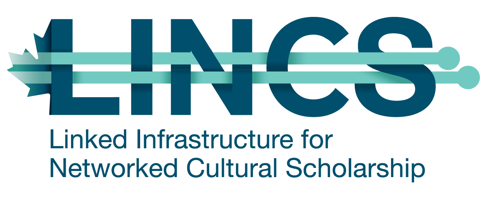
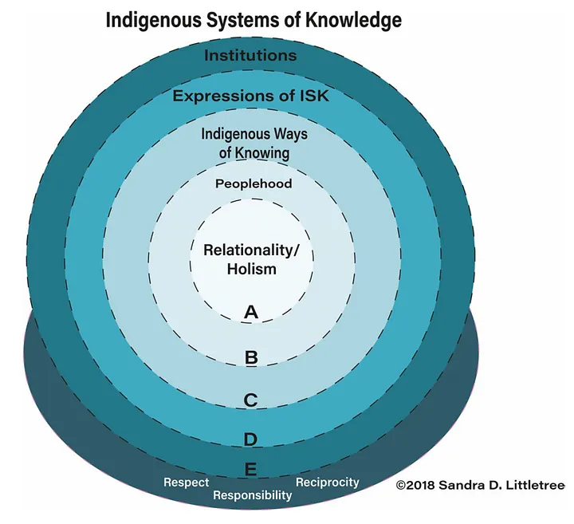
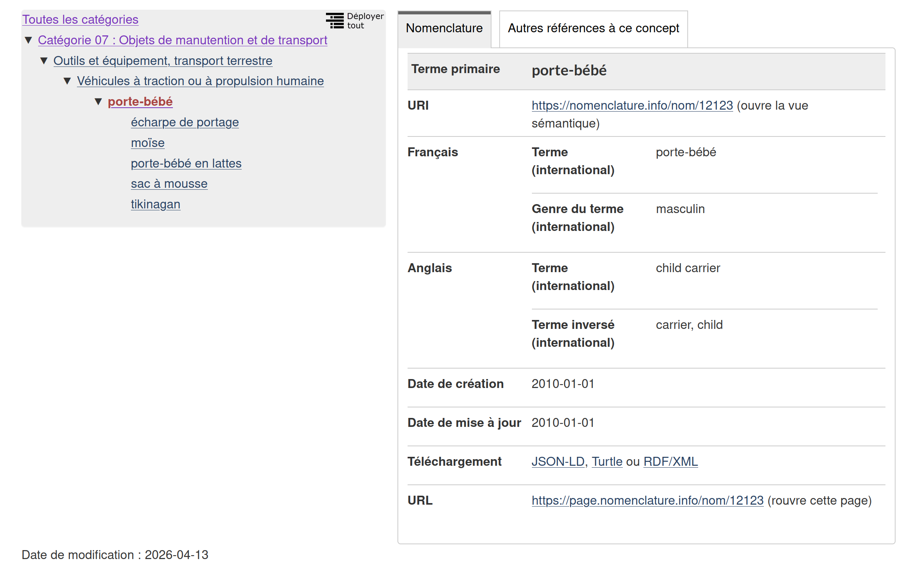
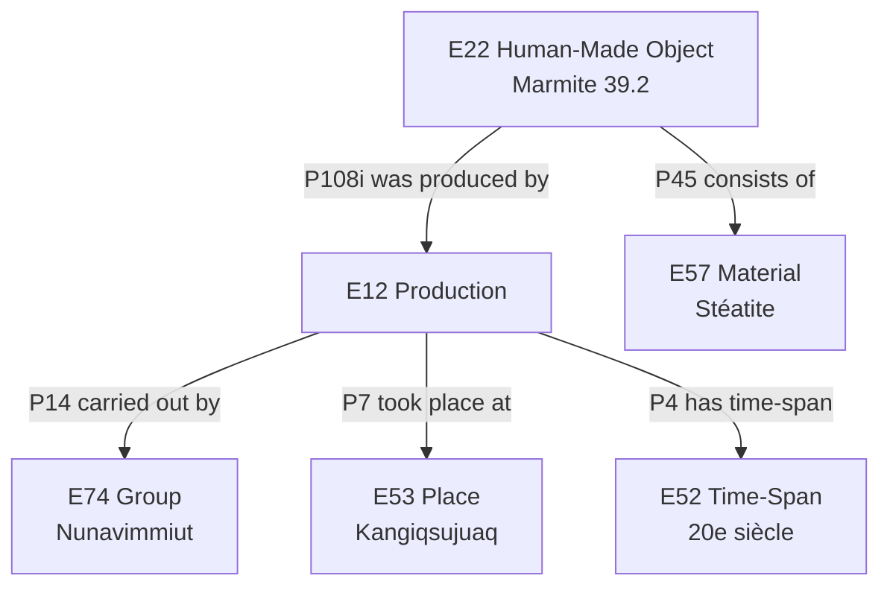
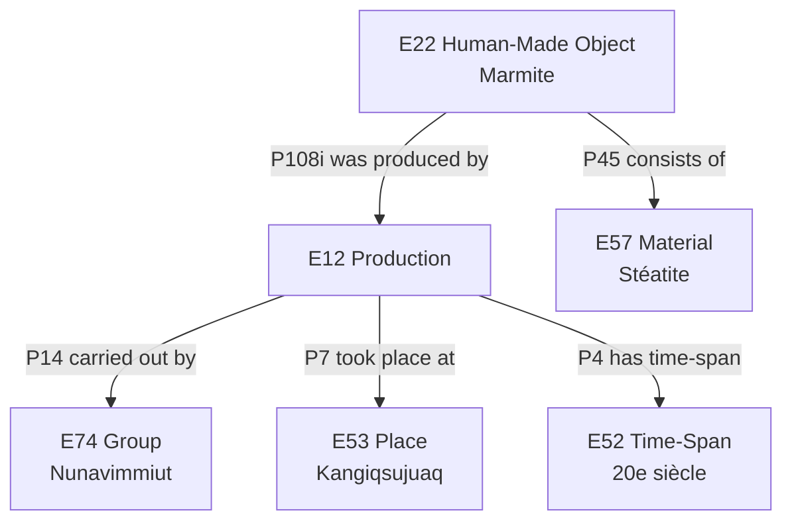
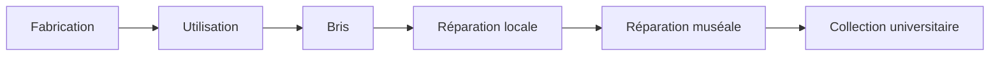
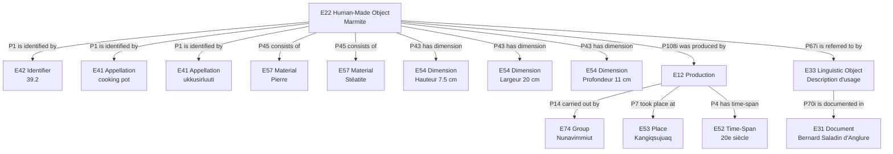
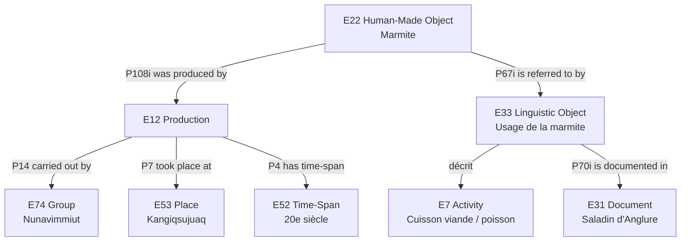

## Documentation des collections autochtones : enjeux éthiques et numériques

### Séminaire de muséologie - intervention de 60 minutes


MSL6526

Partie ECD : 
Musées ne sont pas neutres. 

Quai branly : .

Lonnie G. Bunch : smithonian : we should be careful of eachother. 

changement de titre dans les cartels. 

actimuseo : solution filemaker. 

difficulté d'avoir une base commune : Gestion vs catalogue d'information. 

bibliothèque : mission de partage des info vs musée : pas besoin de présenté les oeuvres pour les partager. 


# Documentation des collections autochtones : enjeux éthiques et numériques
### Présentation du projet CollectiveAccess to LOD dans le cadre du partenariat LINCS

**Zoë&#0160;Renaudie**

**Séminaire de muséologie** Université de Montréal | Projet Forward Linking
25 juin 2026

<div class="logos" style="display: flex">
  <div class="flex-1">
    
  </div>
  <div class="flex-1">
    
  </div>
  <div class="flex-1">
    
  </div>
</div>

/** Notes **/
Bonjour à toutes et à tous. Merci d’être présents.
Je vais commencer par une question simple : à quoi sert une fiche d’œuvre ?
La réponse instinctive est : à identifier, localiser, décrire.
Mais cette réponse suppose que la fiche enregistre une vérité préexistante.
Or, documenter, c'est choisir. Choisir quoi nommer, dans quelle langue, selon quelle catégorie.
Ces choix ne sont pas innocents. Ils perpétuent des structures de pouvoir.
Emmanuel m'a invité à vous présenter un projet sur lequel nous travaillons mais d'abord reprenons. 

===>>>>>>===

## Plan de la présentation

1. La non-neutralité de la documentation
2. Les vocabulaires contrôlés
3. Les cadres éthiques : OCAP, CARE et droit à l'opacité
4. Infrastructures alternatives : Mukurtu, Local Contexts
5. Étude de cas : Le projet CAD to LOD

/** Notes **/
Nous suivrons ce fil conducteur.
D'abord, nous déconstruirons l'idée que la base de données est un outil neutre.
Ensuite, nous verrons comment les classifications actuelles peuvent être violentes pour les objets autochtones.
Puis, nous explorerons les cadres politiques (OCAP, CARE) qui tentent de corriger le tir.
Nous regarderons les outils techniques qui existent déjà.
Enfin, nous plongerons dans le cœur de notre projet à l'Université de Montréal : la migration vers le Linked Open Data et les dilemmes que cela pose.


===>>>>>>===

## 1. La documentation n'est pas neutre

> « Documenter, c'est choisir. »

- **Hannah Turner**, *Cataloguing Culture* (2020)
- Les catégories sont des **héritages impériaux**, pas des outils neutres.
- **Conflit ontologique** :
  - *Musée* : Hiérarchies fixes, temps linéaire, objets isolés.
  - *Savoirs autochtones* : Holistiques, relationnels, responsabilités vivantes.

/** Notes **/
Hannah Turner montre comment les catégories appliquées à la culture matérielle sont devenues routinières tout en perpétuant des structures impériales.
Le registre de terrain du 19e siècle et la base de données contemporaine partagent la même logique : classifier pour contrôler.

In Jones's view, dissociating documentation from objects comprises custodial neglect and is directly linked to potential risk. Although some of this practice is due to preservation concerns and requirements, cataloging limitations (related to both systems and taxonomies), and physical space constraints, Jones still makes a powerful argument for the primacy of context as the key element of artifactual value.

===vvvvvv===

<div style="display: flex; flex-direction: column; align-items: center; justify-content: center; height: 100%;">

  

<p class="text-small" style="margin-top: 20px; text-align: center;">
   Modèle conceptuel des systèmes de connaissances autochtones  
   (c) Sandra Littletree, Miranda Belarde-Lewis et Melissa Duarte
</p>

</div>

/** Notes **/
Au Canada, avec 630+ communautés des Premières Nations, Inuit et Métis, il n'y a pas de définition unique du savoir.
Mais un point commun émerge : le savoir est relationnel.
Nos systèmes muséaux, eux, isolent l'objet. C'est une incompatibilité structurelle.

===>>>>>>===

## 2. Les vocabulaires

Words Matter: An Unfinished Guide to Word Choices in the Cultural Sector - Ciraj Rassool

/** Notes **/

Les musées se basent sur des vocabulaire controlé commun et des systèmes de classification bibliothécaire et muséale. La Classification décimale Dewey, le Répertoire de vedettes-matière, les thésaurus Getty : ces outils ont été construits dans des contextes occidentaux et structurent implicitement ce qui peut être dit, ce qui peut être lié, ce qui peut être rendu visible. Les communautés autochtones y apparaissent souvent comme des sujets d'étude, dans le passé, dépourvues de souveraineté contemporaine.

===vvvvvv===

### L'exemple du « Véhicule à propulsion humaine » dans le CHIN

<div style="display: flex; flex-direction: column; align-items: center; justify-content: center; height: 100%;">

  

<p class="text-small" style="margin-top: 20px; text-align: center;">
Nomenclature pour le catalogage des objets de musée
</p>

</div>

/** Notes **/

**Exemple problématique présenté par Cara Krompotich lors d'une conférence ici à l'udem :** Porte-bébé haudenosaunee, possiblement Seneca, au Musée national du Danemark.

- Si forcé d’utiliser le formulaire : 
  - Cradleboard (porte-bébé) : bien
  - En remontant la hiérarchie : 
    - Child Carrier (porte-enfant) : vrai
    - Human Powered Vehicles (véhicules à propulsion humaine) : WTF ?!
    - Land Transportation T&E (équipement de transport terrestre) : WTF ?!
- Il faut aller dans l’arrière-plan pour voir la hiérarchie.


===vvvvvv===

## Le problème ontologique

**Dans la base de données (CIDOC-CRM) :**
- Classe : `E22_Human-Made_Object`
- Statut : Inerte, mesurable, classifiable.

**Dans la réalité autochtone :**
- Statut : **Ancêtre incarné**, être vivant, relationnel.
- Conséquence : La base de données **brise le tissu relationnel**.

> « Un objet n'existe que dans le réseau de relations qu'il entretient. »  
> — Littletree, Belarde-Lewis & Duarte

/** Notes **/
Le problème est plus profond.
Pour nous, un masque est un objet fabriqué (E22).
Pour la communauté, c'est un ancêtre.
Le mettre dans une base de données, lui donner un ID unique, le séparer de son contexte pour le rendre "interopérable", c'est le tuer symboliquement.
Sandra Littletree et Miranda Belarde-Lewis parlent d'holisme ontologique : on ne peut pas comprendre l'objet isolément.

===vvvvvv===

## Une alternative : Le système Brian Deer

- Développé par **Brian Deer** (Mohawk de Kahnawá:ke) dans les années 1970.
- Adopté par la bibliothèque **Xwi7xwa** (UBC).
- **Principe** : Organisation par relations géospatiales et profils sociolinguistiques.
- **Différence majeure** : Le système se laisse transformer par la collection, il ne s'impose pas à elle.

/** Notes **/
Il existe des alternatives. Brian Deer, bibliothécaire Mohawk, a créé un système de classification dans les années 70.
Au lieu de classer par disciplines occidentales (Art, Religion, Histoire), il classe par relations entre les communautés et leurs territoires.
La structure doit servir la communauté, pas l'inverse.

Le bibliothécaire Brian Deer, membre de la communauté Mohawk de Kahnawá:ke, a développé dès les années 1970 un système de classification alternatif fondé sur une ontologie autochtone. Le système Brian Deer — adopté notamment par la bibliothèque Xwi7xwa de l'UBC, seule bibliothèque universitaire autochtone au Canada — organise les savoirs selon les relations géospatiales entre communautés et leurs profils sociolinguistiques, plutôt que selon des hiérarchies disciplinaires importées.

===>>>>>>===

## 3. Cadres éthiques : Gouvernance des données

### Le colonialisme numérique

- Extraction de données hors contexte.
- Circulation sans consentement.
- Mythe : « L'information veut être libre » (Kimberly Christen).
- **Réalité** : L'information implique propriété, contrôle et responsabilité.

/** Notes **/
Passons à la gouvernance.
La numérisation et l'ouverture des données sont souvent vendues comme de la démocratisation.
Mais pour les communautés autochtones, cela peut ressembler à une nouvelle forme d'extraction : le colonialisme numérique.
Kimberly Christen nous rappelle que l'information ne "veut" pas être libre. Cette phrase masque des enjeux de pouvoir.

===vvvvvv===

## Les principes OCAP® (Canada)

*Marque déposée du First Nations Information Governance Centre*

- **O**wnership (Propriété) : La communauté possède ses données.
- **C**ontrol (Contrôle) : Pouvoir de décision à toutes les étapes.
- **A**ccess (Accès) : Droit d'accéder à ses propres données.
- **P**ossession (Possession) : Contrôle physique affirmant la propriété.

> **Ce n'est pas technique. C'est politique.**

/** Notes **/
Au Canada, la référence est OCAP. Notez le symbole ®. C'est une marque déposée pour protéger l'intégrité des principes.
Propriété, Contrôle, Accès, Possession.
Cela lie la gouvernance des données à l'autodétermination des Premières Nations.
Ce n'est pas une question de paramétrage logiciel, c'est une question politique.

===vvvvvv===

## Les principes CARE (Global)

*Réponse aux principes FAIR (Findable, Accessible, Interoperable, Reusable)*

- **C**ollective Benefit : Les données doivent bénéficier aux peuples.
- **A**uthority to Control : Reconnaissance de l'autorité autochtone.
- **R**esponsibility : Obligation envers les communautés.
- **E**thics : Le bien-être prime sur l'ouverture.

/** Notes **/
Au niveau international, les principes CARE répondent aux principes FAIR de la science ouverte.
Les FAIR sont techniques. Les CARE ajoutent une dimension relationnelle et éthique.
Le bénéfice collectif et l'autorité de contrôle sont centraux.
Cela implique concrètement : consentement avant numérisation, partage des bénéfices, et droit de fermer l'accès à certaines données.

===vvvvvv===

## Le droit à l'opacité

> « Le droit à l'opacité. »  
> — **Édouard Glissant**

- **Tension** : Web ouvert (transparence totale) vs Savoirs autochtones (secret, sacré, saisonnier).

/** Notes **/
Je veux souligner une tension philosophique majeure : le droit à l'opacité d'Édouard Glissant.
Le droit de ne pas être compris, d'échapper à la transparence totale exigée par le web.
Certains savoirs sont saisonniers. Certains sont genrés.
Le Smithsonian a reconnu cela en 2019 : tous les contenus ne doivent pas être publics.
La documentation doit accueillir cette complexité, pas l'aplatir.

===>>>>>>===

## 4. Infrastructures alternatives

| Projet | Fonctionnalité clé | Impact |
| :--- | :--- | :--- |
| **GRASAC**  et **RRN** (Reciprocal Research Network) | Rapatriement numérique fédéré | Reconnexion des communautés avec leur patrimoine dispersé. |
| **Mukurtu CMS** | Accès différencié (clans, genres) | Espace numérique sûr ("sac" traditionnel). |
| **Local Contexts** | TK Labels (étiquettes sémantiques) | Les protocoles voyagent avec la donnée, même hors plateforme. |

/** Notes **/
Heureusement, des outils existent.
Le GRASAC GRASAC researchers from Indigenous communities, universities, museums and archives have worked together to locate, study, and create deeper understandings of Great Lakes arts, languages, identities, territoriality and governance.
Le RRN permet le rapatriement numérique : les communautés commentent les objets dans les musées du monde entier.
Mukurtu, dont le nom signifie "sac de protection", permet de restreindre l'accès selon les protocoles culturels (ex: visible seulement par les femmes).
Local Contexts crée des étiquettes qui voyagent avec la donnée numérique pour signaler les restrictions d'usage, même quand la donnée sort de son contexte d'origine.

===>>>>>>===

## 5. Étude de cas : Projet CAD to LOD


===>>>>>>===

## 5. Étude de cas : Projet CAD to LOD

### Contexte : Collection ethnographique UdeM

- **Collection** : ~4 000 objets (années 1960–1980), à visée pédagogique.
- **Provenances** : Innu, Inuit (Nunavimmiut, Inuinnait), Atikamekw, et bien d'autres.
- **Migration** : De *Virtual Collections* (FileMaker, Getty) vers **CollectiveAccess** (open source).
- **Objectif du projet** : Passer du web consultable → **Linked Open Data**.
- **Accessible** : [collectionethno.umontreal.ca](https://collectionethno.umontreal.ca)

/** Notes **/
Voici maintenant notre projet concret.
La collection est en ligne depuis la migration vers CollectiveAccess.
Mais "en ligne" ne veut pas dire "en LOD" : les données sont consultables par des humains, pas exploitables par des machines liées à d'autres jeux de données.
L'objectif du projet est d'explorer ce passage, et c'est là que les tensions éthiques deviennent visibles.

===vvvvvv===

### Le défi du Linked Open Data (LOD)

**Principes du LOD :**
1. Identifiants pérennes (URI)
2. Accès ouvert (HTTP)
3. Formats standards (RDF)
4. **Liens explicites et licence ouverte**

**Le conflit :**
- Le LOD exige l'ouverture maximale.
- Les principes CARE/OCAP exigent le **contrôle** et parfois la **fermeture**.

> Comment publier des données en LOD sans voler la souveraineté des communautés ?

/** Notes **/
Le LOD repose sur quatre piliers. Tous postulent l'ouverture.
Mais OCAP et CARE postulent le contrôle.
Ce n'est pas un problème technique à résoudre. C'est une tension à habiter.
Les cinq objets que je vais vous présenter l'illustrent chacun différemment.

===vvvvvv===

### Méthodologie : de la notice au graphe

**Étape 1 :** Extraction du schéma CollectiveAccess  
(outil développé spécifiquement : parsing du profil XML de configuration)

**Étape 2 :** Identification des champs et de leurs limites

**Étape 3 :** Tentative d'alignement avec CIDOC-CRM

**Étape 4 :** Confrontation aux enjeux éthiques : objet par objet

/** Notes **/
La première difficulté a été simplement de comprendre notre propre base.
CollectiveAccess a un schéma installé puis modifié localement. Pour l'extraire proprement, nous avons dû développer un outil de parsing.
Ensuite, nous avons tenté d'aligner les champs sur CIDOC-CRM.
Et c'est là que les cinq objets deviennent des cas d'école.

===vvvvvv===

### Cinq objets, cinq tensions


| 39.2 | Marmite | Nunavimmiut | Ce qui disparaît dans la formalisation |
| 6.64 | Teuiekan (tambour) | Innu | L'objet vivant vs l'artefact figé |
| 34.2 | Bonnet de danse | Inuinnait | Le statut juridique flou (prêt) |
| 75.5.46 | Couteau croche | Atikamekw | La provenance et le fabricant nommé |
| 34.4 | Amulette | Inuinnait | Le secret sacré et la licence ouverte |

/** Notes **/
Voici les cinq objets. Je les ai organisés selon la tension éthique qu'ils révèlent, pas selon leur numéro.

===>>>>>>===

## Objet 1 : La marmite (39.2)

*Ce qui disparaît dans la formalisation*

**Dans CollectiveAccess :**
```xml
<preferred_labels>marmite</preferred_labels>
<culture>nunavimmiut (inuit du Nouveau-Québec)</culture>
<contexte_culturel>profane</contexte_culturel>
<fonctions>Cette marmite sert à la cuisson de viande ou
de poisson sur la lampe à l'huile ou feu de broussailles.
N'est plus utilisée depuis le début du 20e siècle.</fonctions>
<constatEtat>Morceau du fond manquant. Plusieurs morceaux
cassés ont été réparés par couture, en pratiquant des
perforations autour des lignes de brisures et en passant
des fils de coton à l'intérieur. Traces de colle.</constatEtat>
```

/** Notes **/


===vvvvvv===

### Marmite : ce que le LOD capture bien



Relations formalisées, interopérables, liables à Geonames, VIAF, AAT Getty.

/** Notes **/
Voici ce que CIDOC-CRM capture bien.
Les entités et leurs relations : groupe, lieu, période, matériau.
C'est utile pour l'interopérabilité avec d'autres institutions.

===vvvvvv===

### Marmite : ce que le LOD perd

| Information dans la notice | Représentation CRM |
|:---------------------------|:-------------------|
| Remplacement par la marmite de métal | Difficilement représenté |
| Évolution des pratiques techniques | Souvent implicite |
| Réparations par couture (gestes communautaires) | Reléguées aux notes |
| Point de vue des Nunavimmiut sur leur propre objet | **Absent** |
| numéro d'inventaire : "39.2 — aliéné ?" | **Invisible dans le graphe** |

> La formalisation n'est jamais neutre : elle décide ce qui est une "donnée" et ce qui est une "note".

/** Notes **/
Regardez la note dans le numéro d'inventaire : "39.2 — aliéné ?".
Ce point d'interrogation signale une incertitude sur le statut juridique de l'objet.
Dans un graphe LOD publié, cette note disparaît. Or c'est peut-être la donnée la plus importante.
De même, la description des réparations par couture témoigne d'une biographie de l'objet, d'un savoir-faire de réparation, d'une vie après la casse. Le LOD n'a pas de classe pour ça.

===>>>>>>===

## Objet 2 : Le Teuiekan / Tambour Innu (6.64)

*L'objet vivant vs l'artefact figé*

**Dans CollectiveAccess :**
```xml
<preferred_labels>tambour sur cadre</preferred_labels>
<onomastique>Teuiekan (ᑌᐗᐃᐁᑲᓐ)</onomastique>
<culture>innu</culture>
<contexte_culturel>rituel</contexte_culturel>
<fonctions>Le tambour teuiekan est un objet personnel
du chasseur grâce auquel il communique avec le monde
du rêve et des animaux, et qui lui permet de trouver
le gibier, en particulier le caribou. Sa fabrication
est déclenchée par une série de rêves.</fonctions>
<statut_de_lobjet>actif — dépôt illimité</statut_de_lobjet>
<useDate>1963;Date de collecte</useDate>
```

/** Notes **/
Passons au tambour.
Première chose : il a un nom en innu-aimun, avec syllabaire. Ce n'est pas "tambour sur cadre".
Deuxième chose : sa fabrication est déclenchée par des rêves. Ce n'est pas une propriété qu'on peut mettre dans un triplet RDF.
Troisième chose : "actif — dépôt illimité". Actif. L'objet est vivant dans le sens institutionnel. Mais sa vitalité dans le sens innu, qui la représente ?

===vvvvvv===

### Teuiekan : les questions que la notice ne pose pas

**Ce que CollectiveAccess contient :**
- Contexte rituel
- Nom en innu
- Lien au monde du rêve

**Ce que ni CollectiveAccess ni le LOD ne peuvent encoder :**
- Le tambour est-il un être avec lequel on entretient une relation ?
- Sa présence dans une réserve d'université rompt-elle ce lien ?
- Le "dépôt illimité" a-t-il fait l'objet d'un consentement éclairé en 1963 ?
- Qui a autorité pour en parler ?

> Si on publie ces données en LOD avec licence CC-BY, n'importe qui peut les réutiliser, les lier, les redistribuer — sans protocole.

/** Notes **/
Le champ "rituel" dans CollectiveAccess est une étiquette. Il ne crée aucune restriction d'accès.
Si on publie en LOD avec une licence ouverte standard, ces données sur un objet sacré deviennent librement réutilisables.
C'est exactement ce que dénoncent les principes CARE : l'ouverture juridique ne garantit pas l'ouverture éthique.
Et la date de collecte — 1963 — nous rappelle que le consentement de 1963 n'est pas le consentement des principes OCAP de 1998.

===>>>>>>===

## Objet 3 : Le Bonnet de danse Inuinnait (34.2)

*Le statut juridique flou*

**Dans CollectiveAccess :**
```xml
<preferred_labels>bonnet de danse</preferred_labels>
<culture>inuinnait (inuit du Cuivre)</culture>
<acq_mode>prêt</acq_mode>
<fonctions>Caractéristique des Inuits du Cuivre, portée
pour les danses lors de célébrations, de réunions ou
d'accueil de visiteurs étrangers. Surmontée d'un bec de
plongeon à bec blanc et d'une peau d'hermine, deux animaux
considérés comme de puissants protecteurs spirituels.
Objet de luxe, gracieusement prêté par son propriétaire
aux différents participants, hommes ou femmes.</fonctions>
<work_mat_tech>fourrure caribou;peau phoque;hermine;
bec plongeon à bec blanc;cuir, vache ?;tendon caribou;
pigment, ocre ?</work_mat_tech>
```

/** Notes **/


===vvvvvv===

### Bonnet de danse : incertitude et propriété dans le LOD

**Problème 1 : Statut juridique flou**
- Mode d'acquisition : **prêt** (pas propriété)
- En LOD, un URI pérenne pour cet objet implique une permanence que le statut de prêt contredit.

**Problème 2 : L'incertitude dans les données**
- Matériaux : "cuir, vache ?" / "ocre ?"
- Le LOD exige des affirmations formelles. Mais toute la notice dit : *nous ne sommes pas certains*.

**Problème 3 : La description de circulation rituelle**
- L'objet était "gracieusement prêté" lors des soirées — il circulait entre les genres.
- Ce protocole culturel n'a pas de classe CIDOC-CRM.

/** Notes **/
Le LOD est fait pour des affirmations. Pour des triplets sujet-prédicat-objet.
Mais une grande partie de la documentation muséale est faite d'incertitudes, de provisoires, de "peut-être".
Comment publier "cuir, vache ?" en RDF sans figer une erreur possible comme un fait établi ?
Et le statut de prêt : si on attribue un URI pérenne à cet objet, on lui donne une identité numérique permanente dans notre institution — ce qui entre en contradiction avec sa situation juridique.

===>>>>>>===

## Objet 4 : Le Couteau croche Atikamekw (75.5.46)

*La provenance et le fabricant nommé*

**Dans CollectiveAccess :**
```xml
<preferred_labels>couteau croche</preferred_labels>
<culture>atikamekw</culture>
<contexte_culturel>profane</contexte_culturel>
<comments>Fabriqué par Duncan Burgess (en 1973 ?).
Collecté en 1973 à Wemotaci par Norman Clermont,
archéologue du département d'anthropologie de l'UdeM,
dans le cadre de son enquête sur l'histoire du village
et de la culture matérielle de ses habitants.</comments>
<description>Couteau à lame faite d'un couteau de cuisine
chauffé et plié, puis affûtée. Manche en bois de bouleau.
Lame retenue à la poignée par une languette de bois
entourée de babiche.</description>
<constatEtat>Dépôts brunâtres et éraflures sur la lame.
Résidus de peinture verte (frottement ?) sur le manche.
Babiche salie.</constatEtat>
```

/** Notes **/
Quatrième objet. Le seul dont on connaît le fabricant : Duncan Burgess, Atikamekw.
Et on sait qui l'a collecté : Norman Clermont, archéologue de l'UdeM.
Ce n'est pas une "acquisition" abstraite. C'est une transaction entre deux personnes dans un village précis.
La trace de peinture verte sur le manche suggère une vie après la collecte. Un usage non documenté.

===vvvvvv===

### Couteau croche : le fabricant, le collecteur, la vie cachée

**Ce que la notice révèle :**
- Fabricant individuel nommé : **Duncan Burgess** (personne vivante ?)
- Collecteur nommé : Norman Clermont, dans le cadre d'une **enquête académique**
- Lieu précis : **Wemotaci** (réserve Atikamekw, Haute-Mauricie)

**Ce que le LOD soulève :**
- Publier le nom de Duncan Burgess comme `E21 Person` lié à un objet
- La notice dit "achat". Mais le commentaire dit "dans le cadre d'une enquête". Tension.
- Les résidus de peinture verte : une vie hors de la notice, non documentée, visible seulement dans le constat d'état.

**Champ manquant dans CollectiveAccess :**
- Appartenance clanique. Ce champ n'existe pas dans le schéma actuel. Il faudrait l'ajouter.

/** Notes **/
Voici une tension concrète.
En LOD, on pourrait lier Duncan Burgess à cet objet via la propriété "was produced by".
Mais a-t-il consenti à figurer dans un graphe de données publiques ?
La relation entre "achat" et "enquête académique" mérite d'être interrogée. Ces deux modalités n'ont pas les mêmes implications éthiques.
Et l'appartenance clanique : une information fondamentale pour comprendre l'objet dans son contexte, qui n'existe tout simplement pas dans CollectiveAccess.

===>>>>>>===

## Objet 5 : L'Amulette Inuinnait (34.4)

*Le secret sacré et la licence ouverte*

**Dans CollectiveAccess :**
```xml
<preferred_labels>amulette</preferred_labels>
<culture>inuinnait (inuit du Cuivre)</culture>
<contexte_culturel>rituel</contexte_culturel>
<fonctions>Utilisée par le chamane pour intervenir
auprès des puissances surnaturelles (chasse, guérison).
</fonctions>
<references_catalogage>Rasmussen, Knud, 1976 :
"Amulets are called atagtät : 'attachments' [...] 
Among the more important amulets: ermines, because they
make one light of foot; the skin of the great northern
diver, which gives strong life, for this bird hangs on
to life very tenaciously."</references_catalogage>
<acq_mode>achat</acq_mode>
<secteur_geo_culturel>Arctique central</secteur_geo_culturel>
```

/** Notes **/
L'amulette. Contexte rituel. Usage chamanique.
La notice cite Rasmussen — un ethnographe danois du début du 20e siècle.
La connaissance sur cet objet est donc médiatisée par un regard externe, colonial dans sa formation.
Et l'objet a été acheté. Dans quelles circonstances ? Avec quel consentement ?

===vvvvvv===

### Amulette : le cas limite

**Ce que le LOD imposerait :**
- Licence ouverte (CC0 ou CC-BY)
- Données librement réutilisables, redistribuables, interconnectables
- URI pérenne = identité numérique publique et permanente

**Ce que les principes CARE exigent :**
- Authority to Control : qui décide ce qui peut être publié ?
- Responsibility : obligation envers la communauté Inuinnait
- Ethics : le bien-être des communautés prime sur l'ouverture

**La question centrale :**
> Publier en LOD une amulette chamanique avec les données de sa fonction rituelle, sous licence ouverte, est-ce une violation des protocoles culturels — même si l'objet est déjà "public" dans une collection universitaire ?

/** Notes **/
C'est le cas limite.
On pourrait dire : la collection est déjà accessible en ligne, les données sont déjà publiques.
Mais "accessible via interface" et "publiées en LOD sous licence ouverte et interconnectées" ce n'est pas la même chose.
Le LOD démultiplie la circulation des données. Il les rend réutilisables sans contexte.
Et aucun représentant des communautés Inuinnait n'a été consulté dans ce projet.
C'est la limite la plus importante à nommer honnêtement.

===vvvvvv===

### Synthèse : ce que les cinq objets nous apprennent

| Objet | Limite de CollectiveAccess | Limite du LOD | Enjeu CARE/OCAP |
|:------|:--------------------------|:--------------|:----------------|
| Marmite (39.2) | Note "aliéné ?" invisible | Formalisation efface l'incertitude | Qui contrôle la description ? |
| Teuiekan (6.64) | Contexte rituel sans restriction | Licence ouverte = accès non contrôlé | Authority to Control |
| Bonnet (34.2) | Statut de prêt non géré en URI | Affirmations formelles vs incertitude | Responsibility |
| Couteau (75.5.46) | Appartenance clanique absente | Consentement du fabricant nommé | Collective Benefit |
| Amulette (34.4) | Savoirs chamaniques exposés | Redistribution sans protocole | Ethics |

/** Notes **/
Voici la synthèse.
Chaque objet révèle une tension différente, à la fois dans CollectiveAccess et dans le passage vers le LOD.
Ce n'est pas que CollectiveAccess soit mauvais ou que le LOD soit mauvais.
C'est que ni l'un ni l'autre n'a été conçu avec ces enjeux en tête.
Ce que le projet produit, finalement, c'est une cartographie de ces tensions — qui est peut-être plus utile qu'un jeu de données "propre".

===vvvvvv===

### Ce que le projet a produit

**Résultat technique :**
- Outil d'extraction du schéma CollectiveAccess (GitHub : ZoeRenaudie/CAtoLOD)
- Identification des champs manquants (appartenance clanique, protocoles d'accès)
- Proposition de mapping partiel vers CIDOC-CRM

**Résultat réflexif :**
- Visibilité des incompatibilités structurelles entre LOD et souveraineté des données
- Identification des décisions qui ne sont pas techniques mais politiques
- Limite centrale : **aucune communauté autochtone n'a été directement impliquée**

> Ce projet ne résout pas les tensions. Il les rend visibles.

/** Notes **/
Techniquement : un outil, des mappings partiels, une documentation des lacunes.
Réflexivement : une cartographie des tensions.
Et une limite majeure à assumer : les communautés Innu, Inuinnait et Atikamekw n'ont pas été consultées.
Ce n'est pas une excuse. C'est un constat qui devrait orienter la suite.
Passer au LOD sans cette consultation, c'est reproduire exactement la logique que nous avons critiquée au début.


===vvvvvv===

### La notice telle qu'elle apparaît dans le système documentaire

```xml
<preferred_labels>marmite</preferred_labels>
<idno>39.2</idno>
<culture>nunavimmiut</culture>
<datePeriod>20e siècle</datePeriod>
<dimensions>7,5 cm;20 cm;11 cm;</dimensions>

<fonctions>
Cette marmite sert à la cuisson de viande ou de poisson sur la lampe à l'huile ou sur un feu de broussailles.
Cette marmite n'est plus utilisée depuis le début du 20e siècle.
Elle a été remplacée par la marmite de métal.
</fonctions>
```

Cette notice rassemble dans une même structure des informations de nature différente :

* des caractéristiques physiques de l'objet ;
* des informations administratives et muséales ;
* des connaissances ethnographiques ;
* des interprétations produites par les chercheurs et les institutions.

Cette coexistence soulève une première question :

> Qu'est-ce qui constitue une donnée sur l'objet et qu'est-ce qui relève déjà d'une interprétation culturelle ?

===vvvvvv===

### De la notice au modèle CIDOC CRM

Le CIDOC CRM permet de décomposer ces informations en entités et relations distinctes.

| Notice muséale   | CIDOC CRM                        |
| ---------------- | -------------------------------- |
| Marmite          | E22 Human-Made Object            |
| Nunavimmiut      | E74 Group                        |
| Kangiqsujuaq     | E53 Place                        |
| Stéatite         | E57 Material                     |
| 20e siècle       | E52 Time-Span                    |
| Usage de cuisson | E33 Linguistic Object / E55 Type |



Cette transformation améliore l'interopérabilité des données et facilite leur publication sous forme de graphes de connaissances.

===vvvvvv===

### Ce qui est gagné

* formalisation des relations ;
* interopérabilité avec d'autres institutions ;
* alignement avec les standards du Web sémantique ;
* possibilité de requêtes transversales sur les matériaux, les lieux ou les groupes culturels.

===vvvvvv===

### Ce qui disparaît

Le passage vers une représentation formelle ne conserve pas nécessairement toute la richesse de la notice.

| Information présente dans la notice | Représentation CRM       |
| ----------------------------------- | ------------------------ |
| Usage de cuisson                    | Partiellement            |
| Remplacement par le métal           | Difficilement représenté |
| Évolution des pratiques techniques  | Souvent implicite        |
| Transmission des savoirs            | Absente                  |
| Point de vue communautaire          | Absent                   |
| Contexte colonial de la collecte    | Généralement absent      |

La modélisation ne constitue donc jamais une simple traduction neutre des données.

> Le CIDOC CRM représente efficacement les relations entre les entités, mais il ne représente pas nécessairement toutes les formes de connaissance associées à ces entités.

===vvvvvv===

### La marmite comme objet biographique

Le constat d'état révèle une histoire matérielle plus complexe que celle décrite par les seules métadonnées descriptives.

* plusieurs morceaux cassés ont été réparés par couture ;
* présence de traces de colle associées à une réparation ultérieure ;
* perte d'une partie du fond ;
* conservation de l'objet malgré les dommages.

L'objet témoigne ainsi de plusieurs phases de son existence :



Cette succession d'événements constitue une partie essentielle de la biographie de l'objet.

Or, ces informations sont souvent reléguées à des notes textuelles ou à des rapports de conservation peu visibles dans les graphes de données publiés.

===vvvvvv===

### Une lecture à travers les principes CARE

Les principes FAIR visent à rendre les données :

* trouvables ;
* accessibles ;
* interopérables ;
* réutilisables.

Les principes CARE introduisent une perspective complémentaire :

* Collective Benefit ;
* Authority to Control ;
* Responsibility ;
* Ethics.

Dans le cas de cette marmite, plusieurs questions émergent :

* Qui produit la description de l'objet ?
* Qui détermine quelles informations sont publiées ?
* Les Nunavimmiut participent-ils à la définition des métadonnées ?
* Les catégories utilisées reflètent-elles les conceptions locales de l'objet ?

La publication en Linked Open Data ne garantit donc pas à elle seule une représentation équitable des savoirs associés aux collections.

===vvvvvv===

### Enjeu

Le défi n'est pas uniquement de convertir des notices vers le CIDOC CRM.

Le véritable enjeu consiste à déterminer :

> quelles relations méritent d'être représentées,
>
> quelles connaissances sont conservées,
>
> et quelles voix sont rendues visibles dans le graphe de données.


===vvvvvv===





## Cas concret 1 : Le Tambour Innu (Teuiekan)

- **Données actuelles** : Contexte "Rituel", Objet de cérémonie.
- **Questions éthiques pour le LOD :**
  - Le tambour est-il un objet ou un être spirituel ?
  - Doit-il rester "silencieux" dans un musée ?
  - Comment encoder le protocole de manipulation dans un triplet RDF ?
  - **Risque** : Le LOD fige l'objet comme "artefact", effaçant sa vie spirituelle.

/** Notes **/
Prenons le tambour Innu.
Dans la base, c'est un objet rituel.
Mais pour la communauté, c'est un lien spirituel avec le chasseur.
Si on publie ça en LOD, comment on encode le fait qu'il ne devrait peut-être pas être vu par tout le monde ?
Comment on encode le protocole de manipulation ?
Le risque est de figer cet objet vivant dans une catégorie morte "Artefact rituel".

===vvvvvv===




## Cas concret 2 : L'Amulette Inuinnait

- **Données actuelles** : Usage chamanique, contexte "Rituel".
- **Questions éthiques pour le LOD :**
  - Quelles informations peuvent être publiques ?
  - Qui a le droit de parler de pratiques chamaniques ?
  - **Conflit** : Licence ouverte (CC0/CC-BY) vs Secret sacré.
  - Publier en LOD sans restriction = Violation potentielle du protocole.

/** Notes **/
Deuxième cas : l'amulette chamanique.
Ici, c'est la question du secret.
Si on met ces données en LOD avec une licence Creative Commons ouverte, on autorise n'importe qui, n'importe où, à réutiliser cette information sur des pratiques sacrées.
C'est une violation directe des principes CARE.
Faut-il renoncer au LOD pour ces objets ? Ou créer un LOD "conditionnel" ?

===vvvvvv===





```mermaid
graph TD

    OBJ[E22 Human-Made Object<br/>Marmite 39.2]

    %% Identification
    INV[E42 Identifier<br/>39.2]
    FICHE[E42 Identifier<br/>1842]

    %% Production
    PROD[E12 Production]
    CULT[E74 Group<br/>Nunavimmiut]
    PLACE[E53 Place<br/>Kangiqsujuaq]
    TIME[E52 Time-Span<br/>20e siècle]

    %% Matériaux
    MAT1[E57 Material<br/>Pierre]
    MAT2[E57 Material<br/>Stéatite]

    %% Techniques
    TECH1[E55 Type<br/>Sculpté]
    TECH2[E55 Type<br/>Incisé]
    TECH3[E55 Type<br/>Poinçonné]

    %% Dimensions
    H[E54 Dimension<br/>H 7.5 cm]
    W[E54 Dimension<br/>L 20 cm]
    D[E54 Dimension<br/>P 11 cm]

    %% Usage
    USE[E33 Linguistic Object<br/>Description d'usage]

    %% Conservation
    COND[E3 Condition State<br/>Constat 20 janv. 1998]

    %% Acquisition
    ACQ[E8 Acquisition]
    MODE[E55 Type<br/>Achat]

    %% Documentation
    DOC[E31 Document<br/>Notice]
    SRC[E31 Document<br/>Saladin d'Anglure]

    %% Personnes
    P1[E21 Person<br/>Sophie Limoges]
    P2[E21 Person<br/>Micheline Thabet]

    OBJ -- P1 is identified by --> INV
    OBJ -- P1 is identified by --> FICHE

    OBJ -- P108i was produced by --> PROD

    PROD -- P14 carried out by --> CULT
    PROD -- P7 took place at --> PLACE
    PROD -- P4 has time-span --> TIME

    OBJ -- P45 consists of --> MAT1
    OBJ -- P45 consists of --> MAT2

    OBJ -- P2 has type --> TECH1
    OBJ -- P2 has type --> TECH2
    OBJ -- P2 has type --> TECH3

    OBJ -- P43 has dimension --> H
    OBJ -- P43 has dimension --> W
    OBJ -- P43 has dimension --> D

    OBJ -- P67i is referred to by --> USE

    OBJ -- P44 has condition --> COND

    OBJ -- P24i changed ownership through --> ACQ
    ACQ -- P2 has type --> MODE

    OBJ -- P67i is referred to by --> DOC
    OBJ -- P67i is referred to by --> SRC

    DOC -- P94 has created --> P1
    DOC -- P94 has created --> P2
```

## Cas concret 3 : Masques de transformation (Kwakwaka’wakw)

- **Nature de l'objet** : Performance, mouvement (ouvert/fermé), généalogie.
- **Histoire** : Potlatch interdit (1885-1950), objets confisqués.
- **Limite du LOD :**
  - Une fiche statique ne capture pas la **danse**.
  - Le LOD peut-il raconter l'histoire de la confiscation ?
  - Le LOD aide-t-il au rapatriement ou facilite-t-il l'exposition non consentie ?

/** Notes **/
Troisième cas : les masques de transformation.
Ces masques sont faits pour bouger, pour danser lors du Potlatch.
Une fiche LOD statique rate l'essentiel : la performance.
De plus, beaucoup de ces masques ont été confisqués lors de l'interdiction du Potlatch.
Publier leur localisation exacte en LOD aide-t-il les communautés à les retrouver ? Ou cela rend-il leur exposition illégitime plus facile à l'échelle mondiale ?
C'est un dilemme constant.

===>>>>>>===

## 6. Conclusion et perspectives

### Vers un « LOD Souverain » ?

1. **Intégrer les labels** *Local Contexts* directement dans les flux de données.
2. **Ontologies flexibles** : Accepter qu'un objet ait plusieurs vérités (multiples descriptions).
3. **Priorité à la relation** : La consultation communautaire avant la publication technique.

> « La documentation ne doit pas seulement décrire le passé. Elle doit préparer un avenir respectueux. »

/** Notes **/
Pour conclure, le projet CAD to LOD ne vise pas à produire un jeu de données parfait.
Il vise à rendre visibles les compromis.
Nos pistes : intégrer les labels Local Contexts dans le code même des données.
Créer des ontologies qui acceptent la multiplicité des vérités.
Et surtout, se rappeler que la technique doit servir la relation, pas l'inverse.
Passer au LOD, c'est changer de regard éthique, pas juste de format technique.
Merci de votre attention.

===>>>>>>===

## Questions & Discussions

**Projet Forward Linking**  
Université de Montréal  
[Votre Email]  
[ Lien vers la collection : collectionethno.umontreal.ca ]

Les polices utilisées sont Manifont Grotesk (c) CUTE Sophie Vela, Max Lillo et al. et DM Sans (c) OFL Camille Circlude, Eugénie Bidaut, Mariel Nils, Bérénice Bouin, merci au travail de Bye-Bye Binary

/** Notes **/
Je suis maintenant ouvert à vos questions.
Nous pouvons discuter des aspects techniques de l'intégration des labels, ou des défis de la consultation communautaire.
```


===vvvvvv===

## Références

<div class="csl-bib-body" style="line-height: 1.35; margin-left: 2em; text-indent:-2em; font-size: 1.5rem">

  <div class="csl-entry" style="margin-bottom: 0.5em;">Krmpotich, Cara, et Alice Stevenson, éd. 2024. Collections Management as Critical Museum Practice. UCL Press. JSTOR. <a href="https://doi.org/10.2307/jj.19551243">https://doi.org/10.2307/jj.19551243</a></div>

  <div class="csl-entry" style="margin-bottom: 0.5em;">Jones, Mike. 2022. Artefacts, Archives, and Documentation in the Relational Museum. Routledge. <a href="https://doi.org/10.4324/9781003092704">https://doi.org/10.4324/9781003092704</a></div>

  <div class="csl-entry" style="margin-bottom: 0.5em;">Todd, Zoe. 2016. « An Indigenous Feminist’s Take On The Ontological Turn: ‘Ontology’ Is Just Another Word For Colonialism ». Journal of Historical Sociology 29 (1): 4‑22. https://doi.org/10.1111/johs.12124.</div>


</div>


------

### *Pourquoi la documentation n'est pas neutre*

Je vais commencer par une question qui peut sembler triviale : à quoi sert une fiche d'oeuvre ?

On pourrait répondre : à identifier un objet, à le localiser, à le décrire. Mais cette réponse suppose que la fiche enregistre quelque chose qui préexiste à elle, quelque chose de stable, de donné. Or documenter, c'est aussi choisir. Choisir quoi nommer, dans quelle langue, selon quelle catégorie, avec quelle autorité. Et ces choix ne sont pas innocents.

Hannah Turner, dans *Cataloguing Culture* (2020), montre comment les catégories appliquées à la culture matérielle ethnographique sont devenues routinières dans les institutions tout en perpétuant des structures impériales. Le registre de terrain, la base de données contemporaine, le logiciel de gestion de collection : ce sont des héritages, pas des outils neutres.

Ce que je voudrais faire aujourd'hui, c'est ouvrir la boîte noire de la documentation des collections autochtones, montrer les tensions qui la traversent, et vous présenter quelques-uns des cadres et des projets qui tentent d'y répondre.

Un point de contexte d'abord. Au Canada, on dénombre plus de 630 communautés des Premières Nations, ainsi que les peuples Inuit et Métis. Il n'existe pas de définition universelle du savoir autochtone, mais il est généralement caractérisé comme holistique, interrelationnel, et ancré dans la responsabilité envers les êtres vivants, les ancêtres et les générations futures. Cette conception du monde est structurellement incompatible avec les systèmes d'organisation muséaux actuels, qui reposent sur des hiérarchies fixes, des catégories stables, et une temporalité linéaire.

##### **Évolution des bases de données**

1. Registre d’inventaire papier dans des carnets → listes
2. Card catalogue : début des classifications pour créer des connexions entre objets (en anthropologie, généralement par matériaux)
3. Digital relational database / Content Collection System : recherche et  visualisation de relations. Conçu pour le personnel muséal, outils  internes institutionnels.

**Public :** accès par interface frontale. Ex : MOA “Explore the globe” : recherche sur mappemonde.

**Objets désobéissants (Disobedient objects)** : objets qui ne correspondent pas aux formulaires. [Mieux que “œuvre  complexe” ! Différence avec “unruly” et oeuvres variables ?]

Inbal Livne, conservatrice : devoir de diligence envers les personnes historiques ET le public contemporain.

*Words Matter: An Unfinished Guide to Word Choices in the Cultural Sector* - Ciraj Rassool

**Le catalogue :** la chose la plus permanente et souvent ce qui reste le plus longtemps  dans une institution. Aussi ce qui est le plus difficile à modifier. Peu de personnes ont le droit d’y toucher. Donc les mots qu’on y met sont  très importants.

------

### *Objectification, décontextualisation, effacement*

#### **Construction de structures textuelles**

**Formulaires avec champs** - basés sur vocabulaires et thésaurus. Ex : RCIP/CHIN avec Nomenclature

**Exemple problématique :** Porte-bébé haudenosaunee, possiblement Seneca, au Musée national du Danemark.

- Si forcé d’utiliser le formulaire : 
  - Cradleboard (porte-bébé) : bien
  - En remontant la hiérarchie : 
    - Child Carrier (porte-enfant) : vrai
    - Human Powered Vehicles (véhicules à propulsion humaine) : WTF ?!
    - Land Transportation T&E (équipement de transport terrestre) : WTF ?!
- Il faut aller dans l’arrière-plan pour voir la hiérarchie.

#### **Description réparatrice (Reparative description)**

Définition (dictionary.archivists.org) :

- n. Remédiation de pratiques ou données qui excluent, réduisent au silence, nuisent ou caractérisent mal les personnes marginalisées dans les  données créées ou utilisées par les archivistes.
- adj. Relatif à la remédiation de pratiques ou données qui excluent, réduisent au  silence, nuisent ou caractérisent mal les personnes marginalisées.

**Point crucial :** NOUS POUVONS changer les vocabulaires car NOUS les avons écrits en premier lieu.

#### 

Prenons un exemple concret. Dans une base de données muséale classique, un masque cérémoniel sera enregistré comme `E22_Human-Made_Object` — un objet fabriqué par un être humain. C'est la classe de base dans la plupart des ontologies patrimoniales. Or, pour de nombreuses communautés, ce masque n'est pas un objet. C'est un ancêtre incarné. Un être avec lequel on entretient une relation. Le fait de le traiter comme un artefact classifiable, mesurable, assignable à une provenance géographique et une période chronologique, c'est déjà lui faire quelque chose.

Sandra Littletree, Miranda Belarde-Lewis et Melissa Duarte ont proposé un modèle conceptuel des systèmes de connaissance autochtones structuré autour de deux principes fondamentaux : la relationalité et l'holisme ontologique. La relationalité, c'est l'idée que les objets, les personnes, les savoirs n'existent que dans le réseau de relations qu'ils entretiennent — avec la communauté, le territoire, les ancêtres, les générations futures. L'holisme ontologique, c'est l'idée qu'un objet ne peut pas être compris isolément : il est un nœud dans un tissu de significations. Mettre cet objet dans une base de données, l'assigner à un identifiant unique, le séparer de ses relations pour le rendre interopérable, c'est précisément briser ce tissu.


Je veux mentionner ici une tension philosophique importante, soulevée par Édouard Glissant, qui parlait du droit à l'opacité : le droit de ne pas être compris, d'échapper à la transparence totale que réclament les systèmes de connaissance dominants. Dans le contexte numérique, ce droit à l'opacité entre directement en collision avec les principes du web ouvert, qui postule que tout savoir devrait être librement accessible, interopérable, réutilisable. Cette tension, nous allons y revenir, elle est au cœur de tout projet d'ouverture des données patrimoniales autochtones.

------

### *OCAP, CARE, colonialisme numérique*

On entend beaucoup parler de numérisation, d'ouverture des données, d'interopérabilité. Ces projets sont souvent présentés comme des avancées pour l'accessibilité et la démocratisation du patrimoine. Mais dans le contexte des collections autochtones, ils peuvent aussi reproduire des formes d'extraction et d'asymétrie.

Le colonialisme numérique, c'est l'idée que les infrastructures, les modèles et les cadres juridiques du web reproduisent des logiques coloniales : centralisation du pouvoir dans des institutions du Nord global, extraction de données culturelles hors de leur contexte, circulation sans consentement, bénéfices qui ne retournent pas aux communautés concernées. Comme le formule Kimberly Christen, l'information ne "veut" pas être libre : cette formule masque des questions de propriété, de contrôle et de responsabilité qui sont particulièrement aiguës pour les communautés qui ont déjà subi l'extraction de leurs savoirs.

Face à ces enjeux, deux cadres de gouvernance se sont imposés comme références internationales.

**Les principes OCAP** ont été développés par le First Nations Information Governance Centre au Canada. OCAP est une marque déposée — ce détail n'est pas anodin, il protège les principes contre les usages déformés. Les quatre principes sont : Ownership (propriété collective des communautés sur leurs données), Control (pouvoir de décision à toutes les étapes), Access (droit des communautés d'accéder à leurs propres données), et Possession (contrôle physique des données comme mécanisme d'affirmation de la propriété). Ce qui est fondamental ici, c'est que ces principes lient la gouvernance des données à l'autodétermination des Premières Nations. Ce n'est pas une question technique : c'est une question politique.

**Les principes CARE** ont été développés en 2019 par la Global Indigenous Data Alliance, en réponse aux principes FAIR — Findable, Accessible, Interoperable, Reusable — qui dominent le discours sur l'ouverture des données scientifiques. Les FAIR sont des principes techniques. Les CARE ajoutent une dimension politique et relationnelle : Collective Benefit (les écosystèmes de données doivent bénéficier aux peuples autochtones), Authority to Control (reconnaissance des droits et de l'autorité des peuples autochtones sur leurs données), Responsibility (obligation envers les communautés dans l'utilisation des données), Ethics (les droits et le bien-être des peuples autochtones sont prioritaires à toutes les étapes).

Ce que ces deux cadres impliquent concrètement pour la documentation muséale, c'est un changement de paradigme. On passe d'une logique de description — je documente un objet — à une logique de relation — je m'engage envers une communauté. Cela suppose d'obtenir un consentement avant de numériser, de partager les bénéfices de la recherche, de reconnaître le droit au rapatriement, et surtout d'accepter que certaines données ne soient pas publiques.

Un exemple concret : en 2019, le Smithsonian's National Museum of the American Indian a publié une directive qui identifie des catégories de contenus nécessitant une attention particulière — des contenus sensibles dont la définition varie selon les communautés et les nations. Certains objets ne peuvent être vus que par certaines personnes. Certains savoirs ne circulent qu'à certaines saisons. La documentation muséale doit pouvoir accueillir cette complexité, plutôt que de l'aplatir au nom de l'accessibilité universelle.

“Cultural belonging” fonctionne bien pour la côte ouest

Ici considérés comme des **parents/relatives**

Ex : le gaya (sac, poche) → RELATION CARE (soins relationnels)

------

### *RRN, Mukurtu, Local Contexts*

Plusieurs projets ont tenté de construire des infrastructures alternatives, qui intègrent les principes de souveraineté des données autochtones dès leur conception.

Le **Reciprocal Research Network**, lancé en 2010 par le Museum of Anthropology de l'UBC en partenariat avec trois nations autochtones — la Musqueam Indian Band, la Stó:lō Nation et la U'mista Cultural Society — donne accès à plus de 400 000 objets issus des Premières Nations de la côte nord-ouest, répartis dans dix-neuf institutions à travers le monde. Son principe central est le rapatriement numérique : redonner aux communautés la possibilité d'accéder virtuellement à un patrimoine dispersé. L'architecture est fédérée — chaque institution conserve ses données, mais les rend interopérables. L'environnement collaboratif permet aux membres des communautés de commenter les objets, de partager des connaissances, de créer des collections personnelles. Pensé comme un espace de reconnexion.

**Mukurtu CMS** est un système de gestion de contenu open source développé depuis 2007 avec des communautés autochtones du monde entier. Son nom vient du Warumungu d'Australie centrale et désigne un sac traditionnel pour conserver des objets précieux — une métaphore pour un espace numérique sûr. Ce qui distingue Mukurtu, c'est son système d'accès différencié : les niveaux de permission sont définis par les valeurs et les pratiques culturelles de chaque communauté. Un contenu peut n'être visible que pour les membres d'un genre particulier, d'un clan, d'un groupe d'âge. Plus de 600 groupes autochtones dans le monde utilisent aujourd'hui Mukurtu. Sa limite principale, c'est qu'il reste une base de données relationnelle, peu adaptée à des collections qui mêlent des provenances de nations très différentes.

**Local Contexts**, fondé en 2010 par Jane Anderson et Kim Christen, propose un système d'étiquettes sémantiques : les Traditional Knowledge Labels et les Biocultural Labels. Ces étiquettes, intégrées directement dans les métadonnées, permettent aux communautés d'indiquer les règles d'accès, d'usage et de transmission de leurs savoirs. Elles ne sont pas juridiquement contraignantes au sens du droit d'auteur occidental, mais elles créent de nouvelles normes culturelles et techniques. Une étiquette peut signaler qu'un contenu est saisonnier, qu'il ne peut être partagé qu'avec des membres initiés, ou qu'il appartient à un genre spécifique. C'est un outil de recontextualisation qui reconnaît la légitimité des protocoles communautaires comme fondement de la gouvernance des savoirs.

------

### *Présentation, expérimentations, limites*

Je vais maintenant vous présenter le projet dans lequel j'ai été impliquée, qui vous permettra, je l'espère, de voir comment toutes ces tensions se matérialisent dans une situation concrète.

Le projet CollectiveAccess to LOD s'inscrit dans le partenariat CRSH Forward Linking, porté par Michael Sinatra, Emmanuel Château-Dutier, Violaine Debailleul à l'Université de Montréal. Il porte sur la collection ethnographique du Département d'anthropologie — environ 4 000 objets, constitués principalement entre les années 1960 et 1980, dont des objets provenant de communautés autochtones Innu, Inuit et Atikamekw. La collection est gérée dans CollectiveAccess, un logiciel open source de gestion de collections, et accessible en ligne. Mais elle n'est pas encore en Linked Open Data : les données sont consultables par des humains, pas exploitables par des machines et interconnectées avec d'autres jeux de données.

Les institutions GLAM se demandent comment créer la voie pour des approches empathiques qui permettent aux communautés de connaître leurs savoirs et leur histoire selon leurs propres termes. Pour y arriver, il est essentiel d’incorporer les épistémologies autochtones dans les institutions eurocanadiennes (Punzalan, 2017). La présence de 630 communautés des Premières Nations, ainsi que les peuples Inuit et Métis sur le territoire « canadien » ne permet pas de proposer une définition universelle d’un savoir autochtone. Cependant, il est convenu qu’il est généralement holistique, interrelationnel, interactionnel et à grande échelle (Doyle et al., 2015). Cette conception du savoir n’est pas considérée par les systèmes d’organisation muséaux actuels (Gagnon, 2024). Ces systèmes homogénéisent les subtilités des différentes cultures et tendent à les représenter dans le passé, sans souligner la vitalité et la résilience des nations contemporaines (Bosum, 2017).

Ce projet vise à convertir et aligner les données de la collection ethnographique de l’UdeM gérées dans la base CollectiveAccess vers le web des données liées (Linked Open Data), afin de favoriser leur réutilisation, leur interopérabilité et leur ouverture à des contextes de recherche et de réappropriation. L’objectif n’était pas uniquement technique, mais consistait à créer un cadre expérimental permettant d’interroger concrètement les effets, les biais et les implications méthodologiques de l’ouverture des données dans le contexte spécifique des collections ethnographiques, en tenant compte des problématiques du colonialisme numérique. En effet, ces principes fondamentaux reposent sur des infrastructures, des modèles et des cadres juridiques historiquement situés, susceptibles de reproduire des formes d’asymétrie dans la circulation et l’appropriation des savoirs [(Igloliorte et al., s. d.; Christen 2012)](https://www.zotero.org/google-docs/?s6wfPq). Nous avons donc questionné les besoins suivants indispensables aux LOD : 

- les données doivent être accessibles sous licence ouverte (c’est-à-dire avec le moins possible de restrictions légales entravant leur réutilisation par de tierces parties) ;
- les données doivent être liées entre elles sur la base de standards communs et prédéfinis (modèles et vocabulaires).

### La collection d’ethnographie

L’Université de Montréal conserve une quinzaine de collections patrimoniales, parmi lesquelles figure la collection d’ethnographie du département d’anthropologie. Constituée principalement entre les années 1960 et 1980, cette collection a été développée dans un objectif avant tout pédagogique, en lien avec l’enseignement et la formation en anthropologie. C'est une collection avec peu de probleme d'acquisition car relativement jeune. les provenances sont bien identifiées. 

Elle comprend environ 4 000 objets, dont des objets de commande, des objets neufs, des échantillons de matériaux ou encore des éléments issus de l’environnement naturel. On y trouve par exemple une branche rongée par un castor, illustrant l’intérêt porté aux relations entre humains, animaux et milieux. La collection rassemble également des modèles réduits, des instruments de musique, ainsi que des objets produits pour le marché du tourisme ou de l’artisanat.

Les objets proviennent des cinq continents, avec une représentation particulièrement importante des Amériques (Bolivie, de Colombie et du Pérou), d’Afrique (principalement d’Afrique centrale) et du Canada. Pour ce dernier ensemble, la collection inclut des objets issus de communautés autochtones telles que les Innu, les Inuit et les Atikamekw. On y trouve également des ensembles spécifiques, comme des objets liés aux pratiques vaudoues en Haïti (par exemple des tasses à espresso utilisées dans un cadre rituel) ou des pièces de vannerie provenant de la Martinique.

Dans le cadre du projet *Forward Linking*, notre étude se concentre plus spécifiquement sur les objets provenant des communautés autochtones Innu, Inuit, et Atikamekw, afin d’interroger les modalités de documentation, de mise en relation et de diffusion de ces données dans le contexte du web des données liées, en tenant compte des enjeux éthiques, épistémologiques et politiques propres à ce type de collections.

### Collective Access

La gestion de la collection reposait initialement sur *Virtual Collections* du Getty Conservation Institute (GCI), développé sur la plateforme FileMaker Pro. Ce choix s’expliquait par plusieurs facteurs : la recommandation de la Société des musées du Québec (SMQ), un coût relativement modéré adapté aux capacités financières d’une petite institution, ainsi qu’une certaine flexibilité en matière de personnalisation du système.

Cependant, au fil du temps, ce dispositif a montré des limites de plus en plus marquées. L’augmentation progressive des coûts liés aux nouvelles versions de FileMaker Pro a renforcé la dépendance à un éditeur commercial, tandis que la structure du modèle de données s’est révélée difficile à modifier sans interventions techniques lourdes. Par ailleurs, le système ne proposait aucune solution native pour la publication des données sur le web, limitant ainsi la diffusion et la valorisation de la collection.

En 2015, le Getty Conservation Institute annonce l’arrêt du développement de *Virtual Collections*. En l’absence de mises à jour et d’évolutions futures, le système entre dans une phase d’obsolescence programmée. Pour la collection, cette situation constitue une impasse : si la base de données continue de fonctionner à court terme, elle devient progressivement incompatible avec les évolutions technologiques et les standards contemporains de gestion et de diffusion des collections. Dans le cadre d’un projet de valorisation des collections autochtones financé par le Ministère, la collection a alors fait le choix de migrer vers *CollectiveAccess*, une solution open source développée et maintenue par une communauté internationale de professionnels du patrimoine.

Ce choix présente plusieurs avantages déterminants. En tant que logiciel libre, *CollectiveAccess* permet de s’affranchir de la dépendance à un éditeur commercial. Il bénéficie par ailleurs d’une communauté active assurant un développement continu, une documentation abondante et un forum d’entraide. Le système offre une grande flexibilité, grâce à un modèle de données entièrement configurable, et intègre nativement des outils de publication web permettant de déployer une interface publique moderne et responsive. Enfin, il est conforme à de nombreux standards de description et d’échange de données patrimoniales, tels que Dublin Core, CDWA, LIDO et SPECTRUM. La migration des données s’est déroulée en plusieurs étapes successives. Un audit initial a permis d’identifier les incohérences, les doublons et les champs incomplets présents dans la base existante. Cette phase a été suivie d’un travail de nettoyage et de consolidation des données, incluant notamment la normalisation des vocabulaires. Un processus de *mapping* a ensuite été réalisé afin d’établir les correspondances entre l’ancien modèle de données et celui de *CollectiveAccess*. Les données ont alors été transformées et importées à l’aide de scripts de conversion, avant de faire l’objet d’une phase de vérification et de correction destinée à assurer le contrôle qualité post-migration.

À l’issue du processus de migration, la collection est désormais accessible en ligne à l’adresse suivante : https://collectionethno.umontreal.ca. Cette mise en ligne constitue une étape importante dans la valorisation et la diffusion de la collection, en permettant un accès public aux notices, aux images et aux informations descriptives associées aux objets. Toutefois, bien que la collection soit publiée sur le web, elle ne relève pas à ce stade d’une démarche de *Linked Open Data*. Les données sont accessibles via une interface de consultation destinée aux utilisateurs humains, mais elles ne sont pas exposées sous forme de données structurées interopérables reposant sur les principes du web sémantique. En particulier, les notices ne disposent pas d’identifiants URI pérennes exploitables comme ressources du web de données, ne sont pas publiées dans des formats standardisés tels que RDF, et ne sont pas explicitement reliées à des jeux de données externes au moyen de vocabulaires ou d’ontologies partagés. Cette distinction met en évidence une différence fondamentale entre la publication web et l’ouverture des données au sens des LOD. La première vise principalement la consultation et la médiation auprès d’un public élargi, tandis que la seconde implique une exposition des données orientée vers leur réutilisation, leur interconnexion et leur exploitation par des systèmes automatisés. Passer d’un site de consultation à un dispositif LOD suppose ainsi un changement de paradigme, tant sur le plan technique que conceptuel.

### Linked Open Data (LOD)

Cette recherche propose une réflexion pragmatique sur les Linked Open Data (LOD), non pas comme un idéal théorique ou un horizon normatif, mais comme un ensemble de principes, de pratiques et d’infrastructures concrètes mobilisées dans le cadre de projets patrimoniaux et muséaux.

#### Définition des Linked Open Data

Les Linked Open Data désignent un ensemble de données publiées sur le web de manière à être à la fois ouvertes, structurées et interconnectées. Formulés initialement par Tim Berners-Lee [(2009)](https://www.zotero.org/google-docs/?DtKsJ5), les principes des LOD reposent sur quatre critères fondamentaux :

- l’utilisation d’identifiants pérennes (URI) pour désigner les ressources ;
- l’accessibilité des données via des protocoles standards du web (notamment HTTP) ;
- la structuration des données dans des formats lisibles par les machines (tels que RDF) ;
- l’établissement de liens explicites entre les données, permettant leur mise en relation avec d’autres jeux de données.

Dans le domaine patrimonial, les LOD visent à dépasser la logique de bases de données isolées en favorisant l’interopérabilité entre institutions, la circulation des informations et la réutilisation des données dans des contextes de recherche, de médiation ou de création.

#### Enjeux des Linked Open Data dans le contexte patrimonial

L’adoption des LOD soulève un ensemble d’enjeux techniques, épistémologiques, juridiques et politiques, particulièrement sensibles lorsqu’ils sont appliqués à des collections ethnographiques ou autochtones.

##### Enjeux techniques et méthodologiques

La mise en œuvre des LOD implique un important travail de modélisation des données : choix des ontologies, alignement avec des vocabulaires existants, définition de relations explicites entre entités. Ces opérations supposent une normalisation qui peut entrer en tension avec la complexité, l’ambiguïté ou la pluralité des contextes culturels documentés. Les standards mobilisés sont majoritairement développés dans des contextes occidentaux et structurent implicitement ce qui peut être dit, lié ou rendu visible.

##### Enjeux épistémologiques

Les LOD reposent sur une logique de formalisation des savoirs qui privilégie des catégories stables, des relations explicites et des hiérarchies normalisées. Cette approche peut contribuer à figer des interprétations, à invisibiliser des savoirs situés ou à réduire des objets complexes à des descripteurs normalisés. La promesse d’interopérabilité s’accompagne ainsi d’un risque d’uniformisation des cadres de connaissance.

##### Enjeux juridiques et éthiques

L’ouverture des données constitue l’un des principes centraux des LOD. Elle suppose la diffusion des données sous licence ouverte, avec un minimum de restrictions à leur réutilisation. Or, dans le cas de collections ethnographiques et autochtones, cette logique peut entrer en contradiction avec des protocoles culturels, des droits collectifs ou des principes de gouvernance des données, tels que ceux formulés par les cadres OCAP ou CARE. L’ouverture juridique ne garantit pas nécessairement une ouverture éthique.

##### Enjeux politiques et sociotechniques

Enfin, les LOD s’inscrivent dans des infrastructures numériques globales marquées par des asymétries de pouvoir. La capacité à publier, lier et exploiter les données n’est pas également distribuée entre les institutions, les chercheurs et les communautés concernées. Dans ce contexte, les LOD peuvent contribuer à renforcer des formes de colonialisme numérique, en facilitant l’extraction, la circulation et la réappropriation de données culturelles hors de leurs contextes d’origine, si ces processus ne sont pas interrogés de manière critique.

Plutôt que de rejeter ou de promouvoir les Linked Open Data de manière abstraite, cette recherche s’attache à en analyser les conditions concrètes de mise en œuvre, les choix techniques qu’ils impliquent et les tensions qu’ils révèlent. Les LOD sont ainsi envisagés comme un terrain d’expérimentation permettant de rendre visibles les compromis, les limites et les responsabilités associés à l’ouverture et à l’interconnexion des données patrimoniales.

La méthodologie adoptée dans cette recherche repose sur une approche qualitative et expérimentale, combinant analyse théorique, mise à l’épreuve d’outils existants et réflexion critique sur les pratiques de documentation et d’ouverture des données dans le contexte des collections ethnographiques.

#### État de l’art

Dans un premier temps, un état de l’art a été réalisé afin de situer le projet à l’intersection de plusieurs champs de recherche : les Linked Open Data appliqués au patrimoine, la documentation des collections ethnographiques, les études critiques des données et les réflexions sur le colonialisme numérique et la gouvernance des données autochtones. Cette revue de littérature a permis d’identifier les principaux modèles, standards et cadres théoriques mobilisés dans les projets de web sémantique patrimonial, tout en mettant en évidence leurs limites et les critiques formulées à leur encontre, notamment en ce qui concerne l’universalisation des vocabulaires et les enjeux éthiques de l’ouverture des données.

#### Expérimentation sur CollectiveAccess

Dans un second temps, la recherche s’est appuyée sur une expérimentation pratique menée à partir de la base de données *CollectiveAccess* de la collection ethnographique. Cette phase expérimentale visait à évaluer les possibilités offertes par l’outil pour préparer, structurer et éventuellement aligner les données en vue d’une exposition en Linked Open Data. L’expérimentation a porté sur la modélisation des données, la structuration des entités (objets, personnes, lieux, événements), ainsi que sur l’identification des champs et vocabulaires susceptibles d’être mobilisés ou transformés dans une logique de web sémantique.

#### Ateliers d’expérimentation

Cette expérimentation s’est déployée à travers quatre ateliers successifs, conçus comme des espaces de travail collaboratifs et réflexifs. Chaque atelier avait pour objectif de tester concrètement des hypothèses méthodologiques, tout en documentant les choix, les difficultés rencontrées et les arbitrages opérés.

#### Consultation et expertise sur les enjeux autochtones

Tout au long du processus, une attention particulière a été portée aux enjeux spécifiques liés aux collections autochtones. Une consultation a été menée avec la personne en charge de la question autochtone au sein de Links, Alisson Stacey, afin d’intégrer une expertise située dans les choix méthodologiques.


--

Exemples concrets. 
Les champs de bdd comme collective acces tres strict selon shémas. il faut rajouté des champs et leur place dans le shema comme les clans.

---

### **Objet 1 : Marmite Nunavimmiut (39.2)**

**Données actuelles (CollectiveAccess) :**

- **Numéro** : 39.2 (note: "aliéné ?")
- **Nom** : Marmite
- **Culture** : Nunavimmiut (Inuit du Nouveau-Québec / Nunavik)
- **Matériaux** : Pierre, stéatite
- **Technique** : Sculpté, incisé, poinçonné
- **Période** : 20e siècle
- **Fonction** : Cuisson de viande ou de poisson sur lampe à l'huile ou feu de broussailles (non utilisée depuis début 20e siècle)
- **Contexte** : Profane
- **Dimensions** : 7,5 × 20 cm (H × diam ?)
- **Acquisition** : Achat
- **Catalogage** : 20 janvier 1998
- **Personnes** : Sophie Limoges, Micheline Thabet


### **Objet 2 : Tambour Innu (6.64)**

**Données actuelles (CollectiveAccess) :**

- **Numéro** : 6.64
- **Nom** : Tambour sur cadre
- **Nom innu** : Teuiekan (ᑌᐗᐃᐁᑲᓐ)
- **Culture** : Innu
- **Matériaux** : Peau de caribou, bois, fibre, plume
- **Période** : 3e quart du 20e siècle (1950-1975)
- **Fonction** : Objet personnel du chasseur pour communiquer avec le monde du rêve et des animaux, trouver le gibier (surtout caribou)
- **Contexte** : **RITUEL** ⚠️
- **Dimensions** : 11 cm × 69 cm
- **Acquisition** : Achat
- **Statut** : Actif, dépôt illimité
- **Catalogage** : 10 octobre 1995
- **Personnes** : Micheline Thabet, José Mailhot, Andrée Michaud
- **Catégorie** : Moyens d'expression; Communication / Objet de cérémonie et de culte; Musique

#### **Pour le Tambour Innu (6.64)**

1. **Nature spirituelle :**

2. - Le teuiekan est-il considéré comme ayant une vie spirituelle ?
   - Est-il lié personnellement au chasseur qui l'a créé/utilisé ?
   - Sa séparation du chasseur a-t-elle des conséquences spirituelles ?

3. **Propriété et usage :**

4. - Peut-on "posséder" un teuiekan ou seulement en être gardien ?
   - Le tambour peut-il/doit-il être "silencieux" dans un musée ?
   - Y a-t-il des protocoles pour le manipuler, le photographier, l'exposer ?

5. **Rapatriement :**

6. - Devrait-il retourner dans la communauté Innu ?
   - Y a-t-il encore des chasseurs qui utiliseraient un teuiekan ?
   - Quel serait son rôle approprié aujourd'hui ?


### **Objet 3 : Bonnet de danse Inuinnait (34.2)**

**Données actuelles (CollectiveAccess) :**

- **Numéro** : 34.2
- **Nom** : Bonnet de danse
- **Culture** : Inuinnait (Inuit du Cuivre / Copper Inuit)
- **Matériaux** : Fourrure de caribou, peau de phoque, fourrure d'hermine, bec de plongeon à bec blanc, plume de plongeon, cuir de vache (?), tendon de caribou, pigment
- **Technique** : Découpé, teint, assemblé, cousu
- **Période** : 3e quart du 20e siècle
- **Fonction** : Porté pour danses lors de célébrations, réunions ou accueil de visiteurs étrangers (caractéristique des Inuit du Cuivre)
- **Contexte** : Profane
- **Dimensions** : 35 × 18 cm
- **Acquisition** : **PRÊT** (pas propriété du musée)
- **Catalogage** : 11 mars 1997
- **Personnes** : Isabelle Anguita, Micheline Thabet, Rémi Savard, Helen Kalvak (?), Violaine Debailleul
- **Catégorie** : Vêtements et accessoires; Moyens d'expression / Coiffure; Objet de cérémonie et de culte


### **Objet 4 : Couteau croche Atikamekw (75.5.46)**

**Données actuelles (CollectiveAccess) :**

- **Numéro** : 75.5.46
- **Nom** : Couteau croche
- **Culture** : Atikamekw (ᐊᑎᑲᒣᒃᐤ)
- **Matériaux** : Bois de bouleau, métal, peau
- **Technique** : Sculpté, fendu, troué, inséré, enroulé, noué, assemblé, affûté
- **Période** : 3e quart du 20e siècle
- **Fonction** : Outil polyvalent indispensable pour la vie en forêt (avec hache et fusil)
- **Contexte** : Profane
- **Dimensions** : 6,5 × 29 cm
- **Acquisition** : Achat
- **Catalogage** : 26 janvier 1998
- **Personnes** : Duncan Burgess, Sophie Limoges, Micheline Thabet, Norman Clermont
- **Catégorie** : Outillage et équipement pour traitement de matières premières / Travail du bois


### **Objet 5 : Amulette Inuinnait (34.4)**

**Données actuelles (CollectiveAccess) :**

- **Numéro** : 34.4
- **Nom** : Amulette
- **Culture** : Inuinnait (Inuit du Cuivre)
- **Matériaux** : Fourrure de phoque, bec d'oiseau (plongeon à bec blanc), tendon de caribou (?)
- **Technique** : Taillé, cousu, assemblé
- **Période** : 3e quart du 20e siècle
- **Fonction** : Utilisée par le chamane pour intervenir auprès des puissances surnaturelles (chasse, guérison)
- **Contexte** : **RITUEL** 
- **Dimensions** : 4,5 × 41,2 cm
- **Acquisition** : Achat
- **Catalogage** : 24 février 1997
- **Personnes** : Christine St-Jean, Micheline Thabet, Rémi Savard
- **Catégorie** : Moyens d'expression / Objet de cérémonie et de culte

1. **Pouvoir spirituel :**

2. - L'amulette conserve-t-elle son pouvoir loin du chamane ?
   - Sa présence dans un musée affecte-t-elle son efficacité ?
   - Y a-t-il des dangers à la manipuler sans protocoles appropriés ?

3. **Savoir sacré :**

4. - Quelles informations sur l'amulette peuvent être publiques ?
   - Quelles informations doivent rester secrètes ?
   - Qui a le droit de parler de pratiques chamaniques ?

5. **Contexte d'acquisition :**

6. - Dans quelles circonstances a-t-elle été vendue/donnée ?
   - Le chamane/la famille ont-ils consenti en connaissance de cause ?
   - Y a-t-il une revendication potentielle de rapatriement ?


# Transformation masks

by                                    [Dr. Lauren Kilroy-Ewbank](https://smarthistory.org/author/dr-lauren-kilroy-ewbank/)                                

[                                     Artwork Details                                  ](https://smarthistory.org/transformation-masks/collapseArtworkDetails)

[](https://smarthistory.org/wp-content/uploads/2024/04/AN1137263-e1712949684851.jpg)

Kwakwaka’wakw artist, *Eagle Mask closed*, late 19th century (Alert Bay, Vancouver Island, British Columbia,  Canada), cedar wood, feathers, sinew, cord, bird skin, hide, plant  fibers, cotton, iron, pigments, 37 x 57 x 49 cm ([American Museum of Natural History](https://digitalcollections.amnh.org/CS.aspx?VP3=DamView&VBID=2URMLBFRY641&PN=1&WS=SearchResults&FR_=1&W=918&H=1212#/DamView&VBID=2URMLBRXI6S2&PN=1&WS=SearchResults), New York)

### Transformation

Imagine a man standing before a large fire wearing the heavy eagle  mask shown above and a long cedar bark costume on his body. He begins to dance, the firelight flickers and the feathers rustle as he moves about the room in front of hundreds of people. Now, imagine him pulling the  string that opens the mask, he is transformed into something else  entirely—what a powerful and dramatic moment!

[](https://smarthistory.org/wp-content/uploads/2024/04/AN1137264-e1712950283760.jpg)

Kwakwaka’wakw artist, *Eagle Mask open*, late 19th century (Alert Bay, Vancouver Island, British Columbia,  Canada), cedar wood, feathers, sinew, cord, bird skin, hide, plant  fibers, cotton, iron, pigments, 37 x 57 x 49 cm ([American Museum of Natural History](https://digitalcollections.amnh.org/CS.aspx?VP3=DamView&VBID=2URMLBFRY641&PN=1&WS=SearchResults&FR_=1&W=918&H=1212#/DamView&VBID=2URMLBRXI6S2&PN=1&WS=SearchResults), New York)

Northwest Coast transformation masks manifest transformation, usually an animal changing into a mythical being or one animal becoming  another. Masks are worn by dancers during ceremonies, they pull strings  to open and move the mask—in effect, animating it. In the Eagle mask  shown above from the collection of the American Museum of Natural  History, you can see the wooden frame and netting that held the mask on  the dancer’s head. [When the cords are pulled](https://smarthistory.org/wp-content/uploads/2023/11/76c5c4d9c668e92d7777d622fa6fe7f219c11a13.jpg), the eagle’s face and beak split down the center, and the bottom of the  beak opens downwards, giving the impression of a bird spreading its  wings. Transformed, the mask reveals the face of an ancestor.

[](https://smarthistory.org/wp-content/uploads/2024/04/08.491.8902_side_PS6-copy.png)

Open and closed views, ʼNa̱mǥis artist (of the Kwakwaka’wakw), *Thunderbird Mask*, 19th century (Alert Bay, Vancouver Island, British Columbia, Canada),  cedar, pigment, leather, nails, metal plate, 78.7 x 114.3 x 119.4 cm  open; 52.1 x 43.2 x 74.9 cm closed ([Brooklyn Museum](https://www.brooklynmuseum.org/opencollection/objects/19432))

A Transformation Mask at the Brooklyn Museum shows a Thunderbird, but when opened it reveals a human face flanked on either side by two  lightning snakes called sisiutl, with another bird below it, and with a small figure in black above it.

[](https://smarthistory.org/wp-content/uploads/2024/04/6739906963_3b48c5fd28_o-copy.png)

Kwakwaka’wakw artist, *Whale Mask*, 19th century (Alert Bay, Vancouver Island, British Columbia, Canada),  cedar wood, cord, metal, leather, denim, pigments, 58 x 36.5 x 161.3 cm  (The Metropolitan Museum of Art, New York; photo: [Peter Roan](https://flic.kr/p/bgzMwt), CC BY-NC 2.0)

A whale transformation mask, such as the one in the Metropolitan  Museum of Art, gives the impression that the whale is swimming. The  mouth opens and closes, the tail moves upwards and downwards, and the  flippers extend outwards but also retract inwards.

Transformation masks, like those belonging to the Kwakwaka’wakw  (pronounced Kwak-wak-ah-wak, a Pacific Northwest Coast Indigenous  people) and illustrated here, are worn during a potlatch, a ceremony  where the host displayed his status, in part by giving away gifts to  those in attendance. These masks were only one part of a costume that  also included a cloak made of red cedar bark. During a potlatch,  Kwakwaka’wakw dancers perform wearing the mask and costume. The masks  conveyed social position (only those with a certain status could wear  them) and also helped to portray a family’s genealogy by displaying  (family) crest symbols.

### The Kwakwaka’wakw

Masks are not the same across the First Nations of the Northwest  Coastal areas; here we focus solely on Kwakwaka’wakw transformation  masks.

The Kwakwaka’wakw (“Kwak’wala speaking tribes”) are generally called  Kwakiutl by non-Native peoples. They are one of many Indigenous groups  that live on the western coast of British Columbia, Canada. The  mythology and cosmology of different Kwakwaka’wakw Nations (such as the  Kwagu’ł (Kwakiutl) or ʼNa̱mǥis) is extremely diverse, although there are commonalities. For instance, many groups relate that deceased ancestors roamed the world, transforming themselves in the process (this might  entail removing their animal skins or masks to reveal their human selves within).

Kwakwaka’wakw bands are arranged into four clans (Killer Whale, Eagle, Raven, and Wolf clans). The clans are divided into *numayn* (or *‘na’mina*), which can be loosely translated as “group of fellows of the same kind” (essentially groups that shared a common ancestor). *Numayns* were responsible for safe-guarding crest symbols and for conveying  their specific rights—which might include access to natural resources  (like salmon fishing areas) and rights to sacred names and dances that  related to a *numayn’s* ancestor or the group’s origins. The *numayn* were ranked, and typically only one person could fill a spot at any  given moment in time. Each rank entailed specific rights, including  ceremonial privileges—like the right to wear a mask such as the Brooklyn Museum’s Thunderbird transformation mask. Animal transformation masks  contained crests for a given *numayn*. Ancestral entities and supernatural forces temporarily embody dancers wearing these masks and other ceremonial regalia.

[![Transformation Mask, Kwakiutl population, 19th century (British Columbia, Canada), wood paint, graphite, cedar, cloth, string, 34 x 53 cm closed, 130 cm open (Quai Branly Museum, Paris). "This transformation mask opens into two sections. Closed, it represents a crow or an eagle; when spread out, a human face appears. It was associated with initiation rites that took place during the winter. During these ceremonies, both religious and theatrical, the spirit of the ancestors was supposed to enter into men."](https://smarthistory.org/wp-content/uploads/2024/04/collcon-e1712952058914.jpeg)](https://smarthistory.org/wp-content/uploads/2024/04/collcon-e1712952058914.jpeg)

*Transformation Mask*, Kwakiutl population, 19th century (British Columbia, Canada), wood  paint, graphite, cedar, cloth, string, 34 x 53 cm closed, 130 cm open ([Quai Branly Museum](https://www.quaibranly.fr/en/explore-collections/base/Work/action/show/notice/144401-masque-a-transformation), Paris). “This transformation mask opens into two sections. Closed, it  represents a crow or an eagle; when spread out, a human face appears. It was associated with initiation rites that took place during the winter. During these ceremonies, both religious and theatrical, the spirit of  the ancestors was supposed to enter into men.”

### Animals and myths

Many myths relate moments of transformation often involving trickster supernaturals. Raven, for instance, is known as a consummate  trickster—he often changes into other creatures, and helps humans by  providing them with a variety of useful things such as the sun, moon,  fire, and salmon. Thunderbird (*Kwankwanxwalige’*), who was a  mythical ancestor of the Kwakwaka’wakw, also figures prominently in  mythology. He is believed to cause thunder when he beats his wings and  lightning comes from his eyes. He lives in the celestial realm, and he  can remove his bird skin to assume human form.

[](https://smarthistory.org/wp-content/uploads/2023/11/Raven_screen_detail_01-scaled.jpg)

Bilaterally symmetrical masks (detail), *Tlingit Raven Screen* or *Yéil X’eenh*, attributed to Kadyisdu.axch’, Tlingit, Kiks.ádi clan, active late 18th–early 19th century (Seattle Art Museum; photo: [Joe Mabel](https://commons.wikimedia.org/wiki/File:Raven_screen_detail_01.jpg), CC BY-SA 3.0)

### Design and materials

The masks illustrated here display a variety of brightly colored  surfaces filled with complex forms. These masks use elements of the  formline style, a term coined in 1965 to describe the characteristics of Northwest Coast visual culture. The Brooklyn Museum mask provides a  clear example of what constitutes the formline style. For instance, The  Brooklyn Museum mask (when open) displays a color palette of mostly red, blue-green, and black, which is consistent with other formline objects  like a Tlingit Raven Screen (a house partition screen) attributed to  Kadyisdu.axch’. The masks, whether opened or closed, are bilaterally  symmetrical. Typical of the formline style is the use of an undulating,  calligraphic line. Also, note how the pupils of the eyes on the exterior of the Brooklyn Museum mask are ovoid shapes, similar to the figures  and forms found on the interior surfaces of many masks. This ovoid  shape, along with s- and u-forms, are common features of the formline  style.

The American Museum of Natural History and Brooklyn Museum masks are  carved of red cedar wood, an important and common material used for many Northwest Coast objects and buildings. Masks take months, sometimes  years, to create. Because they are made of wood and other organic  materials that quickly decay, most masks date to the 19th and 20th  centuries (even though we know that the practice extends much farther  into the past). In fact, the artistic style of many transformation masks it thought to have emerged over a thousand years ago.

With the introduction and enforcement of Christianity and as a result of colonization in the 19th century, masking practices changed among  peoples of the Northwest Coast. Prior to contact with Russians,  Europeans, and Euro-Americans, masks like the Brooklyn Museum’s  Thunderbird Transformation Mask were not carved using metal tools. After iron tools were introduced along with other materials and equipment,  masks demonstrate different carving techniques. Earlier masks used  natural (plant and mineral based) pigments, but post-contact, brighter  and more durable synthetic colors were introduced. The open mask from  the American Museum of Natural History, for example, displays bright  red, yellow, and blue.

### Ceremonies and potlatches

Masks passed between family members of a specific clan (they could be inherited or gifted). They were just one sign of a person’s status and  rank, which were important to demonstrate within Kwakwaka’wakw  society—especially during a potlatch. Franz Boas, an anthropologist who  worked in this area between 1885 and 1930, noted that “The acquisition  of a high position and the maintenance of its dignity require correct  marriages and wealth—wealth accumulated by industry and by loaning out  property at interest—dissipated at the proper time, albeit with the  understanding that each recipient of a gift has to return it with  interest at a time when he is dissipating his wealth. This is the  general principle underlying the potlatch….” [1]

[](https://smarthistory.org/wp-content/uploads/2023/11/Masked_dancers_-_Qagyuhl_2838796125-scaled.jpg)

Edward S. Curtis, Kwakwaka’wakw potlatch, c. 1914 ([Smithsonian Institution Libraries](https://library.si.edu/image-gallery/105908), Washington, D.C.)

[Potlatches](https://smarthistory.org/haida-potlatch-pole/) were banned in 1885 until the 1950s because they were considered  immoral by Christian missionaries who believed cannibalism occurred (for its part, the Canadian Government thought potlatches hindered economic  development because people ceased work during these ritual  celebrations). With the prohibition of potlatches, many masks were  confiscated. Those that weren’t destroyed often made their way into  museums or private collections. When the ban against potlatches was  removed by the Canadian government, many First Nations have attempted to regain possession of the masks and other objects that had been taken  from them. Potlatches are still practiced today among Northwest Coast  peoples.

**Editor Note:** In the United States, it is more common to see the term “Native American,” “Native,” or “Indigenous,” whereas  “First Nations” used more frequently in Canada


Droit à l'opacité
