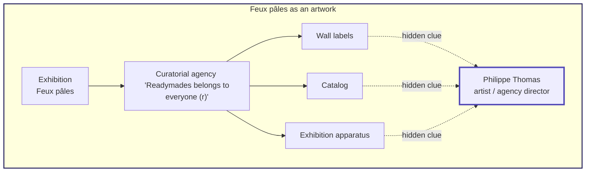
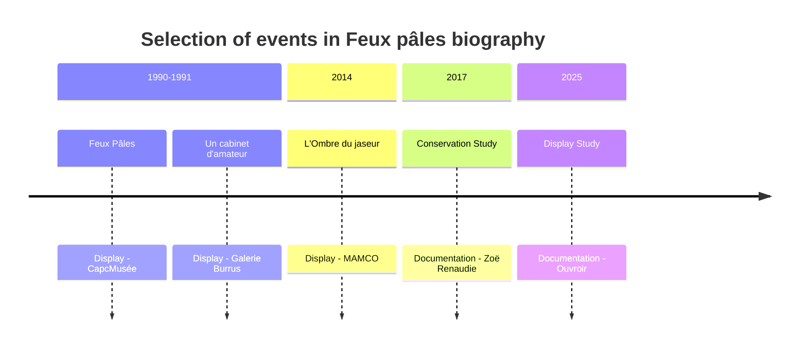
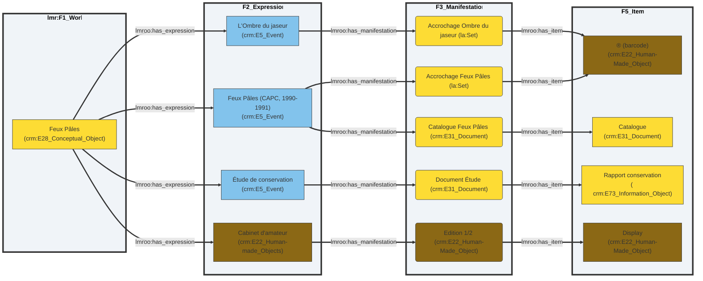
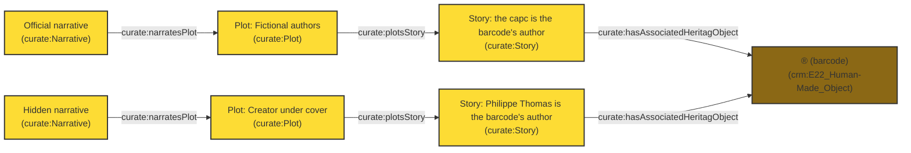
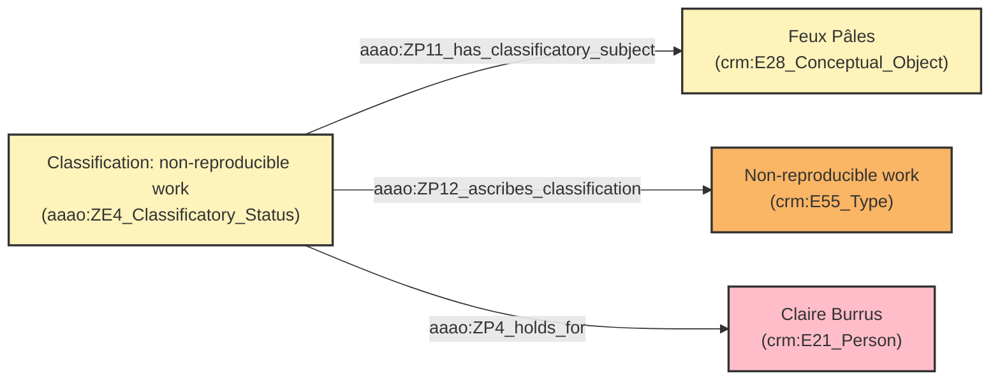

<style display="none"> .flex-1 { flex: 1; } #ouvroir { position: relative; right: 10%; } #udem { margin-top: 0; position: relative; bottom: 10%; } #frq { position: relative; left: 10%; } .reveal h3 { margin-top: 1em; } .reveal .logos { margin-top: 2em; } .reveal ul { text-align: left; } .reveal blockquote { font-size: 0.85em; border-left: 3px solid #534AB7; padding-left: 1em; } .two-col { display: grid; grid-template-columns: 1fr 1fr; gap: 2em; text-align: left; font-size: 0.8em; } .three-col { display: grid; grid-template-columns: 1fr 1fr 1fr; gap: 1.5em; text-align: left; font-size: 0.78em; } .card { border: 0.5px solid #ccc; border-radius: 8px; padding: 0.8em; } </style>

# Exhibitions as Data

### Mapping the Invisible Threads of a Relational and Processual Heritage

**Zoë Renaudie**

Digital Humanities Conference · Session S027 July 29th, 2026 · Daejeon, Republic of Korea

<div class="logos" style="display: flex">   <div class="flex-1"></div>   <div class="flex-1"></div>   <div class="flex-1"></div> </div>

/** Notes **/

I am a contemporary art conservator. This talk was not born in a semantic web lab. It was born on the floor of a contemporary art museum, trying to put into writing what an object was, and discovering that the forms available to me could not say it.

===>>>>>>===

## Exhibition and traces

<figure>

<figcaption>Exemple of exhibition archive's document - Feux Pâles, 1990, (c) capc.</figcaption>
</figure>

/** Notes **/

Museum exhibitions occupy a strange place in cultural heritage. They are central to how the discourse of art history and curating gets built, and yet they are fundamentally ephemeral. Once dismantled, most leave behind almost no complete trace, but plenty of archives.

===vvvvvv===

## Exhibition as data

Collections as data paradigm (Padilla 2017, 2018)

Three imperatives:

> **Generativity** : to increase meaning-making capacity  
> **Legibility** : to document and convey provenance and possibility  
> **Creativity** : to empower experimentation  

/** Notes **/

The "collections as data" paradigm proposes that we stop treating digital surrogates as mere stand-ins for physical documents, and start treating them as raw material: something computers can process, query, and recombine.

Three pillars guide it:

Generativity: making collections compatible with a range of computational tools.

Readability: ensuring that provenance and data integrity remain verifiable.

Creativity: allowing for experimentation, both internal and external.

An ethical imperative accompanies all three: assessing the risks to vulnerable communities, so that data collection never becomes an act of erasure or surveillance.

What I want to do here is extend this paradigm to the exhibition format itself, treating it not as an ephemeral event, but as structured data for art history and museology.

===vvvvvv===

## Exhibitions as *small, complex, and difficult* data

<div class="two-col"> <div>

**What exhibitions are made of**

- Artworks, spatial configurations
- Technical infrastructures
- Institutional constraints
- Professional collaborations
- Discursive framings
- Embodied experiences

</div> <div>

**What existing systems do**

- Privilege finished objects, not process
- Fix events in closed time-spans
- Marginalize collective and informal practices

> "Data are never raw; they are always *capta* — taken, not given." Drucker 2021

</div> </div>

/** Notes **/

Unlike the standard document collections of a library, exhibitions are what I would call small, complex, and difficult data. They are not made of stable entities, but of dynamic relationships: between artworks, space, infrastructure, and embodied experience.

Our current information systems are built for the opposite: they want finished objects, single authors, fixed dates. This creates friction, especially for exhibitions rooted in feminist, queer, or community practices, which resist exactly these norms. As Johanna Drucker reminds us, data is never raw: it is *capta*, something taken, constructed, interpreted.

If we want to treat exhibitions as data, we need to recognize that they are not objects but relational events, surviving only through fragmentary and heterogeneous traces. This tension, between the desire for structured data and the real disorder of the exhibition, is the starting point of my research.

===vvvvvv===

## Methodology

**Steps**

1. Select existing ontologies that model exhibitions
2. Populate each with the *Feux pâles* case study

/** Notes **/

Following the pragmatic modeling approach proposed by Ciula and colleagues (2023), this case study does not illustrate a pre-existing framework; it generates the documentary requirements the model must satisfy. I populated several existing ontologies with an already-documented exhibition case, 

===vvvvvv===

## Methodology

**Steps**

3. Build a working dataset from that population
4. Analyze, during both population and querying, what resists modelling and why

/** Notes **/

built a working dataset from that population, and then analyzed, both during the population process and during querying, what resisted modeling, and why.

All of this work is documented in a repository, where you can find my dataset and the modeling steps. Mostly in French for now, soon available in English.

===vvvvvv===

## Existing ontological landscape

<div class="three-col"> <div class="card">

**CIDOC-CRM** Core heritage model. **Linked Art**

</div> <div class="card">

**LRMoo / FRBRoo** Work, Expression, Manifestation, Item.

</div> <div class="card">

OntoExhibit Exhibition discursive dimensions.

</div> <div class="card">

**Curate** Separates story from plot.

</div> <div class="card">

Display Ouvroir lab extension for topological description of installations.

</div> <div class="card">

**AAAo** Institutional-fact model for difficult historical data.

</div> </div> <br/>

/** Notes **/
This landscape has been constructed across the entire field. CIDOC-CRM, LRMoo, Curate, and AAAo are the ones I will return to in the following slides.

CIDOC-CRM is the heritage ontological foundation developed by ICOM. LRMoo models the Work/Expression/Manifestation/Item hierarchy of a work. Curate structures narrative discourse by separating story from plot. AAAo, the Art and Architecture Argumentation Ontology, models situated belief. OntoExhibit and Display round out this landscape; for lack of time, I will not go into them today.

I confronted *Feux pâles* with these frameworks, and here are a few examples of where I had to adjust them.

===>>>>>>===

## *Feux pâles*

### capcMusée d'art contemporain de Bordeaux, December 1990 - March 1991

<figure>

<figcaption>Préambule de l'exposition Feux Pâles - 1990-1991. Photo : Frédéric Deval, Mairie de Bordeaux. Source : Capc Musée d'art contemporain.  © Claire Burrus, Paris, Jan Mot, Brussels.</figcaption>
</figure>

/** Notes **/

Let me make this concrete. In December 1990, *Feux pâles* opened at the capc Musée d'art contemporain in Bordeaux. On the surface, it looks conventional: eighty-two artists, eleven rooms, a catalogue, organized by an agency called "les readymades appartiennent à tout le monde" (readymades belong to everyone).

===vvvvvv===

### Feux pâles a

<figure>


<figcaption> Representation of the Exhibition Concept (c) Zoë Renaudie. Tool : mermaid
</figcaption>
</figure>

/** Notes **/

It is only on close inspection, and sometimes not even then, that the real device becomes visible. The director of that agency was the artist Philippe Thomas. The entire curatorial apparatus, the agency, the wall labels, the catalogue, was his work. An exhibition as an artwork, containing works by other artists, with hidden information acting as clues to its own story. You can already sense the complexity this poses for documentation and its conservation.

===vvvvvv===

## *Feux pâles* as a network

- **96 artworks**: loaned from 4 continents, from the 15th century to 1990
- **The catalogue**: not documentation of the exhibition, but a constitutive part of it
- **The agency**: a legal fiction with no independent existence
- **The cabinet d'amateur**: a derived work signed by the capc itself
- **Adaptation of the display**: *L'Ombre du jaseur*, MAMCO Geneva, 2014
- **Documentation**: Lebovici 2015, Renaudie 2017, Jaret 2019, Display 2025...

/** Notes **/

*Feux pâles* is not a single object, it is a network: ninety-six works on loan from four continents, spanning the fifteenth century to 1990; a catalogue that is not merely documentation of the exhibition but constitutive of it; an agency, a legal fiction with no existence of its own; a derivative work, the *Cabinet d'amateur*, signed by the capc itself; an adaptation, *L'Ombre du jaseur*, presented at MAMCO Geneva in 2014, long after the artist's death; and a growing layer of documentation and memory.

===>>>>>>===

## The starting point: a documented failure
<div class="two-col">
<div>
<figure>

<figcaption><em>Feux pâles</em> - table of documentation © Zoë Renaudie 2017</figcaption>
</figure>
</div>
<div>
<figure>

<figcaption><em>Feux pâles</em> - network © Zoë Renaudie 2017</figcaption>
</figure>
</div>
</div>

/** Notes **/

My first attempt to document *Feux pâles*, in 2017, during my conservation master's thesis, was a table. I did not yet know the digital humanities existed. And it worked, up to a point: it could list the works with their attributes, record provenance object by object. I even drew a network map by hand.

I also tried a relational database: same rigidity. Rather than seeing this as a network of actors frozen into fixed tables, in Latour's sense, I found it more productive to think with Ingold's notion of the meshwork: attention to the movement between nodes rather than to the nodes themselves.

This failure is not a footnote. It is the starting point of the inquiry.

===vvvvvv===

## Four guiding questions

1. How can exhibitions be conceptualized as **relational and performative** cultural artifacts, and what does this demand of documentation practice?
2. What are the **epistemological limits** of existing heritage ontologies when applied to exhibitions that deliberately destabilize authorship and identity?
3. How can a documentary model accommodate multiple, equally legitimate, **situated perspectives** on the same event?
4. How can ontologies declare **uncertainty and absence** on fragmented (meta-)data?

/** Notes **/

I will present a selection of findings from this inquiry through four questions:

How do we treat exhibitions as relational, performative artifacts, and what does that ask of documentation? 

Where do existing heritage ontologies break down when an exhibition deliberately destabilizes authority and identity?

How can one model hold multiple, equally valid perspectives on the same event?

How can ontologies express uncertainty and absence in incomplete data?

*Feux pâles* will serve as the case study threaded through these four questions.

===>>>>>>===

### 1. *Feux pâles* as a chain of activations



/** Notes **/

Treated as a chain of activations rather than a static entity, *Feux pâles* extends from the original 1990 exhibition to the *L'Ombre du jaseur* reactivation in 2014, passing through the *Cabinet d'amateur* and the conservation study itself. Following Goodman's notion of worldmaking, exhibition documentation must support the coexistence of multiple epistemic perspectives without reducing them to a single unified interpretation.

===vvvvvv===

### Proposed mapping in LRMoo

<figure>


<figcaption>@prefix crm:     <"http://www.cidoc-crm.org/cidoc-crm/">   </figcaption>
<figcaption>@prefix la: <"https://linked.art/ns/terms/">   </figcaption>
<figcaption>@prefix lrmoo:   <"http://iflastandards.info/ns/lrm/lrmoo/"> .   </figcaption>
</figure>

/** Notes **/

Thanks to Carboni and SARI I can map a lot of information on the exhibition. But LRMoo adds a proper four-level hierarchy on top, from Work down to Item to express the activations we mentionned. 

*Feux pâles* fits comfortably here as the Work, with each activation descending as an Expression, itself carrying a Manifestation that is a Set. But this neatness has a condition: you have to accept that *Feux pâles* is a Work in Goodman's sense, and that its Expressions are its activations, whether or not Thomas directed them himself. If you accept that, the hierarchy holds. If you refuse it, the whole mapping collapses.

===>>>>>>===

## 2. What solution do we have when exhibitions destabilize authorship and identity?

### Philippe Thomas's fictionalism

Thomas's explicit goal was to make his own name disappear. For his own artworks, he found a real or fictional signatory: the collector had to agree to sign the piece and thereby become its author.

/** Notes **/

Philippe Thomas's fictionalism is a perfect example. His explicit goal was to make his own name disappear. For every work, he found a signatory, real or fictional: the collector had to agree to sign the piece they had bought, and thereby become its author. With his gallerist and collaborator Claire Burrus, every detail was calculated to make the fiction as credible as possible.

As he put it in an interview, fiction is usually confined to a book, a frame, a screen. What happens when the book, the screen, or the frame is itself caught up in a fabricated story? The first clues sit in the title itself, which echoes Nabokov, and in a catalogue subtitle reused across other works. An exhibition journal, handed out to visitors, plants still more. For most visitors, the fiction is discovered only partially, if at all. But for documentation purposes, as a conservator, I need to know, in order to preserve the integrity of the work.

===vvvvvv===

### (R)
<figure>

<figcaption>Capc Musée d’art contemporain, (R), 1990. Photo : Frédéric Deval, Mairie de Bordeaux. Source : Capc Musée d'art contemporain. © Claire Burrus, Paris, Jan Mot, Brussels.</figcaption>
</figure>

/** Notes **/

Let's take one example: an acrylic painting depicting a barcode, installed at the entrance of the exhibition, a work conceived by Thomas, signed by the capc. 

===vvvvvv===

### Mapping narrative discourse

<figure>


<figcaption>@prefix crm:     <"http://www.cidoc-crm.org/cidoc-crm/">   </figcaption>
<figcaption>@prefix curate: <"http://example.org/ontology/curate2013#">  </figcaption>
</figure>

/** Notes **/
What I want to make legible here is the fictional narrative thread of the exhibition. This mapping draws on the Curate ontology, whose Narrative/Plot/Story structure I adapted. It lets me say that there is an official version, signed by the collector, and a real version, made by Thomas, without having to decide which one is true for the visitor.

===>>>>>>===

## 3. How can a documentary model accommodate multiple, equally legitimate, **situated perspectives** on the same event?

<div class="two-col"> <div>

**capc Bordeaux** The exhibition has no special status among the Froment-period programme. Conservation and publicity fall outside the museum's mandate.

**Claire Burrus** *(artist's estate)* The work is non-reproducible. Transmission is exclusively documentary. Reconstitution is unthinkable.

</div> <div>

**Emeline Jaret** *(estate collaborator, art historian)* Reconstitution requires rigorous documentary accompaniment. *L'Ombre du jaseur* was not *Feux pâles*: the context was too different to be experienced as such.

**MAMCO Geneva** *L'Ombre du jaseur* is a free interpretation, justified as such, not a reconstitution.


</div> </div>

/** Notes **/

In 2017, while questioning the network of actors around *Feux pâles*, distinct and stable conceptions of what the work actually is emerged, each carrying its own position on reproducibility, on the catalogue, on the legitimacy of a reactivation. They genuinely differ.

For the capc, the exhibition holds no special status within the Froment-era programming; conservation and publicity fall outside the museum's mandate. For Claire Burrus, keeper of the estate, the work is not reproducible: transmission is strictly documentary. For Jaret, a reconstruction requires rigorous documentary support, and the 2014 revival was not *Feux pâles*, the context was too different. For MAMCO, that revival is a free interpretation, acknowledged as such, not a reconstruction. For me, all of these positions are valid for as long as they exist, and they can even evolve or change.

Several coherent, irreducible positions, on one and the same object. This is exactly what "situating metadata capture" has to mean in practice.

===vvvvvv===

### AAAo: classificatory status, applied to Claire Burrus's position

<figure>


<figcaption>@prefix crm:     <"http://www.cidoc-crm.org/cidoc-crm/">   </figcaption>
<figcaption>@prefix aaao: <"http://www.ics.forth.gr/isl/AAAO/">  </figcaption>
</figure>

/** Notes **/

AAAo gives me a class I have neither in CRM nor in Curate: `ZE4_Classificatory_Status`. Rather than a property attached directly to the object, a classification is its own node, linked to four elements: the subject being classified, the type of classification, the actor who made it, and the moment it was made. Here, *Feux pâles* is classified as a "non-reproducible work," by Claire Burrus, in 2017. Because this classification is a first-class entity rather than a bare assertion, a second, different classification, made by someone else at another time, simply sits alongside it, with no need to reconcile the two.

Institutional facts, in AAAo's sense, are collective beliefs held by groups over a given period. This temporal boundary lets the model say something a plain assertion cannot: that this classification was true at a given moment, and that we are no longer certain it still is today.

===>>>>>>===

## 4. How can a documentary model accommodate **epistemic status**?

<figure>

<figcaption>Couleur code in Conservation Report (c) Zoë Renaudie</figcaption>
</figure>

- Black = verified
- Grey = missing
- Blue = uncertain
- Strikethrough = historically valid, now obsolete

/** Notes **/

The starting point is the color-coded table I made in 2017: black for "verified," blue for "uncertain," gray for "missing," struck through for "historically obsolete." That visual table serves as an anchor, but the goal is to turn these colors into queryable patterns in a knowledge graph.

===vvvvvv===

## (Meta)data enrichment


<figure>

<figcaption>meta-presentation of the metadata schema(s) (c) Anais Guilhem</figcaption>
</figure>


/** Notes **/

Every technical solution presented here rests on one recurring pattern: `E13 Attribute Assignment`. An attribute is never simply attached to an object; it is assigned during a specific event, by a named actor, at a dated moment, for a stated reason. That event itself becomes an entity in the graph, one that can be cited, contested, or replaced.

===vvvvvv===

## Fuzziness and belief

*I see an artwork in a photograph and believe it matches a catalog entry, but only plausibly, not certainly.*

<figure>


<figcaption>@prefix crm:     <"http://www.cidoc-crm.org/cidoc-crm/">   </figcaption>
<figcaption>@prefix crminf: <"http://www.ics.forth.gr/isl/CRMinf/">  </figcaption>
</figure>

/** Notes **/

*I see an object (`crm:Human-made_Object`, a cup) in an exhibition photograph, and I believe it corresponds to a catalogue entry ("antique cup"), but only plausibly, not with certainty.*

Here, the information is neither true nor false: it is plausible. Standard CIDOC-CRM does not allow a truth modifier ("maybe") to be attached directly to a property. The solution is reification: turning the proposition into a first-class object, so that belief and its truth-value can be attached to it. Two researchers can then hold contradictory beliefs about the same fact without creating any inconsistency in the graph; the belief itself becomes a documented fact: "Researcher A believes the identification is plausible."

CRMinf distinguishes the proposition (I4), the belief (I2/I12), and the truth value (I6). Here, "plausible" is a fuzzy-logic value, `I6_Belief_Value`.

===vvvvvv===

### Lacunae and Opacity


```turtle
ex:Negative_Attribute_Assignment a owl:Class ;
    rdfs:subClassOf crm:E13_Attribute_Assignment ;
    rdfs:label "Negative Attribute Assignment"@en,
               "Assignation d'attribut négative"@fr ;
    rdfs:comment "Records a search having been carried out for the value of a property, and having found none." .

ex:Withheld_Attribute_Assignment a owl:Class ;
    rdfs:subClassOf crm:E13_Attribute_Assignment ;
    rdfs:label "Withheld Attribute Assignment"@en,
               "Assignation d'attribut retenue"@fr ;
    rdfs:comment "Records a known value having been deliberately withheld by a named actor, optionally under a stated condition of access." .
```

/** Notes **/

Fuzzy belief addresses part of the problem: it documents what we know poorly. Two cases remain that CRMinf does not cover:

- what we failed to find out,
- what we are not allowed to say.

The first case is familiar to anyone who has done museum documentation work: hours of research, and nothing. In *Feux pâles*, this is an object visible in an exhibition photograph, never identified. Documenting that as a simple empty field loses something essential: the cell is not empty out of negligence, it is empty as a documented finding. The CIDOC-CRM Special Interest Group, the international body that maintains and develops the standard under ICOM, has itself been working on this distinction since 2019, and Velios, Meghini, Doerr, and Stead proposed, in 2023, a formal extension, negative typed properties, to document this kind of confirmed absence in a conservation context. `Negative_Attribute_Assignment` follows that same logic.

The second case connects back to the fictionalism I opened with, but it is no longer a narratological matter, it is a question of documentary governance. What I want to document is that a named actor, at a given date, chooses not to disclose a value, or to disclose it only under condition. `Withheld_Attribute_Assignment` carries that decision. Making the condition explicit in the model opens the possibility, for downstream infrastructure, of actually enforcing it.

These two classes close the loop opened by fuzzy belief: uncertainty, absence, and opacity become three distinct, and all queryable, regimes. What remains is to see how these four decisions, taken together, answer the four questions posed at the outset.

===>>>>>>===

## Summary: from diagnosis to mechanism

<div class="two-col"> <div>

**1. Relational, not fixed**

**2. Authorship, not identity**

**3. Situated, not centralized**

**4. Absent, not silent**

</div> </div>

/** Notes **/

**First**, how can we conceptualize exhibitions as relational, performative artifacts? CIDOC-CRM's Work/Item hierarchy assumes a stable object. LRMoo's Work/Expression levels let *Feux pâles* remain a single entity across its four activations, without forcing an arbitrary choice between them.

**Second**, what are the epistemological limits of heritage ontologies when facing exhibitions that destabilize authority? CIDOC-CRM's "carried out by" property allows only one answer. A Story/Plot structure, as in Curate, lets two complete and competing authorship claims sit side by side, without deciding which one is true.

**Third**, how can we accommodate multiple, equally legitimate, situated perspectives? A shared descriptive field leaves room for only one position. AAAo's classificatory status gives each claim its own dated, attributed node, allowing four irreconcilable positions to coexist without contradiction.

**Fourth**, how can we declare uncertainty and absence in fragmentary (meta)data? The model needs to turn uncertainty, documented absence, and deliberate opacity into explicit, queryable data, distinguishing what is proven, what is assumed, what was searched for and not found, and what was deliberately withheld.

These four diagnoses share a refusal to let the model impose a single, stable answer where the object itself has none.

===vvvvvv===

### Conclusion


/** Notes **/

*Feux pâles* is not an exceptional case, but a complex one. It illustrates a broader phenomenon: exhibitions whose very meaning rests on the instability, multiplicity, and opacity that conventional documentation seeks to eliminate.

Approached interpretively rather than exhaustively, a small, carefully structured dataset can yield a nuanced understanding of a complex cultural event, which connects to an ongoing debate in the digital humanities about small data and responsible computational practice: rigor does not require scale, the quality of the structure matters more than the size of the corpus. Building these ontologies was not only a way of testing them against a concrete case: it was, in itself, a method of inquiry into exhibitions.

Building on this first round of experience, I am now applying this schema to the exploration of new exhibitions, enriching it with new problems as they arise. In parallel, I am developing a proof of concept to automatically extract this metadata from catalogues and archives using language models, with a validation phase comparing automatic extraction against a manual reference extraction.

===>>>>>>===

Thank you!

This work is carried out within the CIÉCO partnership on new uses of collections (SSHRC), and supported by grant number 2005778 from the Fonds de recherche du Québec. My presence here today is made possible by Université de Montréal International and CRIHN.

zoe.renaudie@umontreal.ca

/** Notes **/

Thank you. I would also like to thank the ontologists and the CIDOC group whose work this draws on, as well as Emmanuel Château-Dutier and David Valentine of the Ouvroir. This work is carried out within the CIÉCO partnership on new uses of collections (SSHRC), and supported by grant number 2005778 from the Fonds de recherche du Québec. My presence here today is made possible by Université de Montréal International and CRIHN.

I am happy to take your questions.

===vvvvvv===

## References

<div style="font-size: 0.55em; text-align: left; columns: 2; column-gap: 2em;">

Altshuler, B. (2008). *Salon to Biennial*. Phaidon.

Berners-Lee, T., Hendler, J., & Lassila, O. (2001). The Semantic Web. *Scientific American*, 284(5).

Bruseker, G. et al. (2025). The Semantic Reference Data Modelling Method. *Journal of Open Humanities Data*, 11(1).

Ciula, A. et al. (2023). *Modelling Between Digital and Humanities*. Open Book Publishers.

Delhalle, H., & Aurégan, X. (2021). La décolonialité du patrimoine. *Géographie et cultures*, 117.

D'Ignazio, C., & Klein, L. (2020). Why Data Science Needs Feminism. *Data Feminism*.

Doerr, M. (2003). The CIDOC Conceptual Reference Module. *AI Magazine*, 24(3).

Drucker, J. (2021). *The Digital Humanities Coursebook*. Routledge.

Glissant, É. (1990). *Poétique de la Relation*. Gallimard.

Goodman, N. (1978). *Ways of Worldmaking*. Hackett.

Hölling, H. B. et al. (2024). *Performance: Ethics and Politics of Conservation, Vol. II*. Routledge.

Martini, F., & Taramarcaz, J. (2023). *Feminist exposure*. Art&fiction.

Moreau, L., & Missier, P. (Eds.) (2013). PROV-O: The PROV Ontology. W3C Recommendation.

Padilla, T. (2017, 2018). Collections as data / On a Collections as Data Imperative. *OCLC / College & Research Libraries News*.

Parcollet, R., & Szacka, L.-C. (2013). Écrire l'histoire des expositions. *Culture & Musées*, 22(1).

Renaudie, Z. (2017). Le monde de Feux pâles. Mémoire de recherche, ESA Avignon.

Renaudie, Z. (2020). The world of "Pale Fires". *ICAR*, 4.

Richter, D., & Drabble, B. (2015). Curating Degree Zero Archive. *ONCURATING.org*, 26.

Riva, P., Žumer, M., & Aalberg, T. (2022). LRMoo. IFLA WLIC 2022.

Rodriguez Ortega, N. et al. (2022). OntoExhibit. V. 1.1.0.

Rodríguez-Ortega, N. (2024). Contours of Knowledge. *Život Umjetnosti*, 114(1).

Denard, H. (Ed.) (2009). The London Charter for the Computer-Based Visualisation of Cultural Heritage.

Takin solution & SARI. (2025). Art and Architectural Argumentation Ontology. Version 2.

Tietz, T., Bruns, O., & Sack, H. (2023). A Data Model for Linked Stage Graph. SWODCH'23.

Valentine, D., Château-Dutier, E., & Renaudie, Z. (2024). The Display Ontology. Version 0.1.

Belteki, D., Rees, A. J., & Sichani, A.-M. (2025). Datafication and Cultural Heritage Collections Data Infrastructures. *Journal of Open Humanities Data*.

Dişli, M., Gabriëls, N., Chambers, S., Ames, S., Knazook, B., & Candela, G. (2025). Exploring the adoption of collections as data in the GLAM context. *Inf. Res.*, 30, 65-77.

Hansson, K., Näslund Dahlgren, A., & Cerratto Pargman, T. (2022). Datafication and Cultural Heritage. *Information & Culture*, 57, 1-5.

Humbel, M., Nyhan, J., Pearlman, N., Vlachidis, A., Hill, J., & Flinn, A. (2024). Socio-cultural challenges in collections digital infrastructures. *J. Documentation*, 81, 56-85.

Llewellyn, C., Shapland, A., Bonnet, T., Sanderson, R., Page, K., Bhaugeerutty, A., Shipp, K., Davis, K. K., Payne, J., & Delmas-Glass, E. (2025). Enriching exhibition scholarship. *Digit. Scholarsh. Humanit.*, 41, 188-.

Monaco, D., Pellegrino, M. A., Scarano, V., & Vicidomini, L. (2022). Linked open data in authoring virtual exhibitions. *Journal of Cultural Heritage*.

Rajan, A. (2025). Exploring exhibition design. *InfoDesign*.

Rodwell, J. C., & Whitelaw, M. (2024). From Inception to Interface. *Parergon*, 41, 161-187.

Vlachidis, A., MacDonald, I., Valeonti, F., Nyhan, J., & Sloan, K. (2025). A Data Atlas Method for Analysing and Visualising Dispersed Cultural Heritage Collections. *magazén*.

Yon, A. (2024). Collection Data: Sharing, Discovery, Inspiration, and Innovation. *Art Libraries Journal*, 49, 85-94.

Yu, J.-E., & Lee, Y. (2022). The Factors of Exhibition Viewing Experience Using Visitors' Reviews as Big Data. *Archives of Design Research*.

</div>

===vvvvvv===

### What an adequate model would require

Not the absence of structure, structure built for instability:

- **Authorship**, distributed and shifting, not singular and fixed
- **Traces**, integrated without enforcing a coherence they never had
- **Interpretations**, held in parallel, not resolved into one
- **Uncertainty and absence**, encoded as data, not left as gaps
- **Time**, recursive, not strictly linear
- **Silence and opacity**, documented as a stance, not a failure
- **Description**, always revisable, never closed

/** Notes **/

Seven requirements, but one thesis underneath them: none of this is a documentation failure to be corrected, it is the actual shape of the object, and the model has to be built for that shape. I favour small, composable extensions of existing patterns over one large new ontology, in line with the pragmatic modelling approach set out by Ciula and colleagues. I am not proposing a finished ontology today. I am proposing a diagnostic vocabulary, tested against one deliberately difficult case, so that the next case does not start from zero.


