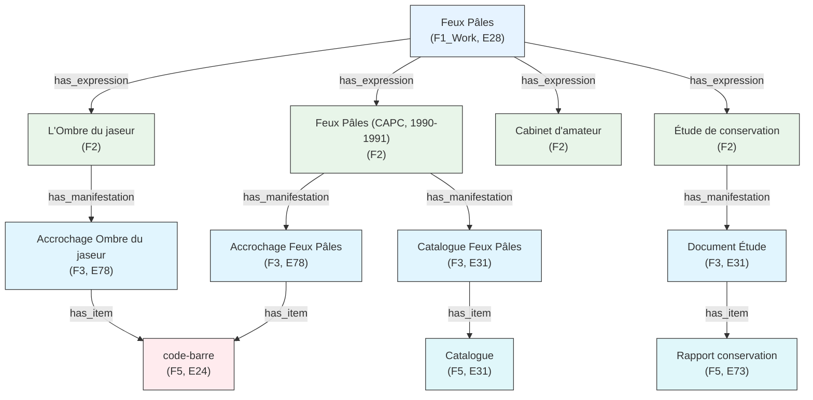
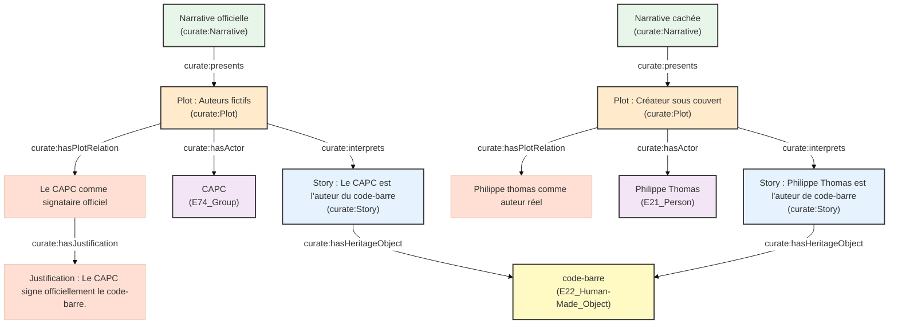
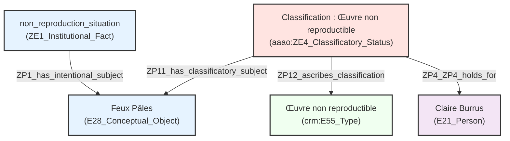
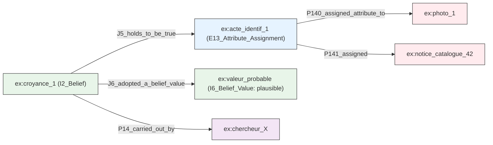
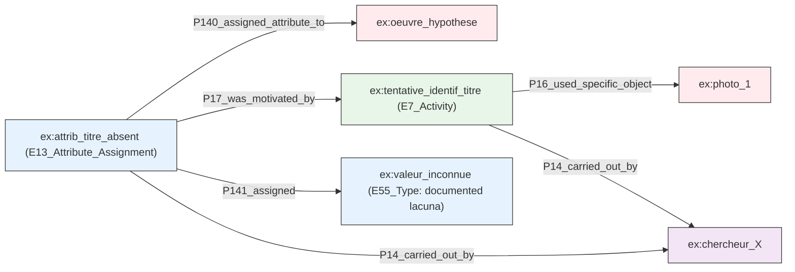
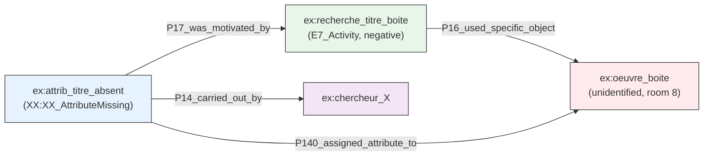
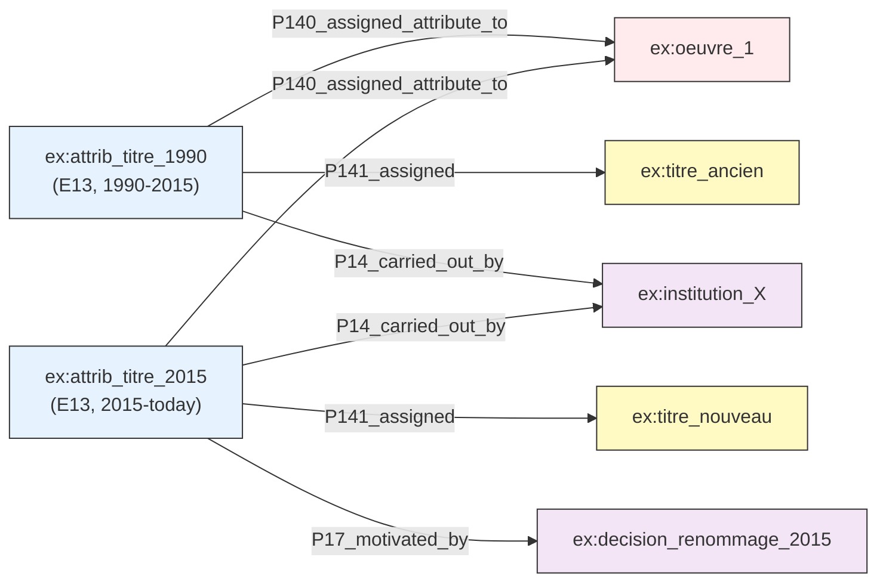
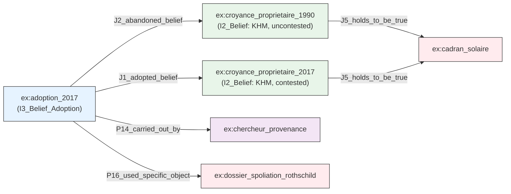

<style display="none">
.flex-1 { flex: 1; }
#ouvroir { position: relative; right: 10%; }
#udem { margin-top: 0; position: relative; bottom: 10%; }
#frq { position: relative; left: 10%; }
.reveal h3 { margin-top: 1em; }
.reveal .logos { margin-top: 2em; }
.reveal ul { text-align: left; }
.reveal blockquote { font-size: 0.85em; border-left: 3px solid #534AB7; padding-left: 1em; }
.two-col { display: grid; grid-template-columns: 1fr 1fr; gap: 2em; text-align: left; font-size: 0.8em; }
.three-col { display: grid; grid-template-columns: 1fr 1fr 1fr; gap: 1.5em; text-align: left; font-size: 0.78em; }
.card { border: 0.5px solid #ccc; border-radius: 8px; padding: 0.8em; }
</style>

# Exhibitions as Data
### Mapping the Invisible Threads of a Relational and Processual Heritage

**Zoë Renaudie**

Digital Humanities Conference · Session S027
July 29th, 2026 · Daejeon, Republic of Korea

<div class="logos" style="display: flex">
  <div class="flex-1"></div>
  <div class="flex-1"></div>
  <div class="flex-1"></div>
</div>

/** Notes **/

Thank you to the organizers and the selection committee.

My name is Zoë Renaudie. I am a doctoral researcher at the Université de Montréal, but before that, and alongside that, I am an art conservator.

That second identity matters for what follows, because this talk did not start in a semantic web lab. It started on the floor of a contemporary art museum, trying to write down what an object was, and finding that the forms I had did not let me say it.

It also means that I am here in a DH conference thanks to the DH community and my collegues. 

===>>>>>>===

## *Feux pâles*
### capcMusée d'art contemporain de Bordeaux, December 1990 – March 1991

<!-- Insert an installation view of Feux pâles, capc Bordeaux, 1990-91. A shot of the Foy gallery showing the barcode piece near the entrance works well here, since it recurs later as Artefact n°1. -->

<div class="two-col">
<div>

**Organized by**
© *readymades belong to everyone*®

**Apparent form**
Conventional thematic and chronological survey — 96 exhibits, 82 artists, 11 rooms, one catalogue

**Actual device**
The agency's director was the artist **Philippe Thomas**. The entire curatorial apparatus was his fiction.

</div>
</div>

/** Notes **/

Museum exhibitions occupy a strange position in cultural heritage. They are central to how art historical and curatorial discourse gets made, and yet they are fundamentally ephemeral. Once dismantled, most of them leave almost no comprehensive trace. Since the 1990s, a growing body of scholarship has treated exhibitions not simply as containers for objects but as sites of institutional, professional, and public engagement.

I want to make that concrete with one exhibition. In December 1990, *Feux pâles* opened at the capcMusée d'art contemporain de Bordeaux. On its surface it looked entirely conventional: eighty-two artists, eleven rooms, one catalogue, organized by an agency called *les readymades appartiennent à tout le monde*, "readymades belong to everyone."

Only on close inspection, and sometimes never, did the mechanism become visible. The director of that agency was the artist Philippe Thomas. The entire curatorial apparatus, the agency, the wall texts, the catalogue, was his artwork.

An exhibition as an artwork, containing artworks by other artists, with hidden information acting as clues to the exhibition's own narrative. You can already see the complex case this poses for documentation and its conservation.

===vvvvvv===

## Exhibition as data

Collections as data paradigm (Padilla 2017, 2018)

Three imperatives:

> **Generativity** : to increase meaning-making capacity
> **Legibility** : to document and convey provenance and possibility
> **Creativity** : to empower experimentation

/** Notes **/

The collections as data paradigm reframes how cultural institutions manage and share their digital holdings. Rather than treating digital surrogates as substitutes for physical documents, it treats them as data: material that can be processed, queried, and recombined by computers.

Three pillars guide it. 
> Generativity: enhancing meaning-making by making collections compatible with diverse computational tools. 
> Legibility: ensuring transparency in how data is selected, cleaned, and structured, so provenance and integrity remain verifiable. 
> Creativity: empowering internal and external experimentation, which in turn redefines professional roles.

The paradigm also carries an ethical imperative: to critically assess risks to vulnerable communities, so that data collection does not become an act of erasure or surveillance.

What I want to do in this talk is extend that paradigm to the exhibition format itself, treating exhibitions not as ephemeral events but as structured data for art history and museology.

===vvvvvv===

## Exhibitions as *small, complex, and difficult* data

<div class="two-col">
<div>

**What exhibitions are made of**
- Artworks, spatial configurations
- Technical infrastructures
- Institutional constraints
- Professional collaborations
- Discursive framings
- Embodied experiences

They produce meaning **through relationships**, not through stable entities.

</div>
<div>

**What existing systems do**
- Privilege finished objects, not process
- Fix events in closed time-spans
- Marginalize collective and informal practices

> "Data are never raw; they are always *capta* — taken, not given."
> Drucker 2021

</div>
</div>

/** Notes **/

However, we face a significant challenge. Unlike standard library holdings, exhibitions are what I would call small, complex, and difficult data. They are not made of stable entities, but of dynamic relationships: between artworks, space, infrastructure, and embodied experience.
@REF

Our current information systems are designed for the opposite: they want finished objects, single authors, fixed dates. This creates friction, especially for exhibitions rooted in feminist, queer, or community practices that resist exactly these norms. As Johanna Drucker reminds us, data is never raw, it is capta, taken, constructed, and interpreted.

So if we are to treat exhibitions as data, we have to acknowledge that they are not objects but relational events that survive only through fragmentary, heterogeneous traces. This tension, between the desire for structured data and the messy reality of the exhibition, is exactly where my research begins.


===vvvvvv===

## *Feux pâles* as a network

- **96 artworks**: loaned from 4 continents, from the 15th century to 1990
- **The catalogue**: not documentation of the exhibition, but a constitutive part of it
- **The agency**: a legal fiction with no independent existence
- **The cabinet d'amateur**: a derived work signed by the capc itself
- **Reinterpretation of the display**: *L'Ombre du jaseur*, MAMCO Geneva, 2014
- **Documentation**: Lebovici 2015, Renaudie 2017, Jaret 2019, Display 2025...

<!-- Insert image-3: installation or archival view illustrating the network of derived works -->


/** Notes **/

*Feux pâles* is not a single object. It is a network. Ninety-six artworks, lent from four continents, ranging from the fifteenth century to 1990. A catalogue that is not only documentation of the exhibition but a constitutive part of it. An agency that is a legal fiction with no independent existence. A derived work, the *Cabinet d'amateur*, signed by the capc itself. A reinterpretation, *L'Ombre du jaseur*, staged at MAMCO Geneva in 2014, well after the artist's death. And a growing layer of documentation, memories. 

===>>>>>>===

## The starting point: a documented failure

**2017**: First attempt to document *Feux pâles* using a relational spreadsheet

<div class="two-col">
<div>

**What the spreadsheet could do**
- List 96 artworks with attributes
- Record provenance data per object
- Colour-coded epistemic system
  - Black = verified
  - Blue = uncertain
  - Grey = missing
  - Strikethrough = historically valid, now obsolete

</div>
<div>

**What the spreadsheet could not do**
- Model relations between heterogeneous elements
- Represent competing interpretive accounts
- Express co-constitutive relationships
- Encode epistemic status as queryable data
- Link the documentation act to the object documented

</div>
</div>

/** Notes **/

My first attempt to document *Feux pâles*, in 2017, during my conservation master's, was a spreadsheet. I did not yet know anything about digital humanities. And it worked, up to a point. It could list all ninety-six artworks with their attributes. It could record provenance per object. 
@enlever ? It even had a colour-coded epistemic system: black for verified metadata, blue for uncertain, grey for missing, strikethrough for information that was historically valid but is now obsolete.

But it could not model relations between heterogeneous elements. It could not represent competing interpretive accounts. It could not express co-constitutive relationships, where one thing is simultaneously an artwork, a fiction, and a piece of evidence. It could not encode epistemic status as queryable data. And it could not link the act of documentation to the object being documented. I also tried a relational database, and the structure proved just as rigid. If we think of the relational database as a Latourian actor-network, frozen into fixed tables, I have found it more productive to think instead with Ingold's notion of the meshwork: attention to the movement along the lines between nodes, rather than to the nodes as fixed points.

This failure is not a footnote. It is the starting point of the inquiry.

===vvvvvv===

## Methodology

**Steps**
1. Select existing ontologies that model exhibitions
2. Populate each with the *Feux pâles* case study
3. Build a working dataset from that population
4. Analyze, during both population and querying, what resists modelling and why

/** Notes **/

Following the pragmatic modelling approach proposed by Ciula and colleagues, this case study does not illustrate a pre-existing framework. It generates the documentary requirements the model has to meet. Concretely: I selected existing ontologies that model exhibitions, populated each of them with the *Feux pâles* case study, built a working dataset from that population, and analyzed, both during population and during querying, what resisted modelling, and why. 

@Show the result. 

===vvvvvv===

## Four guiding questions

1. How can exhibitions be conceptualized as **relational and performative** cultural artifacts, and what does this demand of documentation practice?

2. What are the **epistemological limits** of existing heritage ontologies when applied to exhibitions that deliberately destabilize authorship, identity ?

3. How can a documentary model accommodate multiple equally legitimate situated perspectives**  on the same event ? 

4. How can ontologies declare **uncertainty, absence** on fragmented (meta-)data ?

@change the questions in the text for those 4. 

/** Notes **/

I will present a selection of results from this pragmatic inquiry through three questions. First: how can exhibitions be conceptualized as relational and performative cultural artifacts, and what does that demand of documentation practice? Second: what are the epistemological limits of existing heritage ontologies when applied to exhibitions that deliberately destabilize authorship, identity, and temporal boundaries? Third: how can a documentary model accommodate uncertainty, absence, and multiple, equally legitimate, situated perspectives on the same event? I will use *Feux pâles* as a sustained case study across all three.

===vvvvvv===

## Existing ontological landscape

<div class="three-col">
<div class="card">

**CIDOC-CRM**
Core heritage model. 
**Linked Art**
</div>
<div class="card">
**LRMoo / FRBRoo**
Work, Expression, Manifestation, Item.

</div>

<div class="card">

**OntoExhibit**
Exhibition discursive dimensions. 

</div>
<div class="card">

**Curate**
Separates story from plot. 

</div>
<div class="card">

**Display**
Ouvroir lab extension for topological description of installations.

</div>
<div class="card">

**AAAo**
Institutional-fact model for difficult historical data. 
</div>
</div>

<br/>

/** Notes **/

Piochée dans tout - en gras pour celles utilisées

A brief word on the ontologies I will discuss today. CIDOC-CRM is the core heritage model, strong on provenance and custody, weak on authorship ambiguity and epistemic status. Linked Art is a lightweight profile built on top of it. LRMoo and FRBRoo model the classic Work, Expression, Manifestation, Item hierarchy, strong on intellectual lineage, weaker on co-constitutive and recursive relationships, a limit I will come back to directly. OntoExhibit addresses exhibitions' discursive dimension directly, strong on curatorial intent. Curate separates story from plot. Display is the Ouvroir lab's own extension, with Emmanuel Château-Dutier and David Valentine, for the topological description of installations. And AAAo, the Art and Architectural Argumentation Ontology, attempts to model difficult historical data without reduction, strong on situated belief.

I mapped *Feux pâles* against several of these frameworks, and here are some examples of where I had to adjust.

===>>>>>>===

## 1. How can exhibitions be conceptualized as **relational and performative** cultural artifacts, and what does this demand of documentation practice?

### *Feux pâles* as a chain of activations

Rather than a static entity, *Feux pâles* is a **dynamic and continuously activated network**.

- Exposition 1: *Feux Pâles* (capc, 1990-1991)
- Exposition 2: *L'Ombre du jaseur* (MAMCO, 2014)
- *Un cabinet d'amateur* (Galerie Burrus, 1991)
- Étude de conservation (2017)

<!-- Insert image-4: visual timeline or photograph anchoring the four activations -->

/** Notes **/

Treated as a chain of activations rather than a static entity, *Feux pâles* spans the original 1990 exhibition, the *L'Ombre du jaseur* reactivation in 2014, the *Cabinet d'amateur*, and the conservation study itself. Following Goodman's notion of worldmaking, exhibition documentation must support the coexistence of multiple epistemic perspectives without collapsing them into a unified interpretation.

@remettre linked art ? 

===vvvvvv===

### Proposed mapping in LRMoo



/** Notes **/

LRMoo gives a clean four-level hierarchy from Work down to Item, and *Feux pâles* itself sits comfortably as the Work from which every activation descends as an Expression. It is the cleanest of the three mappings. But that cleanliness has a condition: you have to accept that *Feux pâles* is a Work in Goodman's sense, and that its Expressions are its activations, whether or not Thomas himself directed them. Accept that, and the hierarchy holds. Refuse it, and the whole mapping collapses back into the authorship question I raise next.

===>>>>>>===

## 2. What solution do we have when exhibition destabilize authorship, identity ?

### Philippe Thomas's fictionalism

Thomas's explicit goal was to make his own name disappear. For his own artworks, he found a real or fictional signatory: the collector had to agree to sign the piece and thereby become its author.

> "What I claimed to do is a fiction that leaves the text, that leaves the frame where it is usually expected."
> Philippe Thomas, interview with Stéphane Wargnier

**Example of the network of clues**

- Title *Feux pâles* echoes Nabokov's *Pale Fire*
- Catalogue subtitle, "une pièce à conviction," recurs across his other works
- An exhibition journal, distributed to visitors, seeds further indices
- Discovery is gradual, uneven, and for many visitors, never complete

/** Notes **/

Philippe Thomas's fictionalism is a great example. His explicit goal was to make his own name disappear. For each work, he found a real or fictional signatory. The collector had to agree to sign the purchased piece and thereby become its author. With his gallerist and collaborator Claire Burrus, every detail was calculated so the fiction would be as credible as possible. Each piece serves his larger project: the fiction itself. As he put it in an interview, fiction is usually confined to a book, a frame, a screen. What happens when the book, the screen, or the frame are themselves caught up in a fabricated story? The first clues sit in the title itself, which echoes Nabokov, and in a catalogue subtitle he reused across other works. An exhibition journal, handed to visitors, seeds further indices. For most visitors, the fiction is discovered only partially, if at all.

But to document as a conservator, we need to know, in order to preserve the work's integrity.

===vvvvvv===




/** Notes **/

An example is a barcode-like acrylic painting, signed capc, conceived by Thomas through the agency. In CIDOC-CRM, "carried out by" forces a choice, the capc, Thomas, or the agency, and there is exactly one slot for what is really three legitimate answers. Neither model has a class for the object's hybrid status, simultaneously artwork, scenographic element, and exhibition title. Here inspired of Curate. 

Inspired of the Curate Ontology. Inspired because I twisted the main purpose of the ontology.
Connecter aux sources

===vvvvvv===

## 3.

<div class="two-col">
<div>

**capc Bordeaux**
The exhibition has no special status among the Froment-period programme. Conservation and publicity fall outside the museum's mandate.

**Claire Burrus** *(artist's estate)*
The work is non-reproducible. Transmission is exclusively documentary. Reconstitution is unthinkable.

</div>

<div>
**Emeline Jaret** *(estate collaborator, art historian)*
Reconstitution requires rigorous documentary accompaniment. *L'Ombre du jaseur* was not *Feux pâles*: the context was too different to be experienced as such.

**MAMCO Geneva**
*L'Ombre du jaseur* is a free interpretation, justified as such, not a reconstitution.

</div>
</div>

/** Notes **/

In 2017, interviewing the network of actors around *Feux pâles*, distinct and stable conceptions of what the work is emerged, each entailing its own position on reproducibility, on the catalogue, and on the legitimacy of any reactivation. And they genuinely differ. For the capc, the exhibition has no special status among the Froment-era programme, and conservation falls outside the museum's mandate. For Claire Burrus, as keeper of the artist's estate, the work is non-reproducible; transmission is exclusively documentary, and reconstitution is unthinkable. For Jaret, reconstitution requires rigorous documentary accompaniment, and the 2014 restaging was not *Feux pâles*, the context was too different to be experienced as such. For MAMCO, that restaging is a free interpretation, justified as such, not a reconstitution at all.

Four coherent, irreducible positions, on the same object. This is exactly what "situating the capture of metadata" has to mean in practice, and it is where I turn next.

===vvvvvv===

### AAAo: classificatory status, applied to Claire Burrus's position



/** Notes **/

AAAo gives me a class I don't have in CRM or Curate: ZE4_Classificatory_Status. Rather than a property attached directly to the object, a classification is its own node, tied to four things at once: the subject being classified, the type of classification, the actor who made it, and when. Here, *Feux pâles* is classified as a "non-reproducible work," by Claire Burrus, in 2017. Because that classification is a first-class entity rather than a bare assertion, a second, different classification by someone else, at a different time, simply sits alongside it. Nothing has to be reconciled.

Institutional facts are collective beliefs about the world held by groups for a period of time.

@I would be nice to say : it was true at points of time but now we are not sure. 

===vvvvvv===

### Result

The epistemological limit is not primarily technical, it is representational: existing ontologies model **facts about a work**, when what *Feux pâles* actually requires is a model of **positions held about a work**, by named actors, for stated reasons, some of which are legitimately never disclosed.


/** Notes **/

So, to answer the second question: the epistemological limit is not primarily technical, it is representational. Existing ontologies model facts about a work. What *Feux pâles* actually requires is a model of positions held about a work, by named actors, for stated reasons, some of which are legitimately never disclosed.

@ didn't talk about time ?

===>>>>>>===

## 4. How can a documentary model accommodate **epistemic status** ?

tableau 2017


/** Notes **/

tableau


- assigned an **epistemic status**: certain, uncertain, false, historically valid but superseded, deliberately left undeclared or given through conditions

===vvvvvv===

## How CIDOC-CRM documents metadata, generically

<!-- Insert figure from Anaïs Guilhem's presentation on metadata enrichment here -->

Every technical solution in the next slides is a variation on **one recurring pattern**: `E13 Attribute Assignment`.

```turtle
ex:assignment_N a crm:E13_Attribute_Assignment ;
    crm:P140_assigned_attribute_to ex:the_object ;
    crm:P141_assigned ex:the_value ;
    crm:P177_assigned_property_of_type ex:the_property ;
    crm:P14_carried_out_by ex:the_actor ;
    crm:P4_has_time-span ex:the_period ;
    crm:P17_was_motivated_by ex:the_reason .
```

/** Notes **/

Before the specific cases, one general point about how CIDOC-CRM actually documents metadata, because every solution in the next few slides is a variation on the same pattern. An attribute is never simply attached to an object as a property. It is assigned, through an E13 Attribute Assignment event, by a named actor, at a dated moment, motivated by a stated reason. That event is itself an entity in the graph, which can be cited, contested, and superseded. Everything I am about to show you, belief values, lacunae, superseded titles, condition states, is this same pattern, specialized for a different kind of situation.

===vvvvvv===

## Fuzzyness / uncertain information

*I see an artwork in a photograph and believe it matches a catalogue entry - but only plausibly, not certainly.*



*Note: I use a qualitative label from a controlled scale ("plausible") rather than a decimal. A single researcher's number, unaccompanied by a calibration method, claims more precision than the judgment behind it actually has.*

/** Notes **/

The first is fuzzy or uncertain information. Say I see an artwork in a photograph and believe it plausibly matches a given catalogue entry. CIDOC-CRM does not natively carry a way to qualify that; its attribute assignment is binary. The more robust, academically defensible solution is the CRMinf extension, which separates the proposition itself from the belief held about it, a related but genuinely distinct formalism from a bare E13, not the same class reused. I want to flag a choice I made deliberately: I use a qualitative label, "plausible," from a controlled scale, rather than a decimal.

**CRMinf separates the proposition from the belief held about it**. two researchers can hold different beliefs about the same act without contradiction in the graph. This is a *related but distinct* formalism from a bare `E13`: it reifies belief around a proposition, rather than assigning a value directly.

===vvvvvv===

## Missing information (lacuna)

*An artwork appears in a photograph, but its title and date are unknown.*

CRM's open-world logic already treats absence of assertion as absence of knowledge, not negation. The real need: declare that a **search was undertaken and came back empty**.



/** Notes **/

The second is missing information, a lacuna. I see an artwork in a photograph, but its title and date are simply unknown. CRM, working in an open-world logic, already treats absence of assertion as absence of knowledge rather than as negation, which is a good default. But the real problem is different: I want to declare explicitly that a search was undertaken and came back empty, so that the gap reads as documented rather than as a simple oversight. My first version of this used a typed placeholder node per property, which worked but did not scale. The version I now use folds the lacuna back into the same E13 Attribute Assignment pattern: the assignment points to a shared, controlled "unknown" value, and its motivation points to the search activity that failed to resolve it.

===vvvvvv===

### A documented lacuna, in the corpus itself
<!-- Insert image-6: the display case, room 8, "Le musée réfléchi" -->

*An unidentified graphic work, contained in a box, appears in the display case of room 8, "Le musée réfléchi." No caption, no inventory number, no mention in the catalogue or the press file.*

```turtle
XX:XX_Attribute_Missing a owl:Class ;
    rdfs:subClassOf crm:E13_Attribute_Assignment ;
    rdfs:label "Attribute Missing"@en ;
    rdfs:comment "An attribute assignment that records the documented absence of a value for a property after a search activity."@en .
```



/** Notes **/

A concrete instance from the corpus itself: an unidentified graphic work, in a box, visible in the display case of room 8, "Le musée réfléchi." Uncaptioned, absent from the catalogue and the press file. I created one new, named class, `XX:XX_AttributeMissing`, subclassed from E13. Because it is its own declared class rather than a value inspected property by property, the title's status becomes directly queryable: I can ask the graph "which titles are documented lacunae" and get an answer. A single real artefact routinely needs several small mechanisms like this at once, layered on different properties of the same node.

===vvvvvv===

## Superseded or contradicted information

*A title, once accepted, is today judged offensive and has been formally replaced, but the historical fact must be kept.*



/** Notes **/

The third is superseded or contradicted information. The underlying mechanism is the same one used for the fuzzy case: each successive attribution is a distinct E13 Attribute Assignment, dated through a time-span, carried out by a named actor. Nothing is overwritten; everything accumulates. The 1990 attribution stays in the graph, carrying its own time-span. The 2015 attribution sits alongside it, motivated by a documented renaming decision. What CRM lacks natively is an explicit "supersedes" link, shown here as the dashed edge, clearly marked as a local, non-standard extension.

===vvvvvv===

### I3 Belief Adoption: dating the change of mind itself

*The sundial's ownership belief moves from "KHM Vienna, uncontested" (pre-2017) to "KHM Vienna, contested, restitution claim pending" (2017–), and the graph should record exactly when that shift happened and who made it.*



**I3 Belief Adoption** is the event that links the two beliefs: it does not just replace one value with another, it records *whose* research act caused the shift, and *on the basis of what*.

/** Notes **/

One more use of the CRMinf mechanism, this time for the sundial. Before 2017, the belief that the Kunsthistorisches Museum owned it, uncontested, sat quietly in the graph. In 2017, a new belief appears, still KHM, but now contested. I3 Belief Adoption is the event that connects the two: it records who caused the shift and what evidence prompted it. Same discipline as the AAAo slide, these exact property labels are version-dependent, check before reuse.

===vvvvvv===

1. How can exhibitions be conceptualized as **relational and performative** cultural artifacts, and what does this demand of documentation practice?

2. What are the **epistemological limits** of existing heritage ontologies when applied to exhibitions that deliberately destabilize authorship, identity ?

3. How can a documentary model accommodate multiple equally legitimate situated perspectives**  on the same event ? 

4. How can ontologies declare **uncertainty, absence** on fragmented (meta-)data ?


@Etre concret dans la slide de reponse et general sur les exemples . 
Conclusion : quelles sont les difficultés de ce projet ? Chaque expo est unique : tout le monde doit faire ce trivail. Ma contribution : trouver une solution. Retur d'experience sur : Faites  des etudes de cas. 


===>>>>>>===

## What an adequate model would require

An exhibition documentary model must be capable of:

1. Representing **distributed and shifting authorship**
2. Integrating **heterogeneous documentary traces** without enforcing artificial coherence
3. Preserving **contradictory or parallel interpretations**
4. Encoding **epistemic status and degrees of uncertainty**
5. Modelling **non-linear and recursive temporalities**
6. Documenting **absences, silences, and opacity** as meaningful conditions, not deficiencies
7. Supporting **iterative enrichment** over time rather than closure through final description

/** Notes **/

Pulling this together, an adequate exhibition documentary model needs to do seven things: represent distributed and shifting authorship; integrate heterogeneous traces without forcing artificial coherence; preserve contradictory or parallel interpretations; encode epistemic status and degrees of uncertainty; model non-linear and recursive temporalities; document absences and opacity as meaningful conditions, not deficiencies; and support iterative enrichment over time, rather than closure through a final description. I favour small, composable extensions of existing patterns over one large new ontology, and I favour naming gaps and pointing at adjacent domains over building a competing standard. I am not proposing a finished ontology today. I am proposing a diagnostic vocabulary, and a set of requirements, to guide that work.

sourcer

===vvvvvv===

## Conclusion

<div class="two-col">
<div>

**What this research demonstrates**
- Modelling choices embody values
- Documentation practices shape cultural memory
- Small, carefully structured datasets support nuanced engagement when approached interpretively

</div>
<div>

**The broader stakes**
- Engagement is not only a matter of access
- It is a question of how cultural phenomena are modelled
- Whose expertise informs that modelling
- What forms of knowledge the resulting structures enable or foreclose

</div>
</div>

/** Notes **/

*Feux pâles* is not an exceptional case but it is a messy one. It is a particularly legible instance of a broader condition: exhibitions whose meaning depends on the very instability, multiplicity, and opacity that conventional documentation seeks to eliminate.

Approached interpretively rather than exhaustively, a small, carefully structured dataset like this one can support genuinely nuanced engagement with a complex cultural event. That connects to an ongoing conversation in digital humanities around small data and responsible computational practice, the idea that **rigour does not require scale**, and that the quality of the structure matters more than the size of the corpus.

What this shows, more broadly, is threefold. Modelling choices embody values. Documentation practices shape cultural memory. And small, well-structured datasets, treated with care, can do work that large ones often cannot.

And the stakes go beyond access. This is a question of how cultural phenomena get modelled, whose expertise informs that modelling, and what forms of knowledge the resulting structures enable, or foreclose.

@revoir conclu pour dire comment concretement c'est exhibition as dta. Que l'etude pragmatique m'a permi de comprendre les ontologies mais aussi faire desdecovertes sur lexposition grace aux ontologies. 

===>>>>>>===

Thank you!

And to the different ontologists and the CIDOC group for their work. Also Emmanuel Château-Dutier and David Valentine from l'Ouvroir.

This work is supported by a grant ("2005778") from the Fonds de recherche du Québec, and this presentation by Udem International and the CRIHN.

zoe.renaudie@umontreal.ca

/** Notes **/

Thank you. I also want to thank the ontologists and the CIDOC group whose work this builds on, and Emmanuel Château-Dutier and David Valentine at the Ouvroir. This work is supported by a grant, number 2005778, from the Fonds de recherche du Québec, and my presence here today by Université de Montréal International and the CRIHN. I am happy to take questions.

@ add tools and repo

===vvvvvv===

## References

<div style="font-size: 0.55em; text-align: left; columns: 2; column-gap: 2em;">

Altshuler, B. (2008). *Salon to Biennial*. Phaidon.

Berners-Lee, T., Hendler, J., & Lassila, O. (2001). The Semantic Web. *Scientific American*, 284(5).

Bruseker, G. et al. (2025). The Semantic Reference Data Modelling Method. *Journal of Open Humanities Data*, 11(1).

Ciula, A. et al. (2023). *Modelling Between Digital and Humanities*. Open Book Publishers.

Delhalle, H., & Aurégan, X. (2021). La décolonialité du patrimoine. *Géographie et cultures*, 117.

D'Ignazio, C., & Klein, L. (2020). Why Data Science Needs Feminism. *Data Feminism*.

Doerr, M. (2003). The CIDOC Conceptual Reference Module. *AI Magazine*, 24(3).

Drucker, J. (2021). *The Digital Humanities Coursebook*. Routledge.

Glissant, É. (1990). *Poétique de la Relation*. Gallimard.

Goodman, N. (1978). *Ways of Worldmaking*. Hackett.

Hölling, H. B. et al. (2024). *Performance: Ethics and Politics of Conservation, Vol. II*. Routledge.

Martini, F., & Taramarcaz, J. (2023). *Feminist exposure*. Art&fiction.

Moreau, L., & Missier, P. (Eds.) (2013). PROV-O: The PROV Ontology. W3C Recommendation.

Padilla, T. (2017, 2018). Collections as data / On a Collections as Data Imperative. *OCLC / College & Research Libraries News*.

Parcollet, R., & Szacka, L.-C. (2013). Écrire l'histoire des expositions. *Culture & Musées*, 22(1).

Renaudie, Z. (2017). Le monde de Feux pâles. Mémoire de recherche, ESA Avignon.

Renaudie, Z. (2020). The world of "Pale Fires". *ICAR*, 4.

Richter, D., & Drabble, B. (2015). Curating Degree Zero Archive. *ONCURATING.org*, 26.

Riva, P., Žumer, M., & Aalberg, T. (2022). LRMoo. IFLA WLIC 2022.

Rodriguez Ortega, N. et al. (2022). OntoExhibit. V. 1.1.0.

Rodríguez-Ortega, N. (2024). Contours of Knowledge. *Život Umjetnosti*, 114(1).

Denard, H. (Ed.) (2009). The London Charter for the Computer-Based Visualisation of Cultural Heritage.

Takin solution & SARI. (2025). Art and Architectural Argumentation Ontology. Version 2.

Tietz, T., Bruns, O., & Sack, H. (2023). A Data Model for Linked Stage Graph. SWODCH'23.

Valentine, D., Château-Dutier, E., & Renaudie, Z. (2024). The Display Ontology. Version 0.1.

Belteki, D., Rees, A. J., & Sichani, A.-M. (2025). Datafication and Cultural Heritage Collections Data Infrastructures. *Journal of Open Humanities Data*.

Dişli, M., Gabriëls, N., Chambers, S., Ames, S., Knazook, B., & Candela, G. (2025). Exploring the adoption of collections as data in the GLAM context. *Inf. Res.*, 30, 65-77.

Hansson, K., Näslund Dahlgren, A., & Cerratto Pargman, T. (2022). Datafication and Cultural Heritage. *Information & Culture*, 57, 1-5.

Humbel, M., Nyhan, J., Pearlman, N., Vlachidis, A., Hill, J., & Flinn, A. (2024). Socio-cultural challenges in collections digital infrastructures. *J. Documentation*, 81, 56-85.

Llewellyn, C., Shapland, A., Bonnet, T., Sanderson, R., Page, K., Bhaugeerutty, A., Shipp, K., Davis, K. K., Payne, J., & Delmas-Glass, E. (2025). Enriching exhibition scholarship. *Digit. Scholarsh. Humanit.*, 41, 188-.

Monaco, D., Pellegrino, M. A., Scarano, V., & Vicidomini, L. (2022). Linked open data in authoring virtual exhibitions. *Journal of Cultural Heritage*.

Rajan, A. (2025). Exploring exhibition design. *InfoDesign*.

Rodwell, J. C., & Whitelaw, M. (2024). From Inception to Interface. *Parergon*, 41, 161-187.

Vlachidis, A., MacDonald, I., Valeonti, F., Nyhan, J., & Sloan, K. (2025). A Data Atlas Method for Analysing and Visualising Dispersed Cultural Heritage Collections. *magazén*.

Yon, A. (2024). Collection Data: Sharing, Discovery, Inspiration, and Innovation. *Art Libraries Journal*, 49, 85-94.

Yu, J.-E., & Lee, Y. (2022). The Factors of Exhibition Viewing Experience Using Visitors' Reviews as Big Data. *Archives of Design Research*.

</div>


Si Q/A 

===vvvvvv===

### (Meta-)data deliberately left undeclared or given through conditions

Glissant's *droit à l'opacité*: information can be **voluntarily withheld**, by principle or by condition, rather than absent by accident.

> "Le droit à l'opacité... n'est pas l'enfermement dans une particularité impénétrable. C'est l'accord donné à ces pratiques du monde qui se proposent à la Relation universelle."
> *"The right to opacity... is not enclosure in an impenetrable particularity. It is the consent given to those practices of the world that offer themselves to universal Relation."*
> Glissant, *Poétique de la Relation*, 1990 (my translation)


/** Notes **/

Here is the most critical point. Up to now, we have treated absence of data as a problem to be solved. But what if that absence is intentional?

Some actors do not withhold information by accident. They decline to disclose it by principle, in the sense Glissant gives to the right to opacity. Absence and opacity, in this framework, are legitimate epistemic stances, not deficiencies to be corrected.

Metadata can still be shared, but under stated conditions. The question then becomes how to make that queryable without violating the ethics that motivated the withholding in the first place. Label Context. 

===vvvvvv===

### Proposition: an *Undisclosed Attribute* class

```turtle
XX:XX_Undisclosed a owl:Class ;
    rdfs:subClassOf crm:E13_Attribute_Assignment ;
    rdfs:label "Undisclosed Attribute"@en, "Attribut non divulgué"@fr ;
    rdfs:comment "An attribute assignment that records the deliberate withholding of a value, motivated by ethical, legal, or cultural principles."@en .
```

/** Notes **/

Concretely, I subclass `E13_Attribute_Assignment` again, this time as `XX:XX_Undisclosed`, and I attach to it the documented reason for the withholding as an `E73_Information_Object`, rather than leaving that reason implicit. The class sits deliberately next to `AttributeMissing`: both are searches, but one comes back empty because the information genuinely could not be found, and the other comes back empty because someone, named and dated, chose not to disclose it. Keeping them as siblings under the same E13 pattern, rather than collapsing them into one "unknown" bucket, is what lets the graph distinguish a gap from a boundary.