<style display="none">
.flex-1 { flex: 1; }
#ouvroir { position: relative; right: 10%; }
#udem { margin-top: 0; position: relative; bottom: 10%; }
#frq { position: relative; left: 10%; }
.reveal h3 { margin-top: 1em; }
.reveal .logos { margin-top: 2em; }
.reveal ul { text-align: left; }
.reveal blockquote { font-size: 0.85em; border-left: 3px solid #534AB7; padding-left: 1em; }
.two-col { display: grid; grid-template-columns: 1fr 1fr; gap: 2em; text-align: left; font-size: 0.8em; }
.three-col { display: grid; grid-template-columns: 1fr 1fr 1fr; gap: 1.5em; text-align: left; font-size: 0.78em; }
.card { border: 0.5px solid #ccc; border-radius: 8px; padding: 0.8em; }
</style>

# Exhibitions as Data
### Mapping the Invisible Threads of a Relational and Processual Heritage

**Zoë Renaudie**

Digital Humanities Conference · Session S027
July 29th, 2026 · Daejeon, Republic of Korea

<div class="logos" style="display: flex">
  <div class="flex-1"></div>
  <div class="flex-1"></div>
  <div class="flex-1"></div>
</div>

/** Notes **/

Thank you to the organizers and the selection committee.

My name is Zoë Renaudie. I am a doctoral researcher at the Université de Montréal, but before that, and alongside that, I am an art conservator.

That second identity matters for what follows, because this talk did not start in a semantic web lab. It started on the floor of a contemporary art museum, trying to write down what an object was, and finding that the forms I had did not let me say it.

===>>>>>>===

## *Feux pâles*
### capcMusée d'art contemporain de Bordeaux, December 1990 – March 1991

<!-- Insert an installation view of Feux pâles, capc Bordeaux, 1990-91. A shot of the Foy gallery showing the barcode piece near the entrance works well here, since it recurs later as Artefact n°1. -->

<div class="two-col">
<div>

**Organized by**
© *readymades belong to everyone*®

**Apparent form**
Conventional thematic and chronological survey — 96 exhibits, 82 artists, 11 rooms, one catalogue

**Actual device**
The agency's director was the artist **Philippe Thomas**. The entire curatorial apparatus was his fiction.

</div>
</div>

/** Notes **/

Museum exhibitions occupy a strange position in cultural heritage. They are central to how art historical and curatorial discourse gets made, and yet they are fundamentally ephemeral. Once dismantled, most of them leave almost no comprehensive trace. Since the 1990s, a growing body of scholarship has treated exhibitions not simply as containers for objects but as sites of institutional, professional, and public engagement in their own right, closer to performances than to collections. They leave behind what we might call performing remains: fragments that resist conventional archival logic.

I want to make that concrete with one exhibition. In December 1990, *Feux pâles* opened at the capcMusée d'art contemporain de Bordeaux. On its surface it looked entirely conventional: eighty-two artists, eleven rooms, one catalogue, organized by an agency called *les readymades appartiennent à tout le monde*, "readymades belong to everyone."

Only on close inspection, and sometimes never, did the mechanism become visible. The director of that agency was the artist Philippe Thomas. The entire curatorial apparatus, the agency, the wall texts, the catalogue, was his artwork.

An exhibition as an artwork, containing artworks by other artists, with hidden information acting as clues to the exhibition's own narrative. You can already see the complex case this poses for documentation and its conservation.

===vvvvvv===

## Exhibition as data

Collections as data paradigm (Padilla 2017, 2018)

Three imperatives:

> **Generativity** — to increase meaning-making capacity
> **Legibility** — to document and convey provenance and possibility
> **Creativity** — to empower experimentation

/** Notes **/

The collections as data paradigm reframes how cultural institutions manage and share their digital holdings. Rather than treating digital surrogates as substitutes for physical documents, it treats them as data: material that can be processed, queried, and recombined by computers.

Three pillars guide it. Generativity: enhancing meaning-making by making collections compatible with diverse computational tools. Legibility: ensuring transparency in how data is selected, cleaned, and structured, so provenance and integrity remain verifiable. Creativity: empowering internal and external experimentation, which in turn redefines professional roles.

The paradigm also carries an ethical imperative: to critically assess risks to vulnerable communities, so that data collection does not become an act of erasure or surveillance.

What I want to do in this talk is extend that paradigm to the exhibition format itself, treating exhibitions not as ephemeral events but as structured data for art history and museology.

===vvvvvv===

## Exhibitions as *small, complex, and difficult* data

<div class="two-col">
<div>

**What exhibitions are made of**
- Artworks, spatial configurations
- Technical infrastructures
- Institutional constraints
- Professional collaborations
- Discursive framings
- Embodied experiences

They produce meaning **through relationships**, not through stable entities.

</div>
<div>

**What existing systems do**
- Privilege finished objects, not process
- Fix events in closed time-spans
- Marginalize collective and informal practices

> "Data are never raw; they are always *capta* — taken, not given."
> Drucker 2021

</div>
</div>

/** Notes **/

However, we face a significant challenge. Unlike standard library holdings, exhibitions are what I would call small, complex, and difficult data. They are not made of stable entities, but of dynamic relationships: between artworks, space, infrastructure, and embodied experience.

Our current information systems are designed for the opposite: they want finished objects, single authors, fixed dates. This creates friction, especially for exhibitions rooted in feminist, queer, or community practices that resist exactly these norms. As Johanna Drucker reminds us, data is never raw, it is capta, taken, constructed, and interpreted.

I want to flag something explicitly, because I am going to ask you to hold it for a while: everything I show you later, a belief you can query, a documented lacuna, a fact someone declared undisclosed, is this exact idea, capta, made operational in RDF. I will call back to this directly once we get there, rather than leaving it stranded here as a theory slide.

So if we are to treat exhibitions as data, we have to acknowledge that they are not objects but relational events that survive only through fragmentary, heterogeneous traces. This tension, between the desire for structured data and the messy reality of the exhibition, is exactly where my research begins.


===vvvvvv===

## *Feux pâles* as a network

- **96 artworks**: loaned from 4 continents, from the 15th century to 1990
- **The catalogue**: not documentation of the exhibition, but a constitutive part of it
- **The agency**: a legal fiction with no independent existence
- **The cabinet d'amateur**: a derived work signed by the capc itself
- **Reinterpretation of the display**: *L'Ombre du jaseur*, MAMCO Geneva, 2014
- **Documentation**: Lebovici 2015, Renaudie 2017, Jaret 2019, Display 2025...

<!-- Insert image-3: installation or archival view illustrating the network of derived works -->


/** Notes **/

*Feux pâles* is not a single object. It is a network. Ninety-six artworks, lent from four continents, ranging from the fifteenth century to 1990. A catalogue that is not only documentation of the exhibition but a constitutive part of it. An agency that is a legal fiction with no independent existence. A derived work, the *Cabinet d'amateur*, signed by the capc itself. A reinterpretation, *L'Ombre du jaseur*, staged at MAMCO Geneva in 2014, well after the artist's death. And a growing layer of scholarship, including my own research since 2017.

Exhibitions, in other words, are not objects. They are relational and processual events that survive only through fragmentary, heterogeneous, and situated traces. So the question becomes: how, and why, do we document them.

===>>>>>>===

## The starting point: a documented failure

**2017**: First attempt to document *Feux pâles* using a relational spreadsheet

<div class="two-col">
<div>

**What the spreadsheet could do**
- List 96 artworks with attributes
- Record provenance data per object
- Colour-coded epistemic system
  - Black = verified
  - Blue = uncertain
  - Grey = missing
  - Strikethrough = historically valid, now obsolete

</div>
<div>

**What the spreadsheet could not do**
- Model relations between heterogeneous elements
- Represent competing interpretive accounts
- Express co-constitutive relationships
- Encode epistemic status as queryable data
- Link the documentation act to the object documented

</div>
</div>

/** Notes **/

My first attempt to document *Feux pâles*, in 2017, during my conservation master's, was a spreadsheet. I did not yet know anything about digital humanities. And it worked, up to a point. It could list all ninety-six artworks with their attributes. It could record provenance per object. It even had a colour-coded epistemic system: black for verified metadata, blue for uncertain, grey for missing, strikethrough for information that was historically valid but is now obsolete.

But it could not model relations between heterogeneous elements. It could not represent competing interpretive accounts. It could not express co-constitutive relationships, where one thing is simultaneously an artwork, a fiction, and a piece of evidence. It could not encode epistemic status as queryable data. And it could not link the act of documentation to the object being documented. I also tried a relational database, and the structure proved just as rigid. If we think of the relational database as a Latourian actor-network, frozen into fixed tables, I have found it more productive to think instead with Ingold's notion of the meshwork: attention to the movement along the lines between nodes, rather than to the nodes as fixed points.

This failure is not a footnote. It is the starting point of the inquiry.

===vvvvvv===

## Methodology

**Steps**
1. Select existing ontologies that model exhibitions
2. Populate each with the *Feux pâles* case study
3. Build a working dataset from that population
4. Analyze, during both population and querying, what resists modelling and why

The typology and requirements that follow are named only after the ruptures that produced them, not asserted in advance.

/** Notes **/

Following the pragmatic modelling approach proposed by Ciula and colleagues, this case study does not illustrate a pre-existing framework. It generates the documentary requirements the model has to meet. Concretely: I selected existing ontologies that model exhibitions, populated each of them with the *Feux pâles* case study, built a working dataset from that population, and analyzed, both during population and during querying, what resisted modelling, and why. I want to be disciplined about that order for the rest of this talk: I will show you the breaks before I name the pattern behind them, not the other way around.

===vvvvvv===

## Three guiding questions

1. How can exhibitions be conceptualized as **relational and performative** cultural artifacts, and what does this demand of documentation practice?

2. What are the **epistemological limits** of existing heritage ontologies when applied to exhibitions that deliberately destabilize authorship, identity, and temporal boundaries?

3. How can a documentary model accommodate **uncertainty, absence, and multiple equally legitimate situated perspectives** on the same event?

/** Notes **/

I will present a selection of results from this pragmatic inquiry through three questions. First: how can exhibitions be conceptualized as relational and performative cultural artifacts, and what does that demand of documentation practice? Second: what are the epistemological limits of existing heritage ontologies when applied to exhibitions that deliberately destabilize authorship, identity, and temporal boundaries? Third: how can a documentary model accommodate uncertainty, absence, and multiple, equally legitimate, situated perspectives on the same event? I will use *Feux pâles* as a sustained case study across all three.

===vvvvvv===

## Existing ontological landscape

<div class="three-col">
<div class="card">

**CIDOC-CRM**
Core heritage model. Strong on provenance and custody. Weak on authorship ambiguity and epistemic status.
**Linked Art**
</div>
<div class="card">

**LRMoo / FRBRoo**
Work, Expression, Manifestation, Item. Strong on intellectual lineage. Weak on co-constitutive and recursive relationships.

</div>

<div class="card">

**OntoExhibit**
Exhibition discursive dimensions. Strong on curatorial intent. Weak on fictive actors and uncertain provenance.

</div>
<div class="card">

**Curate**
Separates story from plot. Strong on multiple, coexisting narrative interpretations of the same events.

</div>
<div class="card">

**Display**
Ouvroir lab extension for topological description of installations.

</div>
<div class="card">

**AAAo**
Institutional-fact model for difficult historical data. Strong on situated belief. Weak on regimes and opacity. *(2025, industry/consulting-adjacent — not a peer-reviewed standard; more on this when we get there.)*

</div>
</div>

<br/>

/** Notes **/

A brief word on the ontologies I will discuss today. CIDOC-CRM is the core heritage model, strong on provenance and custody, weak on authorship ambiguity and epistemic status. Linked art a framework to it. LRMoo and FRBRoo @presentation. OntoExhibit addresses exhibitions' discursive dimension directly, strong on curatorial intent. Curate separates story from plot. Display is the Ouvroir lab's own extension, with Emmanuel Château-Dutier and David Valentine, for the topological description of installations. And AAAo, the Art and Architectural Argumentation Ontology, attempts to model difficult historical data without reduction, strong on situated belief.

I mapped *Feux pâles* against several of these frameworks, and here are some exemples of were I had to adjust. 

===>>>>>>===

## 1. How can exhibitions be conceptualized as **relational and performative** cultural artifacts, and what does this demand of documentation practice?

### *Feux pâles* as a chain of activations

Rather than a static entity, *Feux pâles* is a **dynamic and continuously activated network**.

- Exposition 1: *Feux Pâles* (capc, 1990-1991)
- Exposition 2: *L'Ombre du jaseur* (MAMCO, 2014)
- *Un cabinet d'amateur* (Galerie Burrus, 1991)
- Étude de conservation (2017)

<!-- Insert image-4: visual timeline or photograph anchoring the four activations -->

/** Notes **/

Treated as a chain of activations rather than a static entity, *Feux pâles* spans the original 1990 exhibition, the *L'Ombre du jaseur* reactivation in 2014, the *Cabinet d'amateur*, and the conservation study itself. Following Goodman's notion of worldmaking, exhibition documentation must support the coexistence of multiple epistemic perspectives without collapsing them into a unified interpretation.

===vvvvvv===

### Proposed mapping with Linked Art

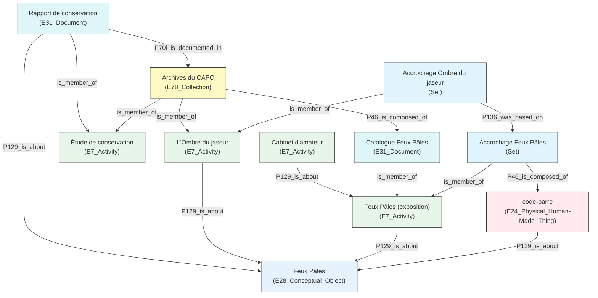

/** Notes **/

everything anchors to *Feux Pâles* the conceptual object (bottom), through `P129_is_about`. Each activity (top row) is a distinct, dated `E7_Activity` that *used* a specific curated holding or archive (`P16`). The 2014 rehang is not a copy of the 1990 one — it is a separate activity `based_on` it (`P136`).Linked art argued an exhibition has a  `Set` membership (`is_member_of`) rather than CRM's dedicated `E78_Curated_Holding` class. A Set is a container, giving more flexibility and having the possibility to includ non Human-made objects. It has been the choice made by our ontologist for display.  

CIDOC-CRM lets me connect activities through P16, "used specific object," and P129, "is about." The conceptual object *Feux Pâles* sits at the centre, and every activity, every set, every document points back to it through P129. What P129 alone cannot express is that the 2014 activity is a *rehang of* the 1990 one rather than an independent reference to it, which is why I add P136, "was based on," directly between the two curated holdings.

===vvvvvv===

### Proposed mapping in LRMoo

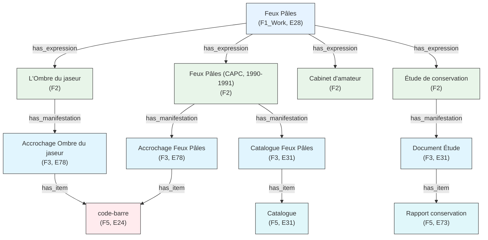

/** Notes **/

LRMoo gives a clean four-level hierarchy from Work down to Item, and *Feux pâles* itself sits comfortably as the Work from which every activation descends as an Expression. It is the cleanest of the three mappings. But that cleanliness has a condition: you have to accept that *Feux pâles* is a Work in Goodman's sense, and that its Expressions are its activations, whether or not Thomas himself directed them. Accept that, and the hierarchy holds. Refuse it, and the whole mapping collapses back into the authorship question I raise next.

===vvvvvv===

### Result

Exhibitions can be modelled as relational, performative artifacts, but only if the model **anchors every trace to the event itself**, not to a finished object.

- CIDOC-CRM and Linked Art: activities and holdings connected through `P129_is_about`, genealogy preserved through `P136_was_based_on`
- LRMoo: the exhibition as a Work whose Expressions are its successive activations, whoever conducts them

**Documentation practice must therefore track the exhibition as an unfolding chain of activations**, not close it at its first occurrence.

/** Notes **/

So, to answer the first question directly: exhibitions can be conceptualized as relational and performative artifacts, provided the model anchors every trace back to the event itself rather than to a single finished object. CIDOC-CRM and Linked Art let me do this through activities and holdings tied together by "is about" and "was based on." LRMoo lets me do it by treating the exhibition as a Work whose Expressions are its successive activations, whether or not the original artist conducted them. What this demands of documentation practice is a shift in default posture: track the exhibition as an unfolding chain, don't close it at its first occurrence.

===>>>>>>===

## 2. What are the **epistemological limits** of existing heritage ontologies when applied to exhibitions that deliberately destabilize authorship, identity, and temporal boundaries?

### Philippe Thomas's fictionalism

Thomas's explicit goal was to make his own name disappear. For his own artworks, he found a real or fictional signatory: the collector had to agree to sign the piece and thereby become its author.

> "What I claimed to do is a fiction that leaves the text, that leaves the frame where it is usually expected."
> Philippe Thomas, interview with Stéphane Wargnier

**Example of the network of clues**
- Title *Feux pâles* echoes Nabokov's *Pale Fire*
- Catalogue subtitle, "une pièce à conviction," recurs across his other works
- An exhibition journal, distributed to visitors, seeds further indices
- Discovery is gradual, uneven, and for many visitors, never complete

/** Notes **/

Philippe Thomas's explicit goal was to make his own name disappear is a great exemple. For each work, he found a real or fictional signatory. The collector had to agree to sign the purchased piece and thereby become its author. With his gallerist and collaborator Claire Burrus, every detail was calculated so the fiction would be as credible as possible. Each piece serves his larger project: the fiction itself. As he put it in an interview, fiction is usually confined to a book, a frame, a screen. What happens when the book, the screen, or the frame are themselves caught up in a fabricated story? The first clues sit in the title itself, which echoes Nabokov, and in a catalogue subtitle he reused across other works. An exhibition journal, handed to visitors, seeds further indices. For most visitors, the fiction is discovered only partially, if at all.

But to document as a conservator, we need to know, to preserve the work integrity.

===vvvvvv===

### ® (barcode)
*Acrylic on canvas, 97×130 cm — Inv. 1991-20, capc*

| Fact | CIDOC-CRM | OntoExhibit |
|---|---|---|
| **Authorship**: signed capc, conceived by Thomas via the agency | `E65_Creation` + `P14_carried_out_by` → one slot, several legitimate fillers: capc? Thomas? agency? | `onto:hasAuthor` — same problem, single authorship presupposed |
| **Hybrid status**: artwork AND scenographic element AND exhibition title | `E22_Man-Made_Object` — no class distinguishes the co-constitutive role | `onto:ExhibitedItem` — captures display role, not co-constitution |
| **Fictive transaction**: the barcode is the "product" delivered by the agency to the capc | No class exists for a fictive transaction — `E8_Acquisition` presupposes a real transfer | No class for contractual fictions |
| **Legal status of agency**: "owner" in 1990, but no legal existence | `E8_Acquisition` for 1991 — agency cannot be `E40_Legal_Body` | Same gap |


/** Notes **/

An example is a barcode-like acrylic painting, signed capc, conceived by Thomas through the agency. In CIDOC-CRM, "carried out by" forces a choice, the capc, Thomas, or the agency, and there is exactly one slot for what is really three legitimate answers. Neither model has a class for the object's hybrid status, simultaneously artwork, scenographic element, and exhibition title. And neither has a class for a fictive transaction, nor for an agency with no legal existence acting as a 1990 owner. Three different ways of breaking, on one object.

===vvvvvv===

## Curate: story versus plot

The Curate ontology separates:
- **Story**: a set of factual events
- **Plot**: a subjective interpretation imposing relations (causality, influence) on those events

Because one story can support several plots, multiple non-contradictory interpretations of the same events can coexist, each with its own justification.

/** Notes **/

The Curate ontology offers one useful distinction here: story, a set of factual events, and plot, a subjective interpretation that imposes relations like causality onto those events. Because the same events can be interpreted differently, Curate allows multiple plots over one story, each with its own justification. Another multi discourse is on interpretation by people.

===vvvvvv===

## Conceptions of the exhibition

<div class="two-col">
<div>

**capc Bordeaux**
The exhibition has no special status among the Froment-period programme. Conservation and publicity fall outside the museum's mandate.

**Claire Burrus** *(artist's estate)*
The work is non-reproducible. Transmission is exclusively documentary. Reconstitution is unthinkable.

</div>
<div>

**Emeline Jaret** *(estate collaborator, art historian)*
Reconstitution requires rigorous documentary accompaniment. *L'Ombre du jaseur* was not *Feux pâles*: the context was too different to be experienced as such.

**MAMCO Geneva**
*L'Ombre du jaseur* is a free interpretation, justified as such, not a reconstitution.

</div>
</div>

/** Notes **/

In 2017, interviewing the network of actors around *Feux pâles*, distinct and stable conceptions of what the work is emerged, each entailing its own position on reproducibility, on the catalogue, and on the legitimacy of any reactivation. And they genuinely differ. For the capc, the exhibition has no special status among the Froment-era programme, and conservation falls outside the museum's mandate. For Claire Burrus, as keeper of the artist's estate, the work is non-reproducible; transmission is exclusively documentary, and reconstitution is unthinkable. For Jaret, reconstitution requires rigorous documentary accompaniment, and the 2014 restaging was not *Feux pâles*, the context was too different to be experienced as such. For MAMCO, that restaging is a free interpretation, justified as such, not a reconstitution at all.

Four coherent, irreducible positions, on the same object. This is exactly what "situating the capture of metadata" has to mean in practice, and it is where I turn next.

===vvvvvv===

avec plot

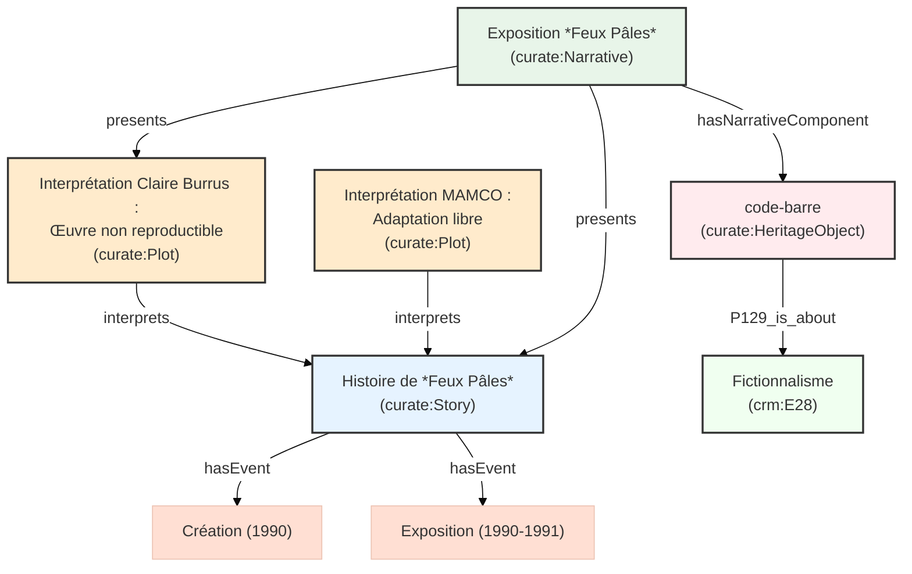


/** Notes **/

This diagram formalizes the four positions I just described. The Story stays neutral: it simply records that the barcode was created, that Feux pâles opened in 1990, and that L'Ombre du jaseur happened in 2014. Nothing there is contested. What differs is the Plot layer: Claire Burrus's plot asserts the work is non-reproducible; MAMCO's plot treats the 2014 restaging as a justified free interpretation. Both plots interpret the same story, and neither cancels the other. The Narrative node is what a given exhibition actually presents to its public: the 1990 show presents the story through the capc's plot, the 2014 show presents it through MAMCO's. And I want to draw your attention to the last edge: the barcode itself connects, through P129_is_about, directly to the concept of fictionalism. That's the graph making explicit what most visitors never notice on the wall.

===vvvvvv===

ajout de aaao

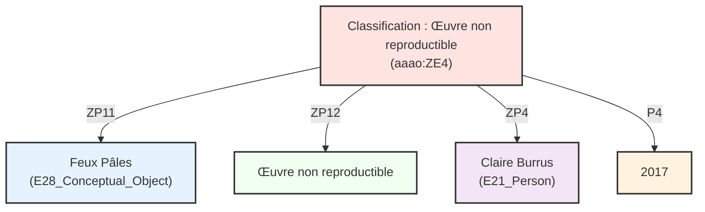


/** Notes **/

AAAo gives me a class I don't have in CRM or Curate: ZE4_Classificatory_Status. Rather than a property directly on the object, a classification is its own node, tied to four things at once — the subject being classified, the type of classification, the actor who made it, and when. Here: Feux pâles is classified as a "non-reproducible work," by Claire Burrus, in 2017. Because that classification is a first-class entity rather than a bare assertion, a second, different classification by someone else, at a different time, simply sits alongside it. Nothing has to be reconciled.

===vvvvvv===

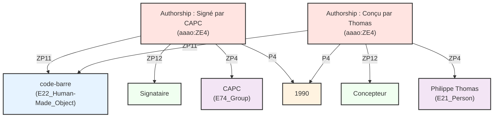

/** Notes **/

Here's the same mechanism solving the exact problem I flagged earlier with the barcode: CRM's single "carried out by" slot forcing a choice between the capc, Thomas, or the agency. With ZE4, I don't have to choose. One classificatory status records that the capc is the signatory; a second, independent one records that Thomas is the conceiver — both dated 1990, both held by named actors, both true at once. This is what I meant when I said the epistemological limit was representational, not technical: the moment the model lets an attribution be an event rather than a slot, the "problem" of Thomas's fictionalism simply stops being a problem for the graph.

===vvvvvv===

### Result

The epistemological limit is not primarily technical, it is representational: existing ontologies model **facts about a work**, when what *Feux pâles* actually requires is a model of **positions held about a work**, by named actors, for stated reasons, some of which are legitimately never disclosed.


/** Notes **/

So, to answer the second question: the epistemological limit is not primarily technical, it is representational. Existing ontologies model facts about a work. What Feux pâles actually requires is a model of positions held about a work, by named actors, for stated reasons, some of which are legitimately never disclosed.

===>>>>>>===

## 3. How can a documentary model accommodate **uncertainty, absence, and multiple equally legitimate situated perspectives** on the same event?

Every observation is:
- attributed to an **identified professional**
- **dated**
- assigned an **epistemic status**: certain, uncertain, false, historically valid but superseded, deliberately left undeclared or given through conditions

/** Notes **/

Quick callback to the point I opened with: sourcing information in conservation isn't a preliminary step before documentation begins, it is itself a constitutive act. Everything from here on is what that looks like once it's actually encoded, attributed, dated, and epistemically typed, every time, plus one more class I owe you, the sibling of opacity, for absences that were genuinely searched for and not found.

===vvvvvv===

## How CIDOC-CRM documents metadata, generically

<!-- Insert figure from Anaïs Guilhem's presentation on metadata enrichment here -->

Every technical solution in the next slides is a variation on **one recurring pattern**: `E13 Attribute Assignment`.

```turtle
ex:assignment_N a crm:E13_Attribute_Assignment ;
    crm:P140_assigned_attribute_to ex:the_object ;
    crm:P141_assigned ex:the_value ;
    crm:P177_assigned_property_of_type ex:the_property ;
    crm:P14_carried_out_by ex:the_actor ;
    crm:P4_has_time-span ex:the_period ;
    crm:P17_was_motivated_by ex:the_reason .
```

An attribute is never just "on" the object. It is **assigned**, by someone, at some point, for some reason — and CRM keeps that assignment as a first-class, citable entity in its own right.

/** Notes **/

Before the specific cases, one general point about how CIDOC-CRM actually documents metadata, because every solution in the next few slides is a variation on the same pattern. An attribute is never simply attached to an object as a property. It is assigned, through an E13 Attribute Assignment event, by a named actor, at a dated moment, motivated by a stated reason. That event is itself an entity in the graph, which can be cited, contested, and superseded. Everything I am about to show you, belief values, lacunae, superseded titles, condition states, is this same pattern, specialized for a different kind of situation.

===vvvvvv===

## Fuzzyness / uncertain information

*I see an artwork in a photograph and believe it matches a catalogue entry — but only plausibly, not certainly.*

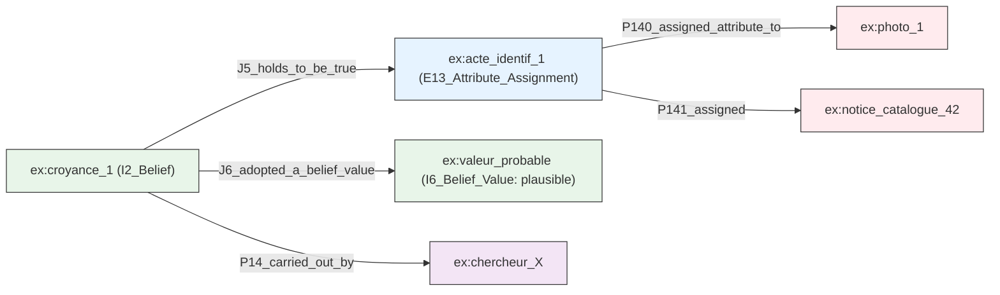

*Note: I use a qualitative label from a controlled scale ("plausible") rather than a decimal. A single researcher's number, unaccompanied by a calibration method, claims more precision than the judgment behind it actually has.*

/** Notes **/

The first is fuzzy or uncertain information. Say I see an artwork in a photograph and believe it plausibly matches a given catalogue entry. CIDOC-CRM does not natively carry a way to qualify that; its attribute assignment is binary. The more robust, academically defensible solution is the CRMinf extension, which separates the proposition itself from the belief held about it, a related but genuinely distinct formalism from a bare E13, not the same class reused. I want to flag a choice I made deliberately: I use a qualitative label, "plausible," from a controlled scale, rather than a decimal.

**CRMinf separates the proposition from the belief held about it** — two researchers can hold different beliefs about the same act without contradiction in the graph. This is a *related but distinct* formalism from a bare `E13`: it reifies belief around a proposition, rather than assigning a value directly.

===vvvvvv===

## Missing information (lacuna)

*An artwork appears in a photograph, but its title and date are unknown.*

CRM's open-world logic already treats absence of assertion as absence of knowledge, not negation. The real need: declare that a **search was undertaken and came back empty**.

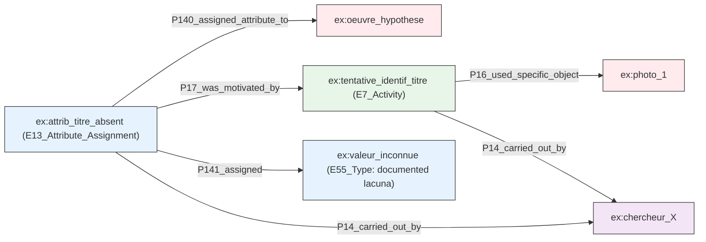

/** Notes **/

The second is missing information, a lacuna. I see an artwork in a photograph, but its title and date are simply unknown. CRM, working in an open-world logic, already treats absence of assertion as absence of knowledge rather than as negation, which is a good default. But the real problem is different: I want to declare explicitly that a search was undertaken and came back empty, so that the gap reads as documented rather than as a simple oversight. My first version of this used a typed placeholder node per property, which worked but did not scale. The version I now use folds the lacuna back into the same E13 Attribute Assignment pattern: the assignment points to a shared, controlled "unknown" value, and its motivation points to the search activity that failed to resolve it. 

===vvvvvv===

### 
<!-- Insert image-6: the display case, room 8, "Le musée réfléchi" -->

*An unidentified graphic work, contained in a box, appears in the display case of room 8, "Le musée réfléchi." No caption, no inventory number, no mention in the catalogue or the press file.*

```turtle
XX:XX_Attribute_Missing a owl:Class ;
    rdfs:subClassOf crm:E13_Attribute_Assignment ;
    rdfs:label "Attribute Missing"@en ;
    rdfs:comment "An attribute assignment that records the documented absence of a value for a property after a search activity."@en .
```

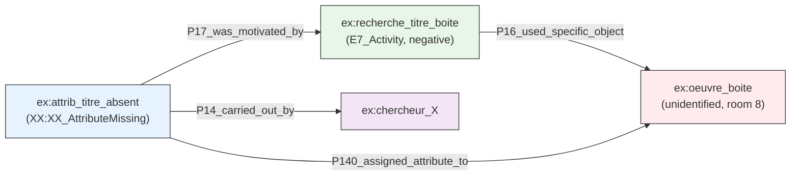

/** Notes **/

**Because `pir:AttributeMissing` is its own declared class**, the title's status is directly queryable rather than inspected value by value — a single real artefact routinely needs several small mechanisms like this at once, layered on different properties of the same node.

A concrete instance from the corpus itself: an unidentified graphic work, in a box, visible in the display case of room 8, "Le musée réfléchi." Uncaptioned, absent from the catalogue and the press file. We can create One new, named class, `XX:XX_AttributeMissing`, makes the title's status directly queryable rather than inspected value by value. A single real artefact routinely needs several small mechanisms at once, layered on different properties of the same node.

===vvvvvv===

## Superseded or contradicted information

*A title, once accepted, is today judged offensive and has been formally replaced, but the historical fact must be kept.*

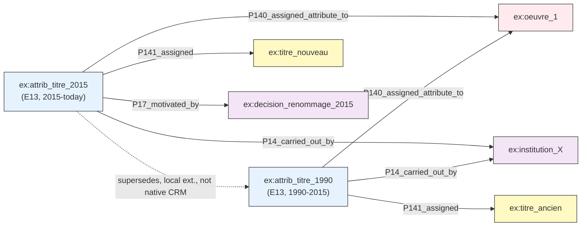

/** Notes **/

The third is superseded or contradicted information. The underlying mechanism is the same one used for the fuzzy case: each successive attribution is a distinct E13 Attribute Assignment, dated through a time-span, carried out by a named actor. Nothing is overwritten; everything accumulates. The 1990 attribution stays in the graph, carrying its own time-span. The 2015 attribution sits alongside it, motivated by a documented renaming decision. What CRM lacks natively is an explicit "supersedes" link, shown here as the dashed edge, clearly marked as a local, non-standard extension.

===vvvvvv===

### *Klappensonnenuhr* [Portable sundial]
*Thomas Tucher, Nuremberg, 17th c. — Ivory, bronze — KHM Vienna, Inv. 9826*

| Fact | CIDOC-CRM | OntoExhibit |
|---|---|---|
| **Lender in 1990**: Kunsthistorisches Museum Vienna | `E10_Transfer_of_Custody` + `P28_custody_surrendered_by` → KHM ✓ | `onto:LoanAgreement` ✓ |
| **Current owner unknown**: looted from Clarisse Rothschild, restitution unresolved | `P52_has_current_owner` is single-valued: one slot, competing claims have no representation | No class for disputed ownership or pending restitution claims |
| **Epistemic status** (2017): data valid in 1990, obsolete and contested in 2017 | No native mechanism for dating epistemic status; `CRMinf I2_Belief` exists | No degrees of certainty, no temporality of documentary observations |

> The model either gives **a false answer** or **no answer**. It cannot give an **honest uncertain one**.

/** Notes **/

a seventeenth-century portable sundial, lent by the Kunsthistorisches Museum Vienna, and looted at some point from Clarisse Rothschild, with restitution still unresolved. CIDOC-CRM's "has current owner" property is single-valued, one slot for what should be two competing claims. And neither model has a native way to date epistemic status. "Owner: KHM Vienna" was true in 1990. By 2017 it is contested. The model can only give a false answer, or no answer. It cannot give an honest, uncertain one.

===vvvvvv===

### I3 Belief Adoption: dating the change of mind itself

*The sundial's ownership belief moves from "KHM Vienna, uncontested" (pre-2017) to "KHM Vienna, contested, restitution claim pending" (2017–), and the graph should record exactly when that shift happened and who made it.*

*(Sourcing note, held from earlier: the exact `J1`/`J2` property labels below vary across CRMinf RDFS versions, check against the version in use before reuse, same caveat as the AAAo slide.)*

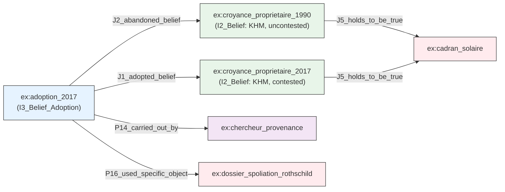

**I3 Belief Adoption** is the event that links the two beliefs: it does not just replace one value with another, it records *whose* research act caused the shift, and *on the basis of what*.

/** Notes **/

One more use of the CRMinf mechanism, this time for the sundial. Before 2017, the belief that the Kunsthistorisches Museum owned it, uncontested, sat quietly in the graph. In 2017, a new belief appears, still KHM, but now contested. I3 Belief Adoption is the event that connects the two: it records who caused the shift and what evidence prompted it. Same discipline as the AAAo slide, these exact property labels are version-dependent, check before reuse.

===vvvvvv===

Glissant's *droit à l'opacité*: information can be **voluntarily withheld**, by principle or by condition, rather than absent by accident.

> "Le droit à l'opacité... n'est pas l'enfermement dans une particularité impénétrable. C'est l'accord donné à ces pratiques du monde qui se proposent à la Relation universelle."
> *"The right to opacity... is not enclosure in an impenetrable particularity. It is the consent given to those practices of the world that offer themselves to universal Relation."*
> Glissant, *Poétique de la Relation*, 1990 (my translation)

**Absence and opacity are legitimate epistemic stances**, not failures to be remedied.

/** Notes **/

Here is the most critical point. Up to now, we have treated absence of data as a problem to be solved. But what if that absence is intentional?

Some actors do not withhold information by accident. They decline to disclose it by principle, in the sense Glissant gives to the right to opacity. Absence and opacity, in this framework, are legitimate epistemic stances, not deficiencies to be corrected.

So meta-data can be shared but under certain conditions. How to make them querable within ethics ?

===vvvvvv===

Proposition : 
```turtle
XX:XX_Undisclosed a owl:Class ;
    rdfs:subClassOf crm:E13_Attribute_Assignment ;
    rdfs:subClassOf crm:E73_Information_Object ;  # 
    rdfs:label "Undisclosed Attribute"@en ;
    rdfs:comment "An attribute assignment that records the deliberate withholding of a value, motivated by ethical, legal, or cultural principles."@en .
``` 
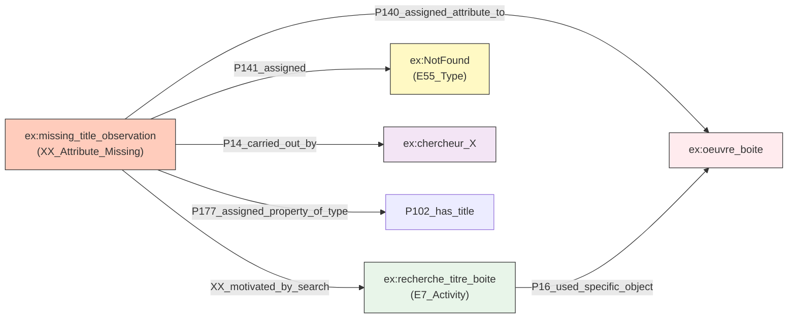

===vvvvvv===

### Result

Uncertainty, absence, and plural perspectives are all instances of **one underlying design philosophy**, not one literal mechanism: replace the atemporal, single-valued assertion with a dated, attributed, accumulating event.

- Belief (CRMinf `I2`) instead of binary assignment — *a related but distinct formalism from a bare `E13`*
- `XX:XX_AttributeMissing` — a search activity causally linked to a documented non-result
- Successive `E13` assignments instead of overwriting
- `I3 Belief Adoption` to date the moment a position itself changed

/** Notes **/

So, to answer the third question, and be precise rather than tidy about it: uncertainty, absence, and plural perspectives are not literally the same class wearing different clothes. CRMinf's belief reifies belief around a proposition, a related but genuinely distinct formalism from a bare E13. AttributeMissing and OpacityAssertion are siblings under E13, declared as their own named classes precisely so the difference between "searched, not found" and "known, withheld" is carried by the type itself. What unifies all of it is a shared design philosophy, not one mechanism: replace the atemporal, single-valued assertion with a dated, attributed, accumulating event. And I want to close the loop I opened at the very start: Drucker's point that data is never raw, it is capta, taken rather than given. Every mechanism I've shown you is that argument made operational.

===>>>>>>===

## What an adequate model would require

An exhibition documentary model must be capable of:

1. Representing **distributed and shifting authorship**
2. Integrating **heterogeneous documentary traces** without enforcing artificial coherence
3. Preserving **contradictory or parallel interpretations**
4. Encoding **epistemic status and degrees of uncertainty**
5. Modelling **non-linear and recursive temporalities**
6. Documenting **absences, silences, and opacity** as meaningful conditions, not deficiencies
7. Supporting **iterative enrichment** over time rather than closure through final description

/** Notes **/

Pulling this together, an adequate exhibition documentary model needs to do seven things: represent distributed and shifting authorship; integrate heterogeneous traces without forcing artificial coherence; preserve contradictory or parallel interpretations; encode epistemic status and degrees of uncertainty; model non-linear and recursive temporalities; document absences and opacity as meaningful conditions, not deficiencies; and support iterative enrichment over time, rather than closure through a final description. I favour small, composable extensions of existing patterns over one large new ontology, and I favour naming gaps and pointing at adjacent domains over building a competing standard. I am not proposing a finished ontology today. I am proposing a diagnostic vocabulary, and a set of requirements, to guide that work.

===vvvvvv===

## Concrete application

- A **structured dataset**, built to study the exhibition
- **Display v2**, developed with David Valentine and Emmanuel Château-Dutier, for exhibition documentation research
- A **practical guide for museums**, through the ICOM Documentation Working Group

/** Notes **/

A structured dataset, built to share my messy data in an querable way. The second version of Display, the tool David Valentine, Emmanuel Château-Dutier and I are building for exhibition documentation research. And a practical guide for museums, through my work chairing the ICOM Documentation Working Group. Feux pâles itself is the proof of concept for all of it: a small enough dataset that I can hand-verify every claim in it, and complex enough that it has broken, usefully, every ontology I have tested against it.

===vvvvvv===

## Conclusion

<div class="two-col">
<div>

**What this research demonstrates**
- Modelling choices embody values
- Documentation practices shape cultural memory
- Small, carefully structured datasets support nuanced engagement when approached interpretively

</div>
<div>

**The broader stakes**
- Engagement is not only a matter of access
- It is a question of how cultural phenomena are modelled
- Whose expertise informs that modelling
- What forms of knowledge the resulting structures enable or foreclose

</div>
</div>

/** Notes **/

*Feux pâles* is not an exceptional case but it is a messy one. It is a particularly legible instance of a broader condition: exhibitions whose meaning depends on the very instability, multiplicity, and opacity that conventional documentation seeks to eliminate.

Approached interpretively rather than exhaustively, a small, carefully structured dataset like this one can support genuinely nuanced engagement with a complex cultural event. That connects to an ongoing conversation in digital humanities around small data and responsible computational practice, the idea that **rigour does not require scale**, and that the quality of the structure matters more than the size of the corpus.

What this shows, more broadly, is threefold. Modelling choices embody values. Documentation practices shape cultural memory. And small, well-structured datasets, treated with care, can do work that large ones often cannot.

And the stakes go beyond access. This is a question of how cultural phenomena get modelled, whose expertise informs that modelling, and what forms of knowledge the resulting structures enable, or foreclose. 


===>>>>>>===

Thank you!

And to the different ontologists and the CIDOC group for their work. Also Emmanuel Château-Dutier and David Valentine from l'Ouvroir.

This work is supported by a grant ("2005778") from the Fonds de recherche du Québec, and this presentation by Udem International and the CRIHN.

zoe.renaudie@umontreal.ca

/** Notes **/

Thank you. I also want to thank the ontologists and the CIDOC group whose work this builds on, and Emmanuel Château-Dutier and David Valentine at the Ouvroir. This work is supported by a grant, number 2005778, from the Fonds de recherche du Québec, and my presence here today by Université de Montréal International and the CRIHN. I am happy to take questions.

===vvvvvv===

## References

<div style="font-size: 0.55em; text-align: left; columns: 2; column-gap: 2em;">

Altshuler, B. (2008). *Salon to Biennial*. Phaidon.

Berners-Lee, T., Hendler, J., & Lassila, O. (2001). The Semantic Web. *Scientific American*, 284(5).

Bruseker, G. et al. (2025). The Semantic Reference Data Modelling Method. *Journal of Open Humanities Data*, 11(1).

Ciula, A. et al. (2023). *Modelling Between Digital and Humanities*. Open Book Publishers.

Delhalle, H., & Aurégan, X. (2021). La décolonialité du patrimoine. *Géographie et cultures*, 117.

D'Ignazio, C., & Klein, L. (2020). Why Data Science Needs Feminism. *Data Feminism*.

Doerr, M. (2003). The CIDOC Conceptual Reference Module. *AI Magazine*, 24(3).

Drucker, J. (2021). *The Digital Humanities Coursebook*. Routledge.

Glissant, É. (1990). *Poétique de la Relation*. Gallimard.

Goodman, N. (1978). *Ways of Worldmaking*. Hackett.

Hölling, H. B. et al. (2024). *Performance: Ethics and Politics of Conservation, Vol. II*. Routledge.

Martini, F., & Taramarcaz, J. (2023). *Feminist exposure*. Art&fiction.

Moreau, L., & Missier, P. (Eds.) (2013). PROV-O: The PROV Ontology. W3C Recommendation.

Padilla, T. (2017, 2018). Collections as data / On a Collections as Data Imperative. *OCLC / College & Research Libraries News*.

Parcollet, R., & Szacka, L.-C. (2013). Écrire l'histoire des expositions. *Culture & Musées*, 22(1).

Renaudie, Z. (2017). Le monde de Feux pâles. Mémoire de recherche, ESA Avignon.

Renaudie, Z. (2020). The world of "Pale Fires". *ICAR*, 4.

Richter, D., & Drabble, B. (2015). Curating Degree Zero Archive. *ONCURATING.org*, 26.

Riva, P., Žumer, M., & Aalberg, T. (2022). LRMoo. IFLA WLIC 2022.

Rodriguez Ortega, N. et al. (2022). OntoExhibit. V. 1.1.0.

Rodríguez-Ortega, N. (2024). Contours of Knowledge. *Život Umjetnosti*, 114(1).

Denard, H. (Ed.) (2009). The London Charter for the Computer-Based Visualisation of Cultural Heritage.

Takin solution & SARI. (2025). Art and Architectural Argumentation Ontology. Version 2.

Tietz, T., Bruns, O., & Sack, H. (2023). A Data Model for Linked Stage Graph. SWODCH'23.

Valentine, D., Château-Dutier, E., & Renaudie, Z. (2024). The Display Ontology. Version 0.1.

Belteki, D., Rees, A. J., & Sichani, A.-M. (2025). Datafication and Cultural Heritage Collections Data Infrastructures. *Journal of Open Humanities Data*.

Dişli, M., Gabriëls, N., Chambers, S., Ames, S., Knazook, B., & Candela, G. (2025). Exploring the adoption of collections as data in the GLAM context. *Inf. Res.*, 30, 65-77.

Hansson, K., Näslund Dahlgren, A., & Cerratto Pargman, T. (2022). Datafication and Cultural Heritage. *Information & Culture*, 57, 1-5.

Humbel, M., Nyhan, J., Pearlman, N., Vlachidis, A., Hill, J., & Flinn, A. (2024). Socio-cultural challenges in collections digital infrastructures. *J. Documentation*, 81, 56-85.

Llewellyn, C., Shapland, A., Bonnet, T., Sanderson, R., Page, K., Bhaugeerutty, A., Shipp, K., Davis, K. K., Payne, J., & Delmas-Glass, E. (2025). Enriching exhibition scholarship. *Digit. Scholarsh. Humanit.*, 41, 188-.

Monaco, D., Pellegrino, M. A., Scarano, V., & Vicidomini, L. (2022). Linked open data in authoring virtual exhibitions. *Journal of Cultural Heritage*.

Rajan, A. (2025). Exploring exhibition design. *InfoDesign*.

Rodwell, J. C., & Whitelaw, M. (2024). From Inception to Interface. *Parergon*, 41, 161-187.

Vlachidis, A., MacDonald, I., Valeonti, F., Nyhan, J., & Sloan, K. (2025). A Data Atlas Method for Analysing and Visualising Dispersed Cultural Heritage Collections. *magazén*.

Yon, A. (2024). Collection Data: Sharing, Discovery, Inspiration, and Innovation. *Art Libraries Journal*, 49, 85-94.

Yu, J.-E., & Lee, Y. (2022). The Factors of Exhibition Viewing Experience Using Visitors' Reviews as Big Data. *Archives of Design Research*.

</div>

===vvvvvv===

###  *La Collection de Monsieur Georges Venzano*
*B&W photograph, 247.5×360 cm (3 panels) — Gal. Claire Burrus — Inv. 1991-21, capc*

| Fact | CIDOC-CRM | OntoExhibit |
|---|---|---|
| **Displayed author**: [capcMusée] actually Philippe Thomas fictionalizing the institution as author | `E21_Person` or `E40_Legal_Body`: neither can express an institution staged as fictive author | `onto:hasAuthor` presupposes a real identifiable agent |
| **Georges Venzano**: fictive "collector" whose name appears in the title | No class for non-narrative fictive persons produced by an artistic device | No distinction between real and fictive persons in exhibition metadata |
| **Sale circuit**: Gal. Claire Burrus → capc 1991 — but the sale is part of the artistic fiction | `E8_Acquisition` models the 1991 transaction — but erases the fictive dimension | Cannot encode a commercial transaction that is simultaneously an artistic gesture |

/** Notes **/

a photograph credited to "the collection of Monsieur Georges Venzano." Venzano does not exist. In the exhibition it is not displayed as an artwork but as documentation. It is, however, an artwork by Philippe Thomas. The sale that brought the piece from Claire Burrus's gallery to the capc, at the close of the exhibition, is real, and simultaneously part of the artistic fiction. The fiction does not just touch the artwork, it touches the metadata itself: title, author, and collector are all fictional, and none of the models tested distinguish a real person from a fictive one. Every row here fails the same way: not one slot with too many fillers, but no slot at all.


===vvvvvv===

## Situer la documentation


===vvvvvv===

## Naming the missing classes

Two named gaps, from AAAo. **Not a new ontology** — a diagnostic: what's missing, and where a real fix would likely borrow from.

| Gap | What's missing | Where a fix likely already exists |
|---|---|---|
| Regimes, not facts | a class grouping related facts under one held position | Not fully in PROV-O; closest to a named `prov:Agent`-scoped bundle |
| Opacity is a stance | a class for deliberate, principled non-disclosure | Partially: paradata / null-value conventions (London Charter, Getty AAT), though these mark *absence*, not *declared refusal* |
| Documented absence | a class for a search that genuinely failed | Closer to `prov:Invalidation` / `prov:wasInvalidatedBy`, repurposed |

**I use the label `pir:` for these three, purely as shorthand for this talk** — a name for the gap, not a submission to a working group.

/** Notes **/

Here is where the two AAAo gaps get named, not solved from scratch. I want to be careful about what I'm claiming: this is not a new ontology. It's three gaps, named, with a pointer to where a real implementation would likely borrow from. A class that groups related facts under one held regime isn't fully covered by PROV-O, the closest analogue is a named, agent-scoped bundle of assertions, but nothing quite matches. A class for deliberate, principled non-disclosure is partially covered by paradata and null-value conventions from the London Charter and from Getty's AAT, but those mark that something is absent, not that someone actively refused to share it, which is a different claim. And documented absence, a search that genuinely failed, is closer to PROV-O's invalidation pattern, repurposed for a slightly different situation. I'm using the label `pir:` purely as shorthand for the rest of this talk, to keep the three gaps visually distinct on the slides, not as a claim that I've built or submitted a competing standard.

===vvvvvv===

### Opacity, made queryable — and a tension I want to name, not resolve

*Philippe Thomas's signature is deliberately absent from the barcode work. That absence is the artwork's founding gesture, not a documentation gap, the same scene from the start of this section.*

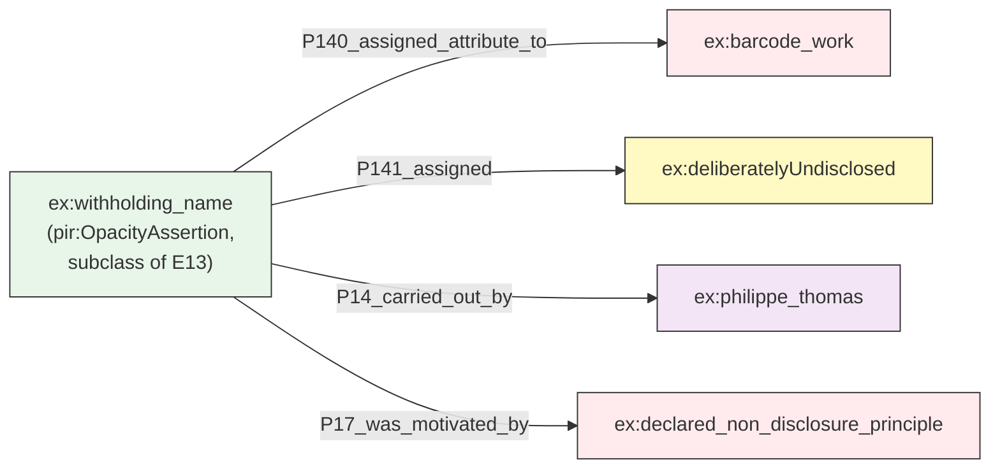

`pir:OpacityAssertion` is declared once as a subclass of `E13_Attribute_Assignment`, so a query for "everything deliberately withheld" no longer has to inspect assigned values one at a time.

**The tension, named rather than dissolved**: this diagram makes refusal *queryable*. A sharp question, and a fair one, is whether turning a principled non-disclosure into a citable, queryable RDF class reproduces exactly the extractive logic that non-disclosure was meant to resist. I don't think this fully resolves. I keep `pir:OpacityAssertion` deliberately thin, actor, motivation-type, date, nothing more, precisely so it records *that* a refusal happened without narrating *what* was refused.

/** Notes **/

Here is the pattern named a moment ago, made concrete, and I want to use the example that matters most for this talk: Philippe Thomas's own name, absent from the barcode work. That absence is not a documentation gap, it is the artwork's founding gesture, the same one I described earlier in this section. The class itself, OpacityAssertion, subclass of E13, already tells you this is a deliberate withholding, not a search that came up empty, without needing to inspect a value to guess intent.

And I want to sit with something rather than resolve it. Making a refusal to disclose into a citable, queryable class is exactly the kind of move that should give us pause. Formalizing opacity into structured, queryable data risks doing the thing the concept was invoked against, extracting a position, cataloguing a silence. I don't have a clean answer to that. What I've tried to do, practically, is keep the class thin on purpose, actor, a motivation type, a date, nothing that narrates the content of what was withheld, so the graph can register that a principled refusal occurred without performing the extraction itself. I'd rather name that as an open tension than pretend the RDF resolves it.

===vvvvvv===

## Toward situated, ethical metadata

If we accept that:
- facts are **situated** (actor, time, source) — AAAo already does this
- regimes of truth are coherent but **relative** — no existing model fully does this
- opacity is an **ethical choice**, not a lack — no existing model fully does this

...then capturing metadata can no longer be treated as neutral, technical, a-temporal field-filling. It becomes a **situated, political act** — this is Drucker's *capta*, from the start of this talk, now operational in RDF.

<div class="two-col">
<div>

**1. Metadata as an act, not a property**
Not "*Feux pâles* is non-reproducible" (absolute), but "Claire Burrus asserted, in a 2017 interview, that *Feux pâles* is non-reproducible."
→ The graph stores **positions held**, not **the truth about the work**.

**2. Opacity as structured data**
Not an empty field (unknown, or forgotten), but "Thomas declared, through the agency, that his authorship is deliberately undisclosed."
→ Silence becomes semantically rich, not a cataloguer's error.

</div>
<div>

**3. Provenance includes the regime of truth**
Documenting *why* a statement takes the form it does: a principled estate position? a legal constraint on the museum? a retrospective historian's interpretation?
→ The model captures the **normative context** that produced the metadata, not only the metadata itself.

</div>
</div>

/** Notes **/

If we accept those three points, then capturing metadata can no longer be treated as a neutral, technical, timeless act of filling in fields. It becomes political, ethical, and situated, and it is exactly the capta point I asked you to hold at the start of this talk, now built out in RDF rather than left as a theory slide.

Concretely, this means three things. First, metadata is no longer a property of the object but an act of an actor. Second, opacity becomes structured data in its own right, which is what we just looked at, and named the tension in. Third, provenance has to include the regime of truth that produced the statement.


===vvvvvv===


### Two gaps

<div class="two-col">
<div>

**1. Burrus's position on reconstitution, on the catalogue, and on legitimacy are not three independent facts: they derive from one coherent regime. AAAo attaches to a single entity at a time; it cannot encapsulate the regime itself.

</div>
<div>

**2. Some actors decline to disclose, by principle, not by accident. AAAo assumes every fact is ultimately exposable and decomposable.

</div>
</div>

/** Notes **/

Two gaps are showing. First: the regime, not the isolated fact, is the real unit of analysis. Burrus's position on reconstitution, on the catalogue, and on legitimacy are not three independent facts, they derive from one coherent regime centred on fidelity to the artist's intentions, and AAAo has no mechanism to encapsulate a regime that organizes several facts together. Second: some actors do not withhold information by accident. AAAo presumes every fact is, in the end, exposable. Both are structural limits, not missing data points, and both are exactly what the diagnostic vocabulary I'm about to name addresses.


===vvvvvv===

## Three ruptures, named


| Rupture | What happens | Where we saw it |
|---|---|---|
| **Forced choice** | One slot, several legitimate fillers | Barcode authorship; sundial's single-valued owner |
| **Structural silence** | No class exists at all | Fictive transaction, agency's legal status; every Venzano row; sundial's undated epistemic status |
| **Flattening** | A class exists, but collapses a plural or co-constitutive status into one dimension | Barcode's artwork / scenography / title status |

**This typology, not any single ontology, is the first result of this inquiry.** It travels: it's what I'll test next against a case that has nothing to do with deliberate fiction.

/** Notes **/

Now that you've seen three separate objects break three separate models, here is the vocabulary for what they have in common, named after the fact, not asserted in advance. A forced choice, one slot, several legitimate fillers, the barcode's authorship, the sundial's single owner field. A structural silence, no class at all, the fictive transaction, the agency's legal status, everything about Venzano, the sundial's undated epistemic status. And flattening, a class exists but collapses a plural status into one dimension, the barcode's hybrid artwork-scenography-title status. This typology, not any one ontology, is the first real finding here. The obvious challenge to it is that I've derived it from a single, deliberately deceptive, atypical artwork. I take that challenge seriously enough to test it directly, next.


===vvvvvv===

## A second case, to test portability

*Feux pâles* is an outlier by design. Does the typology survive a case with no artist trying to trick anyone?

**Illustrative comparator** *(placeholder for a fuller second case study — swap in a confirmed exhibition from the corpus when available; the argument's shape won't change)*: a travelling group exhibition of anonymous or collectively attributed community objects, no fictionalizing artist involved, ordinary institutional documentation throughout.

- **Forced choice recurs**: a single `P14_carried_out_by` slot still cannot hold "made collectively, by an unrecorded group," without picking one nominal author
- **Structural silence recurs**: no ordinary heritage ontology has a class for *collective, deliberately unattributed* authorship, as opposed to *authorship that happens to be unknown*
- **Flattening recurs**: community loan agreements routinely fold "custodian" and "rights-holder" into one property, even when a lending community explicitly holds those as separate, non-transferable roles

**The three ruptures are not an artifact of Thomas's trick.** They recur wherever documentation practice assumes a single author, a fully exposable fact set, and one dimension per property — which is most of the time, not only in adversarial cases.

/** Notes **/

I want to take the N of one problem seriously rather than wave it away. Feux pâles is an outlier by design, an artist deliberately trying to defeat documentation. So does the typology hold anywhere else? I'll flag honestly that what follows is an illustrative sketch, not a fully worked second case study, that work is ongoing and I'd rather show you the shape of the argument than overstate how far along it is. Take an ordinary travelling group exhibition of anonymous or collectively attributed community objects, nobody is trying to deceive anyone here. The same forced choice shows up: one slot for carried-out-by still can't hold "made collectively, by a group nobody individually recorded." The same structural silence shows up: heritage ontologies distinguish unknown authorship from deliberately collective, unattributed authorship poorly or not at all. And the same flattening shows up: loan agreements often fold custodianship and rights-holding into one property even where a lending community insists on keeping them separate. None of Thomas's specific tricks are present, and the typology still bites. That's the argument for portability, sketched rather than fully proven, and it's exactly the kind of thing a second full case study, which I'm planning, should nail down properly.

**What is new here, beyond applying standard CRMinf reification to a striking case study?** Three things, named explicitly:

1. **The three-ruptures typology** (forced choice / structural silence / flattening), named only after the evidence, and tested, provisionally, against a second, non-adversarial case
2. **Regime, and opacity, and documented absence, named as gaps** in existing specifications, with an explicit pointer to where PROV-O and paradata conventions already do part of this work
3. **The Glissant tension held open, not resolved**: making refusal queryable is itself worth interrogating, and I've tried to design the thinnest possible class rather than pretend the RDF settles the ethics

The CRMinf material earlier in this talk is deliberately not the contribution, it is the demonstration that the diagnosis is implementable within existing infrastructure, at low cost, without a large new ontology.


I want to close by answering directly a question I expect from this room: what is actually new here, beyond applying well-established CRMinf reification patterns to a striking case study? Three things, named plainly. The three-ruptures typology, named only after showing you the evidence, and tested, admittedly provisionally, against a second case with no fictionalizing artist in sight. Naming regime, opacity, and documented absence as gaps in existing specifications, with an honest pointer to PROV-O and paradata conventions rather than a claim to have invented something from nothing. And holding the Glissant tension open rather than resolved, because making a refusal queryable deserves real scrutiny, not just a citation.

Everything you saw under CRMinf is not itself the contribution. It's the proof that the diagnosis can be built on infrastructure that already exists, cheaply, without a new ontology from scratch.

*Feux pâles* is not an exceptional case. It is a particularly legible instance of a broader condition. Modelling choices embody values. Documentation practices shape cultural memory. And the stakes go beyond access: this is a question of how cultural phenomena get modelled, whose expertise informs that modelling, and what forms of knowledge the resulting structures enable, or foreclose. Thank you.


Accumulation


===vvvvvv===
integrer dans les notes orales
## A note on notation

**Before the technical material: conventions held for the whole talk.**

- `crm:`, `crminf:`, `aaao:` — properties from published specifications, but not all with equal standing (I flag maturity differences where they matter, starting with AAAo)
- `ex:` — illustrative instance data built for *this* case study, not a claim to a reusable vocabulary
- `pir:` — **not a new ontology.** A small set of labels I use to name classes I believe are missing from existing specs. Several likely already exist, or partly exist, in adjacent domain vocabularies (PROV-O's invalidation pattern, paradata and null-value conventions from the London Charter and Getty AAT). I introduce it in Question 2 as a diagnostic, not a finished technical contribution.

/** Notes **/

One note before the technical material starts, because I want you reading everything from here with the right level of trust in each piece. Anything prefixed crm:, crminf:, or aaao: is a real property from a published specification, though I'll flag in a moment that those specifications don't all carry equal weight. Anything prefixed ex: is instance data specific to this case study, not a vocabulary anyone else would reuse. Anything prefixed pir: is not a new ontology I'm proposing, it's a small set of labels for classes I think are missing, several of which probably already exist, in some form, in PROV-O or in paradata conventions from the London Charter and Getty AAT. I'm naming a gap and pointing at where you might look, not building a competing standard. I'll properly introduce it in Question 2. And wherever a property's label, or even a class's own name, has changed across versions of a spec, I'll flag it the first time it comes up and hold that same discipline every time after, not just once for show.