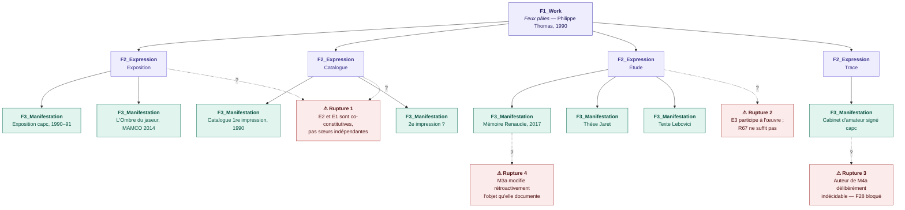
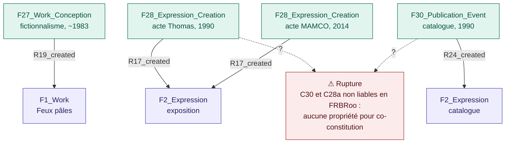
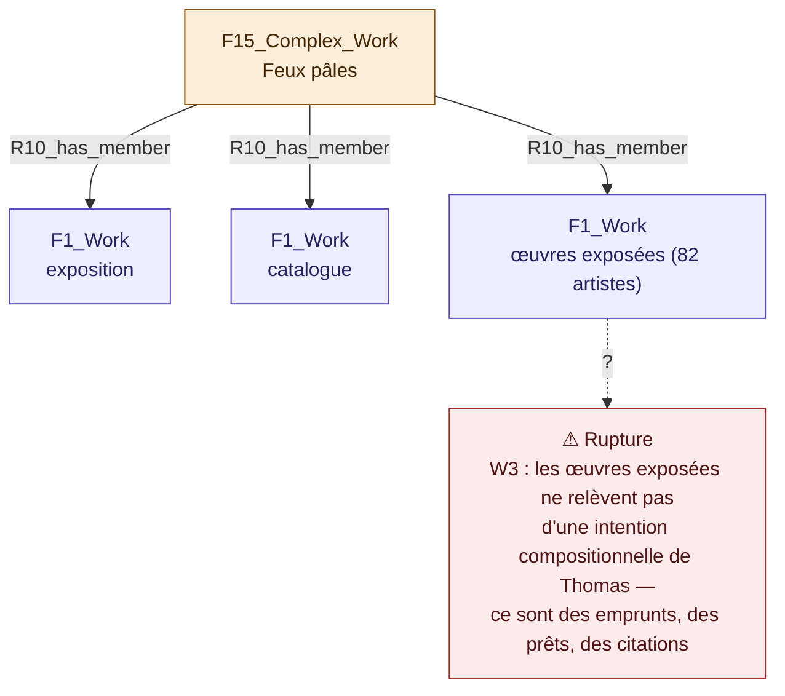
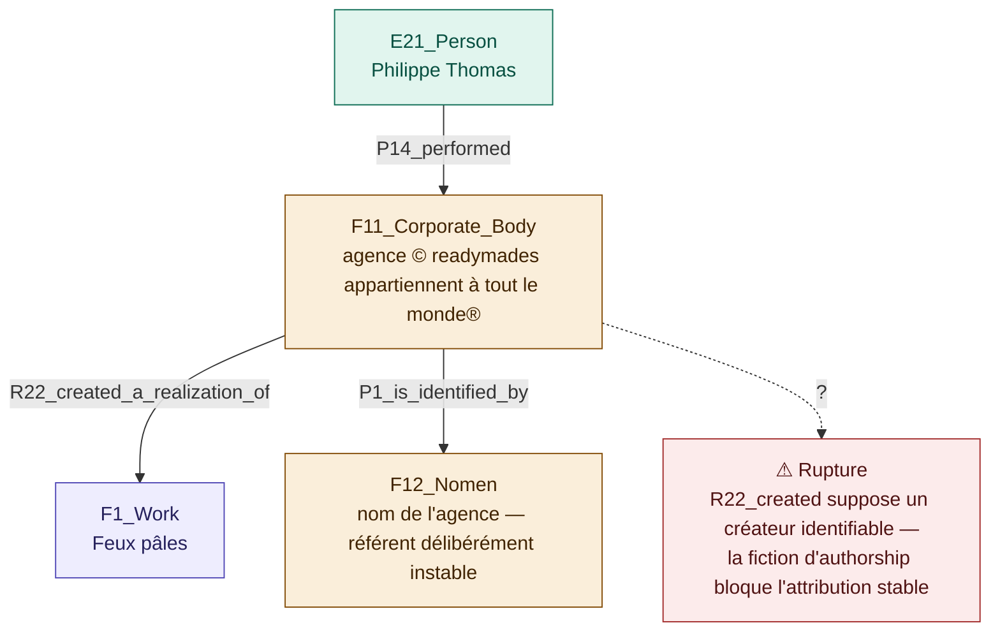
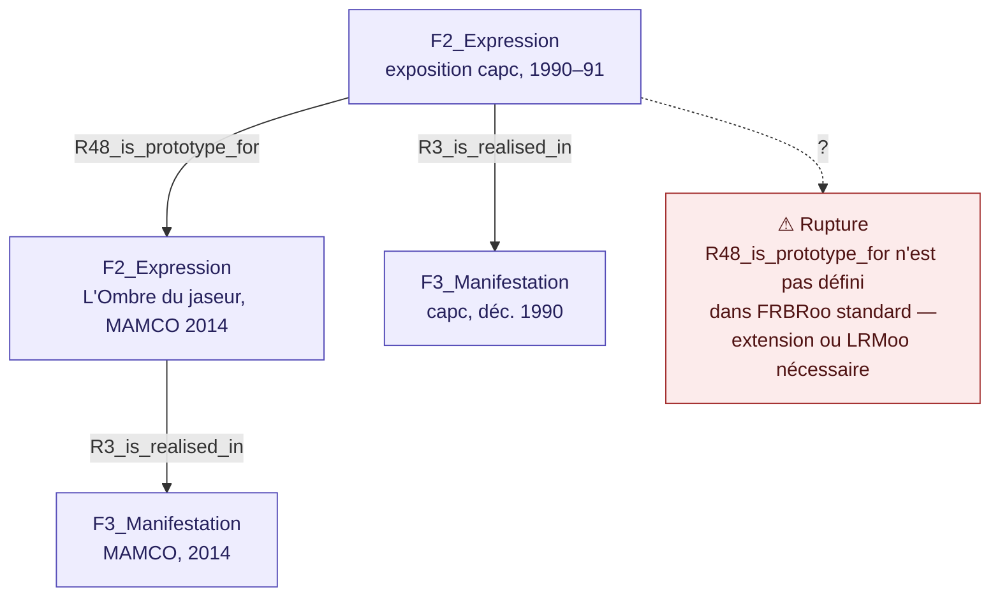

--V2--
## [0:00 – 0:30] Title

Good [morning/afternoon]. My presentation today is called "Exhibitions as Data: Mapping the Invisible Threads of a Relational and Processual Heritage." I'm Zoë Renaudie, a doctoral researcher at the Université de Montréal. This work is supported by a grant from the Fonds de recherche du Québec.

---

## [0:30 – 2:00] *Feux pâles*

Let me start with a story. In December 1990, an exhibition called *Feux pâles* opened at the capcMusée d'art contemporain de Bordeaux. On its surface, it looked entirely conventional: eighty-two artists, eleven rooms, one catalogue, organized by an agency called "readymades appartiennent à tout le monde."

Only on close inspection — and sometimes never — did the mechanisms of its construction become visible. The agency's director was, in fact, the artist Philippe Thomas. The entire curatorial apparatus — the agency, its authorship — was his fiction.

This makes *Feux pâles* what I call an exhibition-artwork: an institutional presentation that is simultaneously a fictional device. And for my purposes today, it's something else too: a test case for documentation.

---

## [2:00 – 3:00] *Feux pâles* as a network

*Feux pâles* is not a single object. It's a network. Ninety-six artworks, loaned from four continents, spanning the fifteenth century to 1990. A catalogue that isn't documentation of the exhibition but a constitutive part of it. An agency that is a legal fiction with no independent existence. A derived work — the *Cabinet d'amateur* — signed by the capc itself. A reactivation in 2014 at MAMCO Geneva. And a growing body of documentation: my own 2017 thesis, later work by Jaret, by Lebovici.

Exhibitions, I want to argue, are not objects. They are relational and processual events that survive only through fragmentary, heterogeneous, and situated traces.

---

## [3:00 – 4:00] Three guiding questions

This raises three questions that structure the rest of this talk.

First: how can exhibitions be conceptualized as relational and performative cultural artifacts — and what does that demand of documentation practice?

Second: what are the epistemological limits of existing heritage ontologies when applied to exhibitions that deliberately destabilize authorship, identity, and temporal boundaries?

Third: how can a documentary model accommodate uncertainty, absence, and multiple, equally legitimate, situated perspectives on the same event?

I'll use *Feux pâles* as a sustained case study to work through all three.

---

## [4:00 – 4:45] Bridge — from database to semantic web
*(This replaces the unfinished notes slide — confirm wording with you before final pass)*

Before turning to the ontologies, it's worth being honest about what a conventional relational database can and cannot do here — because that gap is exactly where this research starts. The semantic web's promise, in principle, is to move past a rigid network of fixed nodes toward genuinely open data. That sounds obvious to say out loud, but it's still not widely used by practitioners in the field.

I'll present two experiments today: one on how *Feux pâles* has been repeatedly reactivated over time, and one on the documentation of something more basic — the exhibited artifacts themselves.

---

## [4:45 – 5:45] Exhibitions as small, complex, difficult data

So what are exhibitions actually made of? Artworks, spatial configurations, technical infrastructures, institutional constraints, professional collaborations, discursive framings, embodied experiences. They produce meaning through relationships, not through stable entities.

Existing systems tend to do the opposite. They privilege finished objects. They require named authorship. They fix events into closed time-spans. They marginalize collective and informal practices.

As Johanna Drucker puts it, data are never raw — they are always *capta*: taken, not given.

---

## [5:45 – 6:45] Existing ontological landscape

Several ontologies already exist in this space. CIDOC-CRM is the core heritage model — strong on provenance and custody, weak on authorship ambiguity and epistemic status. LRMoo and FRBRoo give us Work, Expression, Manifestation, Item — strong on intellectual lineage, weak on co-constitutive and recursive relationships. OntoExhibit addresses exhibitions' discursive dimensions directly — strong on curatorial intent, weak on fictive actors and uncertain provenance.

We even built our own extension at the Ouvroir lab — the Display ontology — for the topological description of installations. But no model currently proposes an integrated approach specifically dedicated to exhibition documentation management.

---

## [6:45 – 8:00] A documented failure

My first attempt to document *Feux pâles*, in 2017, used a relational spreadsheet. And it worked, up to a point. It could list all ninety-six artworks with their attributes. It could record provenance data per object. It even had a colour-coded epistemic system: black for verified, blue for uncertain, grey for missing, strikethrough for information that was historically valid but is now obsolete.

But it could not model relations between heterogeneous elements. It could not represent competing interpretive accounts. It could not express co-constitutive relationships. It could not encode epistemic status as queryable data. And it could not link the act of documentation itself to the object being documented.

This failure isn't a footnote — it's the starting point of this entire inquiry.

---

## [8:00 – 8:30] Experiment A — introduction

So I ran two experiments in semantic modelling. The first treats *Feux pâles* not as a static entity but as a dynamic, continuously activated network — a chain of activations across more than three decades.

---

## [8:30 – 9:15] The LRMoo mapping and its four ruptures

Can LRMoo capture that chain? I mapped the 1990 exhibition, the catalogue, the *Cabinet d'amateur*, the 2014 MAMCO reactivation, my own conservation study, and now this doctoral thesis, onto LRMoo's Work–Expression–Manifestation structure: four expressions under one Work — exhibition, catalogue, study, trace.

It's a defensible structure. But four ruptures appear immediately. The exhibition and the catalogue are co-constitutive, not independent siblings — FRBRoo has no property for that. My own study doesn't just describe the work, it participates in it. The author of the *Cabinet d'amateur* is deliberately undecidable, which blocks the creation property outright. And my 2017 study retroactively modifies the very object it documents.

---

## [9:15 – 10:15] Four attempted fixes

I tested four ways to patch this. Shifting to an event-centred mapping moves the gravity from object to act, closer to conservation epistemology — but the co-constitution problem remains. Treating *Feux pâles* as a Complex Work resolves the catalogue issue, but presupposes a unified compositional intent that Thomas's fiction is precisely designed to undermine. Modelling the agency through F12_Nomen — the name rather than the entity — is ontologically honest, but the creation property still demands a stable referent it can't provide. And using R48, "is prototype for," correctly distinguishes the 2014 reactivation from a simple reproduction — but that property doesn't even exist in the FRBRoo standard.

Each fix solves one rupture and opens another. The choice of mapping is always an interpretive act.

---

## [10:15 – 11:00] What LRMoo cannot express

Across all four ruptures, a pattern emerges. FRBRoo presupposes derivation before co-constitution; *Feux pâles* makes the catalogue part of the work, not derived from it. It presupposes documentation stands outside the work; here, the conservation study participates in the work's existence. It presupposes an identifiable actor; here, authorship is deliberately indecidable. And it presupposes a closed time-span; here, the activation is still open, more than thirty years later.

---

## [11:00 – 11:20] Experiment B — introduction

My second experiment goes back to something more basic: how do we document a single exhibited object? I selected three artifacts out of the ninety-six, each probing a different kind of limit.

---

## [11:20 – 12:20] Artefact n°1 — the barcode

Artefact number one: a barcode-like painting, signed by the capc, but conceived by Thomas through the agency. In CIDOC-CRM, E65 Creation plus "carried out by" forces a choice — the capc? Thomas? the agency? OntoExhibit's `hasAuthor` property makes the same forced choice. Neither model has a class for the object's hybrid status — it's simultaneously an artwork, a scenographic element, and the exhibition's title. And neither has a class for a fictive transaction: the barcode is the "product" the agency delivered to the capc, and the agency itself has no legal existence to be the owner it's recorded as in 1990.

---

## [12:20 – 13:10] Artefact n°4 — the sundial

Artefact number four: a seventeenth-century portable sundial, lent in 1990 by the Kunsthistorisches Museum Vienna. That part, both models handle fine. But the current owner is unknown — the piece was looted from Clarisse Rothschild, and restitution remains unresolved. CIDOC-CRM's "has current owner" property is single-valued; it can't hold competing claims. And neither model has any native way to date epistemic status: "owner: KHM Vienna" was true in 1990. By 2017, it's false, or at least contested. The model either gives a false answer, or no answer. It cannot give an honest, uncertain one.

---

## [13:10 – 14:00] Artefact n°85 — Venzano

Artefact number eighty-five: a photograph credited, on its label, to "the collection of Monsieur Georges Venzano." Venzano doesn't exist. The displayed author is the capc, fictionalized by Thomas as author. The sale that brought the piece from gallerist Claire Burrus to the capc in 1991 is real — but it's also part of the artistic fiction. This is the most striking case, because the fiction doesn't just touch the artwork — it touches the metadata itself. The title, the author, the collector: all fictional, and none of our models distinguish a real person from a fictive one.

---

## [14:00 – 15:00] Three types of rupture

Across both experiments, I see three recurring types of rupture. Forced choice: the model records the fact but imposes an arbitrary decision — who's the author of the barcode, who owns the sundial. Structural silence: no class exists at all — for a fictive non-narrative person, a fictive transaction, a pending restitution claim, a dated epistemic status. And flattening: the model records the fact but erases what makes it meaningful — an E8 Acquisition for the Venzano sale exists, but the artistic friction disappears entirely.

---

## [15:00 – 16:00] What an adequate model would require

So what would an adequate documentary model need to do? Seven things: represent distributed and shifting authorship; integrate heterogeneous traces without forcing artificial coherence; preserve contradictory or parallel interpretations; encode epistemic status and degrees of uncertainty; model non-linear and recursive temporalities; document absences and opacity as meaningful conditions, not deficiencies; and support iterative enrichment over time, rather than closure through a final description.

I want to be clear: I'm not proposing a finished ontology today. I'm proposing a set of requirements to guide that work.

---

## [16:00 – 17:00] A warning — opacity

I want to close on a caution, because it would be easy to hear all this as a call to document everything, exhaustively, forever. Édouard Glissant writes — and I'll paraphrase — that the right to opacity isn't withdrawal into an impenetrable particularity; it's consent to the ways the world proposes itself to universal relation.

Absence and opacity are legitimate epistemic stances, not failures to be remedied. Documentation choices embody values. The structures we build shape what becomes knowable — and what we allow to remain unknown.

---

## [17:00 – 18:00] Conclusion

*Feux pâles* is not an exceptional case. It's a particularly legible instance of a broader condition: exhibitions whose meaning depends on exactly the instability, multiplicity, and opacity that conventional documentation tries to eliminate.

What this shows, I think, is threefold: modelling choices embody values; documentation practices shape cultural memory; and small, carefully structured datasets can support nuanced engagement when approached interpretively, rather than exhaustively.

And the stakes go beyond access. This is a question of how cultural phenomena get modelled, whose expertise informs that modelling, and what forms of knowledge the resulting structures enable — or foreclose.

---

## [18:00 – 19:00] Closing — open questions to the CIDOC-CRM community
*(DRAFT ONLY — needs your input, see note below)*

I'll close with the questions I'm bringing to this community, because I think they matter more than any answer I could offer today.

Should `CRMinf`'s belief-adoption classes be more actively implemented, and extended, so that epistemic status can be dated and versioned rather than treated as a one-off annotation? Is there appetite, within this community, for a shared extension covering fictive non-narrative persons and fictive transactions — cases where the artistic gesture *is* the metadata? And given the four ruptures I've shown in LRMoo, would there be interest in standardizing a co-constitution property, or in promoting `R48_is_prototype_for` into the core standard?

Thank you.

---

## Notes for you

1. **Total: ~19:00**, leaving ~1 minute of slack for pacing on the day. If Q&A time is separate, you're fine; if it's baked into a 20-minute slot, this is tight but workable.
2. **Biggest compression risk**: the [9:15–10:15] block on the four LRMoo alternatives (A1–A4) covers a lot of ground fast. In rehearsal, if you're running long, this is the first place to cut — you could drop A2 or A4 verbally and let the slide stand on its own while you say one sentence per alternative.
3. **The [4:00–4:45] bridge slide** is my reconstruction of your rough notes — please check the wording matches what you actually want to say, especially the phrase about semantic web being "not widely used by practitioners," since that's a claim worth softening or sourcing if challenged in Q&A.
4. **The closing CIDOC-CRM questions** are drafted from the content of your slides, but you hadn't specified them yet — tell me if you want different or additional questions there (e.g. tied to the federated ontology idea), and I'll revise.

-- V1-- 

## Mapping the Invisible Threads of a Relational and Processual Heritage

**Zoë&#0160;Renaudie**

Digital Humanities Conference - Session S027
July, 29th 2026 - Daejeon, Republic of Korea

  

    
  

  

    
  

  

    
  

/** Notes **/

Ces travaux bénéficie d’un octroi (« 2005778 » ou https://doi.org/10.69777/2005778) du Fonds de recherche du Québec.

===>>>>>>===
## Présentation de l'exposition

/** Notes **/

- feux pales, une oeuvre, un exposition

===vvvvvv===
## Un réseau

/** Notes **/
Museum exhibitions occupy a central position in contemporary artistic and curatorial discourses yet embody a fundamentally ephemeral form of cultural heritage. Once dismantled, exhibitions frequently vanish without leaving comprehensive traces, thereby compromising the conservation of essential cultural knowledge and the transmission of collective memory. As Bruce Altshuler (Altshuler 2008) and Vanessa Merminod have demonstrated, exhibitions are not only cultural artifacts but also sites of public, professional, and institutional engagement. Their inherently processual and relational nature resists traditional modes of documentation inherited from object-centered conservation and archival practices. We can consider that exhibitions, like performances, leave behind “performing remains” that challenge conventional archival logics (Hölling et al. 2024; Parcollet et Szacka 2013). 
===vvvvvv===

/** Notes **/
As a result, exhibitions often survive only through fragmentary records, limiting not only art historical inquiry but also broader digital humanities’ engagements with openGLAM, interpretation, and data modelling.
This paper argues that exhibition documentation constitutes a test case for contemporary digital conservation. It proposes that exhibitions can be understood as a form of small, complex, and difficult data whose preservation demands interpretive, situated, and ethically attentive modelling practices. Johanna Drucker (Drucker 2021) reminds us that data are never raw; they are always “capta” (taken, not given) and thus reflect the values, assumptions, and interpretive frameworks of those who collect and structure them. Drawing on semantic web technologies, this research reframes documentation not as neutral recording but as an engaged act of knowledge modelling that actively shapes what becomes knowable, queryable, and transmissible about cultural events over time. 
===vvvvvv===

/** Notes **/

===>>>>>>===
## Questions

/** Notes **/

Three questions guide this inquiry: How can exhibitions be conceptualized as relational and performative cultural artifacts, and what does this shift demand of documentation practice? What are the epistemological limits of existing heritage ontologies when applied to exhibitions that deliberately destabilize authorship, identity, and temporal boundaries? And how can a documentary model accommodate not only uncertainty and absence, but the coexistence of multiple, equally legitimate situated perspectives on the same event? To address these questions, the paper proceeds as follows: with Feux pâles (capcMusée de Bordeaux, 1990-91) as a sustained case study, it first shows what composes an exhibition, surveys existing ontological frameworks and identifies their structural limits; then specify what an adequate documentary model in conservation would suggest.

===>>>>>>===

/** Notes **/

The problem of exhibition preservation emerges from a structural mismatch between conventional heritage data models and the performative nature of exhibitions. Unlike discrete objects, exhibitions operate as assemblages of artworks, spatial configurations, technical infrastructures, institutional constraints, professional collaborations, discursive framings, and embodied experiences. Exhibitions unfold across time and often across multiple sites, producing meaning through relationships rather than through stable entities. Existing documentation systems, however, tend to reduce this complexity by privileging finished objects, named authorship, and fixed events, thereby marginalizing collective practices, informal labour, and experimental or non-dominant curatorial methodologies (Martini et Taramarcaz 2023). This reduction has significant implications for cultural memory, particularly for exhibitions emerging from feminist, Indigenous, queer, or community-based contexts whose modes of engagement frequently challenge institutional norms (Richter et Drabble 2015; Delhalle et Aurégan 2021).

===vvvvvv===

/** Notes **/

Within digital humanities, the rise of linked data and semantic web technologies (Berners-Lee et al. 2001; Bruseker et al. 2025) in museums has opened new possibilities for representing cultural heritage as interconnected networks rather than isolated records. Standards such as the CIDOC Conceptual Reference Model (CIDOC-CRM) developed by the International Committee of Museums (Martin Doerr 2003; M Doerr et Kritsotaki 2006), have enabled institutions to describe relationships among objects, actors, events, and places in machine-readable formats that support interoperability and computational analysis. Extensions and specialized ontologies have emerged responding to generic model limitations for exhibition documentation. LRMoo developed originally for editorial phenomena (RIva et al. 2022; Tietz et al. 2023), Onto-Exhibit addresses exhibition discursive dimensions (Rodríguez-Ortega 2018; Rodriguez Ortega et al. 2022; Rodríguez-Ortega 2024), the Art and Architectural Argumentation Ontology (AAAo) attempts to model difficult historical data without reduction (Takin solution et Swiss Art Research Infrastructure 2025). We created Display ontology (Valentine et al. 2024) within l’Ouvroir to focus on topological descriptions of installations. Despite this ontological richness, no model currently proposes an integrated approach specifically dedicated to exhibition documentation management. This paper contends that exhibitions expose the epistemological limits of existing heritage ontologies and invite a rethinking of semantic modelling as an interpretive and participatory practice rather than a purely technical solution. 

===>>>>>>===

/** Notes **/

This research adopts a pragmatic modelling approach (Ciula et al. 2023) in which the case study does not illustrate a pre-existing framework but actively generates the documentary requirements the model must meet. The central case is Feux pâles, organized by the agency © readymades appartiennent à tout le monde at the capcMusée d’art contemporain de Bordeaux from December 1990 to March 1991. The exhibition is an emblematic instance of what we term an exhibition-artwork: an institutional presentation that is simultaneously a fictional device. Visitors encountered what appeared to be a conventional thematic and chronological survey. Only on close inspection, and sometimes never, did the mechanisms of its construction become visible: the agency’s director was in fact the artist Philippe Thomas, and the entire curatorial apparatus was his fiction.

The methodological approach combines archival investigation of the exhibition’s material traces with theoretical engagement across conservation studies, museology, and digital humanities. It is grounded in the situated practice of conservation-restoration, in which sourcing information is not a preliminary step but a constitutive act: every observation is attributed to an identified professional, dated, and assigned an epistemic status : certain, uncertain, historically valid but no longer current, or deliberately left undeclared. A first attempt to document Feux pâles (Renaudie 2017, 2020) using a relational spreadsheet served as a diagnostic instrument: the inability to use the data, to model relations between heterogeneous elements, or represent competing interpretive accounts made the inadequacy of conventional tools immediately legible. This initial failure is the starting point of the inquiry. From there, this research works outward from the specific documentary problems posed by Feux pâles toward the identification of structural gaps in existing ontological frameworks, testing whether those frameworks can be extended or whether the case demands genuinely new modelling strategies.

===>>>>>>===

/** Notes **/

===>>>>>>===
Show an exemple of the tableau d'origine comme difficile. 

NMontrer que je suis pas seule dans ce cas la avec la solution de Georgia ? 

Partir de ce tableau pour mapper l'exposition comme réseau. Toujours pas convaicu du terme reseau. Je parle de la def de Goodman dans la presentation. 
/** Notes **/

===>>>>>>===
## L'activation 

/** Notes **/

Rather than modelling Feux pâles as a static entity, this research conceptualizes the exhibition as a dynamic and continuously activated network of actors, traces, interpretations, technical operations, institutional framings, and situated observations. The mapping against CIDOC-CRM, OntoExhibit, and the Display ontology revealed questions these frameworks were not designed to answer: how to document an exhibition whose material integrity no longer exists; how to hold non-linear and reactivable temporalities that neither E52_Time-Span nor LRMoo's F3_Manifestation can model without distortion; and how to maintain simultaneously legitimate and irreducible accounts without subordinating some to others. Following Goodman’s notion of “worldmaking” (Goodman, 1978), this research argues that exhibition documentation must support the coexistence of multiple epistemic perspectives without collapsing them into a unified interpretation.

===vvvvvv===

### CIDOC-CRM

Feux pales comme http://cidoc-crm.org/cidoc-crm/7.1.3/E28_Conceptual_Object? 
Then as Activity : exhibition 1992 
exhibition 2014
Documentation Zoë

===>>>>>>===
### LMRooo

/** Notes **/

Le diagramme montre ta structure proposée telle qu'elle tient en FRBRoo, avec les quatre ruptures annotées en rouge sur les arêtes où le modèle résiste.
Quelques observations sur ce que le diagramme révèle visuellement :
La structure à quatre F2_Expression est lisible et défendable, mais les ruptures 1 et 2 montrent qu'elles ne sont pas équivalentes : E1 et E2 entretiennent une relation que FRBRoo ne peut pas nommer (co-constitution), et E3 a un statut ontologique différent des deux premières (elle est à la fois dans le Work et sur lui).
La rupture 3 sur le cabinet d'amateur est peut-être la plus percutante pour une audience DH : c'est un cas où l'ontologie présuppose un acteur identifiable pour F28_Expression_Creation, et où l'œuvre a précisément construit l'indécidabilité de cet acteur comme geste artistique.
La rupture 4 est la plus originale théoriquement : une F3_Manifestation qui modifie rétroactivement les propriétés de l'Expression dont elle est issue n'existe pas dans le modèle.

===vvvvvv===

 Centrer sur les événements plutôt que sur les entités
FRBRoo est fondamentalement un modèle événementiel (il est construit sur CIDOC-CRM). Au lieu de partir du F1_Work comme entité stable, tu peux partir des actes de création :
F28_Expression_Creation pour l'acte de Philippe Thomas en 1990, F30_Publication_Event pour le catalogue, F27_Work_Conception pour le fictionnalisme comme projet artistique préalable. Cette lecture déplace le centre de gravité : l'exposition n'est plus un objet qui a des manifestations, c'est le résultat d'une série d'événements intentionnels enchaînés. C'est plus proche de ta pratique de conservation, où chaque observation est un acte situé.

===vvvvvv===

2. Utiliser F15_Complex_Work
F15_Complex_Work est conçu pour les œuvres composées de plusieurs works distincts qui forment un tout. Tu pourrais modéliser Feux pâles comme un F15_Complex_Work dont les composantes sont : le F1_Work exposition, le F1_Work catalogue, et les œuvres des 82 artistes exposés. Cela résout partiellement la rupture 1 (catalogue co-constitutif) sans forcer une relation de dérivation. Mais ça crée un nouveau problème : les œuvres des artistes exposés ne sont pas des composantes de Feux pâles au sens où Thomas les aurait créées, elles sont des emprunts, des prêts, des citations. F15 présuppose une intention compositionnelle unifiée que la fiction de l'agence complique.

===vvvvvv===

3. Modéliser la fiction d'authorship avec F11_Corporate_Body et F12_Nomen
L'agence © readymades appartiennent à tout le monde® n'est pas une personne physique, pas une institution légale, et pas un personnage fictif au sens narratif. FRBRoo a F11_Corporate_Body pour les entités collectives, mais la propriété R22_created_a_realization_of suppose un créateur identifiable. Tu pourrais utiliser F12_Nomen (la classe pour les noms et appellations) pour modéliser le nom de l'agence comme une appellation délibérément instable, dont le référent change selon qui la consulte (visiteur naïf, initié, chercheur). C'est une modélisation du nom plutôt que de l'entité, ce qui est ontologiquement honnête.

===vvvvvv===

4. F2_Expression avec R48_is_prototype_for
L'Ombre du jaseur au MAMCO n'est pas une nouvelle F3_Manifestation de l'expression de 1990 : c'est une réinterprétation qui prend l'exposition de 1990 comme prototype. FRBRoo a R48_is_prototype_for précisément pour les relations où une expression sert de modèle à une autre sans en être la source directe. Cela te permettrait de distinguer la relation capc→MAMCO (prototype) de la relation catalogue 1990→2e impression (reproduction), ce que ta structure actuelle à quatre expressions ne peut pas exprimer.

===vvvvvv===

/** Notes **/

From this observation emerges a central methodological proposition: exhibition documentation does not primarily model exhibitions as objects, but rather the networks. Documentation itself becomes part of the exhibition’s ongoing activation. In conservation practice, every statement is situated, attributed, dated, and associated with a degree of certainty, uncertainty, revision. The conservation study therefore does not stand outside the exhibition as neutral metadata production; it actively participates in the constitution of the documentary object.

===>>>>>>===

# Tableau de collision — CIDOC-CRM / OntoExhibit
## Trois artefacts de *Feux pâles* (1990)

===vvvvvv===

## Œuvre n°1 — ® (code-barres), capcMusée d'art contemporain, 1990
*Acrylique sur toile, 97×130 cm — Inv. 1991-20, capc*

| Fait documentaire | CIDOC-CRM | OntoExhibit |
|---|---|---|
| **Authorship** : signé par le capcMusée, conçu par Philippe Thomas sous couvert de l'agence | `E65_Creation` + `P14_carried_out_by` → `E39_Actor` — modélisable, mais force un choix : quel acteur est P14 ? Le capc (signataire), Thomas (concepteur) ou l'agence (commanditaire) ? | `onto:hasAuthor` rencontre le même problème — authorship unique présupposée |
| **Statut hybride** : œuvre ET élément scénographique du préambule de l'exposition | `E22_Man-Made_Object` pour l'objet ; le rôle co-constitutif (titre de l'exposition) n'a pas de classe dédiée dans CRM de base | `onto:ExhibitedItem` capture le rôle expositionnel mais pas le statut co-constitutif |
| **Dimension fictionnelle** : le code-barres est le "produit" livré par l'agence au capc — transaction contractuelle et fictionnelle | ⚠ **Rupture** — Aucune classe pour une transaction fictive. `E8_Acquisition` présuppose un transfert de propriété réel. | ⚠ **Rupture** — OntoExhibit ne modélise pas les relations contractuelles ni les dispositifs fictionnels encadrant la production d'une œuvre. |
| **Statut juridique de l'agence** : "propriétaire" en 1990, mais entité sans existence légale | `E8_Acquisition` + `P22_transferred_title_to` pour l'acquisition de 1991 ; le détenteur de 1990 (l'agence) ne peut pas être `E40_Legal_Body` | ⚠ **Rupture** — Même lacune : statut juridique de l'agence inmodélisable. |

===vvvvvv===

## Œuvre n°4 — *Klappensonnenuhr* [Cadran solaire portatif], Thomas Tucher, Nuremberg, XVIIe s.
*Ivoire, bronze, 2,2×12,8×9,6 cm — KHM Vienne, N° Inv. 9826 — Restitution Rothschild en cours*

| Fait documentaire | CIDOC-CRM | OntoExhibit |
|---|---|---|
| **Prêteur en 1990** : Kunsthistorisches Museum, Vienne (N° Inv. 9826) | `E10_Transfer_of_Custody` + `P28_custody_surrendered_by` → KHM — modélisable sans friction. | `onto:LoanAgreement` capture le prêt institutionnel correctement. |
| **Propriétaire actuel inconnu** : bien pillé à Clarisse Rothschild, restitution non résolue | ⚠ **Rupture** — `P52_has_current_owner` est une propriété à valeur unique. Le modèle force un seul propriétaire actuel. La revendication non résolue (KHM vs ayants droit Rothschild) n'a pas de représentation. | ⚠ **Rupture** — OntoExhibit n'a aucune classe pour les revendications de restitution ou les propriétés en litige. Le champ "propriétaire" reste vide ou faux. |
| **Statut épistémique** de l'observation (Tome II, 2017) : donnée historiquement valide en 1990, caduque et litigieuse en 2017 | ⚠ **Rupture** — CIDOC-CRM ne dispose pas nativement d'un mécanisme de datation épistémique des assertions. L'extension `CRMinf` permet `I2_Belief` mais reste peu implémentée. | ⚠ **Rupture** — OntoExhibit ne modélise pas les degrés de certitude ni la temporalité des observations documentaires. |

===vvvvvv===

## Œuvre n°85 — *La Collection de Monsieur Georges Venzano*, 1990
*Photographie N&B contrecollée, 247,5×360 cm (3 panneaux) — Gal. Claire Burrus — Inv. 1991-21, capc*
*Artiste affiché : [capcMusée d'art contemporain] — en réalité Philippe Thomas. Georges Venzano : personnage fictif.*

| Fait documentaire | CIDOC-CRM | OntoExhibit |
|---|---|---|
| **Artiste affiché** : [capcMusée d'art contemporain] — Philippe Thomas fictionnalisant le musée comme auteur | ⚠ **Rupture** — `E21_Person` ou `E40_Legal_Body` : ni l'un ni l'autre ne peut exprimer qu'une institution est mise en scène comme auteur fictif d'une œuvre qui critique précisément cette institutionnalisation. | ⚠ **Rupture** — `onto:hasAuthor` présuppose un agent réel identifiable. Un auteur fictionnellement construit n'a pas de classe. |
| **Georges Venzano** : "collectionneur" fictif dont le nom figure dans le titre de l'œuvre | ⚠ **Rupture** — CIDOC-CRM n'a pas de classe pour les personnes fictives non narratives (entités produites par un dispositif artistique, distinctes des personnages d'une œuvre littéraire). | ⚠ **Rupture** — Même lacune : OntoExhibit ne distingue pas personnes réelles et entités fictives dans les métadonnées d'exposition. |
| **Circuit de vente** : galerie Claire Burrus → capc 1991 (Inv. 1991-21) — mais la vente fait partie de la fiction artistique | `E8_Acquisition` modélise la transaction 1991 correctement — mais efface la dimension fictionnelle de la vente comme acte artistique. | ⚠ **Rupture** — OntoExhibit modélise l'acquisition patrimoniale mais ne peut pas encoder qu'une transaction commerciale est simultanément un geste artistique. |

===vvvvvv===

## Synthèse des types de rupture

| Type | Description | Exemples |
|---|---|---|
| **Choix forcé** | Le modèle peut enregistrer le fait mais impose une décision arbitraire que les données ne justifient pas | `P14` pour `®` ; `P52` pour le cadran Tucher |
| **Silence structurel** | Aucune classe n'existe pour le phénomène | Artiste fictif non narratif ; transaction fictionnelle ; revendication de restitution en cours ; statut épistémique daté |
| **Aplatissement** | Le modèle enregistre le fait en effaçant la dimension qui fait sens | `E8_Acquisition` pour la vente Venzano (la friction artistique disparaît) |

*Statuts épistémiques : noir = vérifié, bleu = incertain, gris = manquant, barré = historiquement valide mais caduc.*

/** Notes **/

===vvvvvv===
/** Notes **/

The research consequently identifies a series of requirements for future documentary models dedicated to exhibitions. Such models should be capable of:
representing distributed and shifting authorship;
integrating heterogeneous documentary traces without enforcing artificial coherence;
preserving contradictory or parallel interpretations;
encoding epistemic status and degrees of uncertainty;
modelling non-linear and recursive temporalities;
documenting absences, silences, and opacity as meaningful informational conditions rather than deficiencies to eliminate;
and supporting iterative enrichment over time rather than closure through final description.

===vvvvvv===

/** Notes **/

Rather than proposing a definitive ontology, this study formulates a set of documentary and epistemological requirements intended to guide future semantic modelling work for exhibitions. The contribution is therefore both critical and constructive: it identifies the limits of current heritage ontologies while outlining the conceptual conditions necessary for more adequate models of exhibition preservation within digital humanities and conservation contexts. This framework also raises a warning: not everything should be documented. Absence and opacity (Glissant 1990) are treated as legitimate epistemic stances, not failures to be remedied.

===>>>>>>===

/** Notes **/

Conclusion
Feux pâles is not an exceptional case that exposes the limits of existing documentary models. It is a particularly legible instance of a broader condition: exhibitions whose meaning depends on the very instability, multiplicity, and opacity that conventional documentation seeks to eliminate. By working from the inside of this difficulty rather than around it, this research  generates a precise map of what a more adequate documentary model for exhibitions would suggest. It demonstrates how a small, carefully structured dataset (when approached interpretively rather than exhaustively) can support nuanced engagement with complex cultural events, aligning with current digital humanities discussions around small data, annotation, and responsible computational practice (D’Ignazio et Klein 2020).
This paper positions semantic exhibition documentation as a form of engaged digital humanities practice that connects institutions, researchers, and communities through shared interpretive infrastructures. It demonstrates how modelling choices embody values, how documentation practices shape cultural memory, and how computational tools can be designed to support plurality, uncertainty, and ethical responsibility. By treating exhibitions as epistemic objects rather than logistical byproducts, this research contributes to broader DH conversations about memory, interpretation, and the role of digital technologies in mediating relationships between past events, present communities, and future forms of knowledge. Ultimately, exhibitions offer a productive lens through which to examine the promises and limits of semantic web technologies within the digital humanities, revealing that engagement is not only a matter of access or participation, but fundamentally a question of how cultural phenomena are modelled, whose expertise informs that modelling, and what forms of knowledge the resulting structures enable or foreclose.

===>>>>>>===

/** Notes **/

Altshuler, Bruce. 2008. Salon to Biennial: Exhibitions That Made Art History. Avec Phaidon. Phaidon. 
Berners-Lee, Tim, James Hendler, et Ora Lassila. 2001. « The Semantic Web ». Scientific American 284 (5): 34‑43. https://doi.org/10.1038/scientificamerican0501-34. 
Bruseker, George, Nicola Carboni, Matthew Fielding, Denitsa Nenova, et Thomas Hänsli. 2025. « The Semantic Reference Data Modelling Method: Creating Understandable, Reusable and Sustainable Semantic Data Models ». Journal of Open Humanities Data 11 (1). https://doi.org/10.5334/johd.282. 
Ciula, Arianna, Øyvind Eide, Cristina Marras, et Patrick Sahle. 2023. Modelling Between Digital and Humanities: Thinking in Practice. Open Book Publishers. https://doi.org/10.11647/obp.0369. 
Delhalle, Harmony, et Xavier Aurégan. 2021. « La décolonialité du patrimoine ». Géographie et cultures, no 117 (janvier): 117. https://doi.org/10.4000/gc.18154. 
D’Ignazio, Catherine, et Lauren Klein. 2020. « Introduction: Why Data Science Needs Feminism ». In Data Feminism. https://data-feminism.mitpress.mit.edu/pub/frfa9szd/release/6. 
Doerr, M, et A. Kritsotaki. 2006. « Documenting Events in Metadata ». Art. de conf. presented sur The 7th International Symposium on Virtual Reality, Archaeology and Cultural Heritage VAST. 
Doerr, Martin. 2003. « The CIDOC Conceptual Reference Module: An Ontological Approach to Semantic Interoperability of Metadata ». AI Magazine 24 (3): 75‑92. https://doi.org/10.1609/aimag.v24i3.1720. 
Drucker, Johanna. 2021. The Digital Humanities Coursebook: An Introduction to Digital Methods for Research and Scholarship. Routledge. https://doi.org/10.4324/9781003106531. 
Hölling, Hanna B., Jules Pelta Feldman, et Emilie Magnin. 2024. Performance: The Ethics and the Politics of Conservation and Care, Volume II. 1re éd. Routledge. https://doi.org/10.4324/9781003467809. 
Martini, Federica, et Julia Taramarcaz. 2023. Feminist exposure: pratiques féministes de l’exposition et de l’archive. Art&fiction Manoir de la Ville de Martigny. 
Parcollet, Remi, et Léa-Catherine Szacka. 2013. « Écrire l’histoire des expositions : réflexions sur la constitution d’un catalogue raisonné d’expositions ». Culture & Musées 22 (1): 137‑62. https://doi.org/10.3406/pumus.2013.1755. 
Renaudie, Zoë. 2017. « Le monde de Feux pâles : l’exposition à l’épreuve de la conservation-restauration ». Mémoire de recherche, École Supérieure d’Art d’Avignon. http://hdl.handle.net/1866/40417. 
Renaudie, Zoë. 2020. « The world of “Pale Fires”, an exhibition put to the test of conservation ». ICAR 4: 204‑17. 
Richter, Dorothee, et Barnaby Drabble. 2015. « Curating Degree Zero Archive: Curatorial Research ». ONCURATING.org (Zürich), no 26. https://doi.org/https://www.on-curating.org/files/oc/dateiverwaltung/issue26/PDF_to_Download/OnCurating_Issue26_CDZA1_DINA4.pdf. 
RIva, Pat, Maja Žumer, et Trond Aalberg. 2022. « LRMoo, a High-Level Model in an Object-Oriented Framework ». Art. de conf. presented sur IFLA WLIC 2022. 
Rodriguez Ortega, Nuria, Maria del Mar Roldán García, Martin Jerónimo Salvachúa, et María Luisa Díez Platas. 2022. OntoExhibit. V. 1.1.0. Released. https://complexhibit-project.github.io/OntoExhibit/index-en.html. 
Rodríguez-Ortega, Nuria. 2018. « Exposiciones y Proyectos Curatoriales: Entre La Preservación de La Memoria y La Explotación de Sus de Datos ». Datos Abiertos Vinculados y Gestión Integral de La Información En Los Centros Patrimoniales, janvier 1. https://www.academia.edu/38710393/Exposiciones_y_proyectos_curatoriales_entre_la_preservaci%C3%B3n_de_la_memoria_y_la_explotaci%C3%B3n_de_sus_de_datos. 
Rodríguez-Ortega, Nuria. 2024. « Contours of Knowledge: Epistemological Implications of Semantic Models in the Representation of the Art Exhibition Domain through the Lens of the OntoExhibit Ontology ». Život Umjetnosti : Časopis o Modernoj i Suvremenoj Umjetnosti i Arhitekturi 114 (1): 122‑47. https://doi.org/10.31664/zu.2024.114.06. 
Takin solution et Swiss Art Research Infrastructure. 2025. « Art and Architectural Argumentation Ontology ». Ontologie. Version 2. https://doi.org/https://ontome.net/namespace/336. 
Tietz, Tabea, Oleksandra Bruns, et Harald Sack. 2023. « A Data Model for Linked Stage Graph and the Historical Performing Arts Domain ». Art. de conf. presented sur SWODCH’23: International Workshop on Semantic Web and Ontology Design for Cultural Heritage. novembre 7. 
Valentine, David, Emmanuel Château-Dutier, et Zoë Renaudie. 2024. « The Display Ontology ». Ontologie. Version 0.1. Https://ouvroir.github.io/display-ontology/. https://ntnlv.ca/display-documentation/. 
