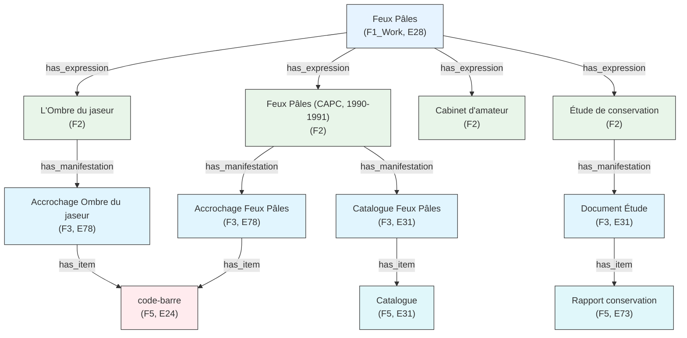
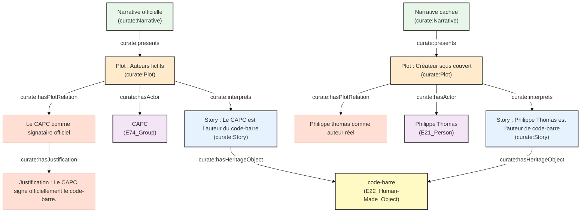
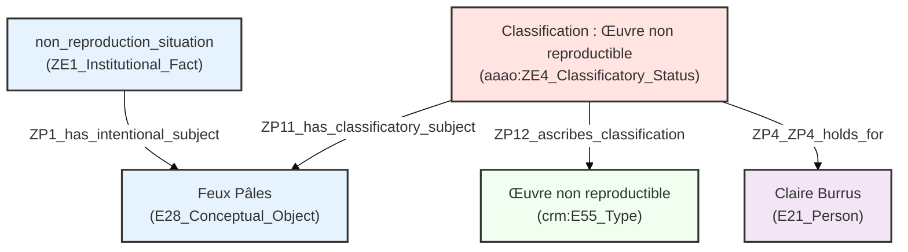
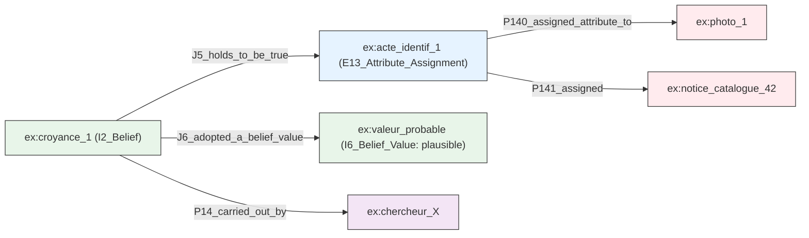
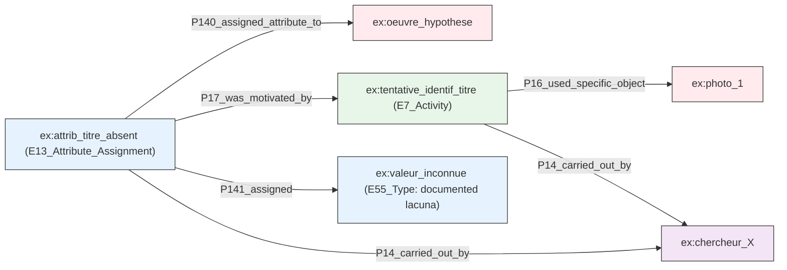

Voici la traduction du contenu de votre présentation en français, en conservant la structure Markdown et les notes pour l'oral.

```markdown
<style display="none">
.flex-1 { flex: 1; }
#ouvroir { position: relative; right: 10%; }
#udem { margin-top: 0; position: relative; bottom: 10%; }
#frq { position: relative; left: 10%; }
.reveal h3 { margin-top: 1em; }
.reveal .logos { margin-top: 2em; }
.reveal ul { text-align: left; }
.reveal blockquote { font-size: 0.85em; border-left: 3px solid #534AB7; padding-left: 1em; }
.two-col { display: grid; grid-template-columns: 1fr 1fr; gap: 2em; text-align: left; font-size: 0.8em; }
.three-col { display: grid; grid-template-columns: 1fr 1fr 1fr; gap: 1.5em; text-align: left; font-size: 0.78em; }
.card { border: 0.5px solid #ccc; border-radius: 8px; padding: 0.8em; }
</style>

# Les expositions en tant que données

### Cartographier les fils invisibles d'un patrimoine relationnel et processuel

**Zoë Renaudie**

Conférence Digital Humanities · Session S027
29 juillet 2026 · Daejeon, République de Corée

<div class="logos" style="display: flex">
  <div class="flex-1"></div>
  <div class="flex-1"></div>
  <div class="flex-1"></div>
</div>

/** Notes **/

Merci aux organisateurs et au comité de sélection.

Je m'appelle Zoë Renaudie. Je suis doctorante à l'Université de Montréal, mais avant cela, et parallèlement à cela, je suis conservatrice-restauratrice d'œuvres d'art.

Cette seconde identité est cruciale pour la suite, car cette intervention n'a pas débuté dans un laboratoire de web sémantique. Elle a commencé au sol d'un musée d'art contemporain, alors que j'essayais de noter ce qu'était un objet, et que je constatais que les formulaires dont je disposais ne me permettaient pas de le dire.

Cela signifie aussi que je suis ici, dans une conférence DH, grâce à la communauté des humanités numériques et à mes collègues.

===>>>>>>===

## *Feux pâles*

### capcMusée d'art contemporain de Bordeaux, décembre 1990 – mars 1991

<!-- Insérer une vue d'installation de Feux pâles, capc Bordeaux, 1990-91. Une prise de vue de la galerie Foy montrant l'œuvre au code-barres près de l'entrée fonctionne bien ici, car elle réapparaît plus tard comme Artefact n°1. -->

<div class="two-col">
<div>

**Organisé par**
© *readymades belong to everyone*®

**Forme apparente**
Survey thématique et chronologique conventionnel — 96 œuvres, 82 artistes, 11 salles, un catalogue

**Dispositif réel**
Le directeur de l'agence était l'artiste **Philippe Thomas**. L'ensemble de l'appareil curatorial était sa fiction.

</div>
</div>

/** Notes **/

Les expositions muséales occupent une position étrange dans le patrimoine culturel. Elles sont centrales dans la production du discours historico-artistique et curatorial, et pourtant, elles sont fondamentalement éphémères. Une fois démontées, la plupart ne laissent presque aucune trace exhaustive. Depuis les années 1990, un corpus croissant de recherches traite les expositions non pas simplement comme des conteneurs d'objets, mais comme des sites d'engagement institutionnel, professionnel et public.

Je souhaite concrétiser cela avec une exposition. En décembre 1990, *Feux pâles* ouvrait au capcMusée d'art contemporain de Bordeaux. En surface, elle semblait tout à fait conventionnelle : quatre-vingt-deux artistes, onze salles, un catalogue, organisée par une agence appelée *les readymades appartiennent à tout le monde*.

Ce n'est qu'à y regarder de plus près, et parfois jamais, que le mécanisme devenait visible. Le directeur de cette agence était l'artiste Philippe Thomas. L'ensemble de l'appareil curatorial, l'agence, les cartels, le catalogue, était son œuvre d'art.

Une exposition comme œuvre d'art, contenant des œuvres d'autres artistes, avec des informations cachées agissant comme des indices pour le propre récit de l'exposition. Vous pouvez déjà voir le cas complexe que cela pose pour la documentation et sa conservation.

===vvvvvv===

## L'exposition en tant que données

Paradigme des collections en tant que données (Padilla 2017, 2018)

Trois impératifs :

> **Générativité** : augmenter la capacité de production de sens
> **Lisibilité** : documenter et transmettre la provenance et les possibilités
> **Créativité** : permettre l'expérimentation

/** Notes **/

Le paradigme des « collections en tant que données » (collections as data) reformule la manière dont les institutions culturelles gèrent et partagent leurs fonds numériques. Plutôt que de traiter les substituts numériques comme des substituts aux documents physiques, il les traite comme des données : du matériau qui peut être traité, interrogé et recombiné par des ordinateurs.

Trois piliers le guident.

> Générativité : améliorer la production de sens en rendant les collections compatibles avec divers outils computationnels.
> Lisibilité : assurer la transparence sur la manière dont les données sont sélectionnées, nettoyées et structurées, afin que la provenance et l'intégrité restent vérifiables.
> Créativité : permettre l'expérimentation interne et externe, ce qui redéfinit en retour les rôles professionnels.

Le paradigme porte également un impératif éthique : évaluer de manière critique les risques pour les communautés vulnérables, afin que la collecte de données ne devienne pas un acte d'effacement ou de surveillance.

Ce que je veux faire dans cette intervention, c'est étendre ce paradigme au format de l'exposition lui-même, en traitant les expositions non pas comme des événements éphémères, mais comme des données structurées pour l'histoire de l'art et la muséologie.

===vvvvvv===

## Les expositions en tant que données *petites, complexes et difficiles*

<div class="two-col">
<div>

**De quoi sont faites les expositions**

- Œuvres d'art, configurations spatiales
- Infrastructures techniques
- Contraintes institutionnelles
- Collaborations professionnelles
- Cadrages discursifs
- Expériences incarnées

Elles produisent du sens **par les relations**, et non par des entités stables.

</div>

<div>

**Ce que font les systèmes existants**

- Privilégient les objets finis, non le processus
- Figent les événements dans des intervalles de temps clos
- Marginalisent les pratiques collectives et informelles

> « Les données ne sont jamais brutes ; elles sont toujours des *capta* — prises, et non données. »
> Drucker 2021

</div>
</div>

/** Notes **/

Cependant, nous faisons face à un défi significatif. Contrairement aux fonds bibliothécaires standards, les expositions sont ce que j'appellerais des données petites, complexes et difficiles. Elles ne sont pas faites d'entités stables, mais de relations dynamiques : entre les œuvres, l'espace, l'infrastructure et l'expérience incarnée.

Nos systèmes d'information actuels sont conçus pour le contraire : ils veulent des objets finis, des auteurs uniques, des dates fixes. Cela crée des frictions, surtout pour les expositions ancrées dans des pratiques féministes, queer ou communautaires qui résistent exactement à ces normes. Comme le rappelle Johanna Drucker, la donnée n'est jamais brute, c'est du *capta*, pris, construit et interprété.

Ainsi, si nous devons traiter les expositions comme des données, nous devons reconnaître qu'elles ne sont pas des objets mais des événements relationnels qui ne survivent que par des traces fragmentaires et hétérogènes. Cette tension, entre le désir de données structurées et la réalité chaotique de l'exposition, est exactement là où commence ma recherche.

===vvvvvv===

## *Feux pâles* en tant que réseau

- **96 œuvres** : prêtées depuis 4 continents, du XVe siècle à 1990
- **Le catalogue** : non pas une documentation de l'exposition, mais une partie constitutive de celle-ci
- **L'agence** : une fiction juridique sans existence indépendante
- **Le cabinet d'amateur** : une œuvre dérivée signée par le capc lui-même
- **Réinterprétation du accrochage** : *L'Ombre du jaseur*, MAMCO Genève, 2014
- **Documentation** : Lebovici 2015, Renaudie 2017, Jaret 2019, Display 2025...

<!-- Insérer image-3 : vue d'installation ou d'archive illustrant le réseau des œuvres dérivées -->

/** Notes **/

*Feux pâles* n'est pas un objet unique. C'est un réseau. Quatre-vingt-seize œuvres, prêtées depuis quatre continents, s'étalant du XVe siècle à 1990. Un catalogue qui n'est pas seulement une documentation de l'exposition mais une partie constitutive de celle-ci. Une agence qui est une fiction juridique sans existence indépendante. Une œuvre dérivée, le *Cabinet d'amateur*, signée par le capc lui-même. Une réinterprétation, *L'Ombre du jaseur*, montée au MAMCO Genève en 2014, bien après la mort de l'artiste. Et une couche croissante de documentation, de mémoires.

===>>>>>>===

## Le point de départ : un échec documenté

**2017** : Première tentative de documenter *Feux pâles* à l'aide d'un tableur relationnel

<div class="two-col">
<div>

**Ce que le tableur pouvait faire**

- Lister 96 œuvres avec leurs attributs
- Enregistrer les données de provenance par objet
- Système épistémique codé par couleur
  - Noir = vérifié
  - Bleu = incertain
  - Gris = manquant
  - Barré = historiquement valide, désormais obsolète

</div>

<div>

**Ce que le tableur ne pouvait pas faire**

- Modéliser les relations entre éléments hétérogènes
- Représenter des comptes rendus interprétatifs concurrents
- Exprimer des relations co-constitutives
- Encoder le statut épistémique en tant que données interrogeables
- Lier l'acte de documentation à l'objet documenté

</div>
</div>

/** Notes **/

Ma première tentative pour documenter *Feux pâles*, en 2017, durant mon master en conservation-restauration, fut un tableur. Je ne connaissais alors rien aux humanités numériques. Et cela a fonctionné, jusqu'à un certain point. Cela permettait de lister les quatre-vingt-seize œuvres avec leurs attributs. Cela permettait d'enregistrer la provenance par objet.
@enlever ? Il avait même un système épistémique codé par couleur : noir pour les métadonnées vérifiées, bleu pour les incertaines, gris pour les manquantes, barré pour les informations historiquement valides mais désormais obsolètes.

Mais cela ne pouvait pas modéliser les relations entre éléments hétérogènes. Cela ne pouvait pas représenter des comptes rendus interprétatifs concurrents. Cela ne pouvait pas exprimer des relations co-constitutives, où une chose est simultanément une œuvre, une fiction et une preuve. Cela ne pouvait pas encoder le statut épistémique en tant que données interrogeables. Et cela ne pouvait pas lier l'acte de documentation à l'objet documenté. J'ai aussi essayé une base de données relationnelle, et la structure s'est révélée tout aussi rigide. Si l'on pense la base de données relationnelle comme un réseau d'acteurs latourien, figé dans des tables fixes, j'ai trouvé plus productif de penser plutôt avec la notion de maillage (meshwork) d'Ingold : une attention au mouvement le long des lignes entre les nœuds, plutôt qu'aux nœuds comme points fixes.

Cet échec n'est pas une note de bas de page. C'est le point de départ de l'enquête.

===vvvvvv===

## Méthodologie

**Étapes**

1. Sélectionner des ontologies existantes qui modélisent les expositions
2. Peupler chacune avec l'étude de cas *Feux pâles*
3. Construire un jeu de données de travail à partir de ce peuplement
4. Analyser, durant le peuplement et l'interrogation, ce qui résiste à la modélisation et pourquoi

/** Notes **/

Suivant l'approche de modélisation pragmatique proposée par Ciula et ses collègues, cette étude de cas n'illustre pas un cadre préexistant. Elle génère les exigences documentaires que le modèle doit rencontrer. Concrètement : j'ai sélectionné des ontologies existantes modélisant les expositions, peuplé chacune d'elles avec l'étude de cas *Feux pâles*, construit un jeu de données de travail à partir de ce peuplement, et analysé, tant durant le peuplement que durant l'interrogation, ce qui résistait à la modélisation, et pourquoi.

@Montrer le résultat.

===vvvvvv===

## Trois questions directrices

1. Comment les expositions peuvent-elles être conceptualisées comme des artefacts culturels **relationnels et performatifs**, et qu'est-ce que cela exige de la pratique documentaire ?

2. Quelles sont les **limites épistémologiques** des ontologies patrimoniales existantes lorsqu'elles sont appliquées à des expositions qui déstabilisent délibérément la paternité, l'identité ?

3. Conception de l'exposition ? @

4. Comment un modèle documentaire peut-il accommoder **l'incertitude, l'absence et de multiples perspectives situées également légitimes** sur un même événement ? @

@Être concret dans la slide de réponse et général sur les exemples.
Conclusion : quelles sont les difficultés de ce projet ? Chaque expo est unique : tout le monde doit faire ce travail. Ma contribution : trouver une solution. Retour d'expérience sur : Faites des études de cas.

/** Notes **/

Je présenterai une sélection de résultats de cette enquête pragmatique à travers trois questions. Première : comment les expositions peuvent-elles être conceptualisées comme des artefacts culturels relationnels et performatifs, et qu'est-ce que cela exige de la pratique documentaire ? Deuxième : quelles sont les limites épistémologiques des ontologies patrimoniales existantes lorsqu'elles sont appliquées à des expositions qui déstabilisent délibérément la paternité, l'identité et les frontières temporelles ? Troisième : comment un modèle documentaire peut-il accommoder l'incertitude, l'absence et de multiples perspectives situées, également légitimes, sur un même événement ? J'utiliserai *Feux pâles* comme étude de cas soutenue à travers les trois.

===vvvvvv===

## Paysage ontologique existant

<div class="three-col">
<div class="card">

**CIDOC-CRM**
Modèle patrimonial de base.
**Linked Art**
</div>

<div class="card">

**LRMoo / FRBRoo**
Œuvre, Expression, Manifestation, Item.

</div>

<div class="card">

**OntoExhibit**
Dimensions discursives de l'exposition.

</div>

<div class="card">

**Curate**
Sépare l'histoire (story) de l'intrigue (plot).

</div>

<div class="card">

**Display**
Extension du labo Ouvroir pour la description topologique des installations.

</div>

<div class="card">

**AAAo**
Modèle de fait institutionnel pour les données historiques difficiles.
</div>
</div>

<br/>

/** Notes **/

Piochée dans tout - en gras pour celles utilisées

Un mot bref sur les ontologies dont je discuterai aujourd'hui. CIDOC-CRM est le modèle patrimonial de base, fort sur la provenance et la garde, faible sur l'ambiguïté de la paternité et le statut épistémique. Linked Art est un profil léger construit dessus. LRMoo et FRBRoo modélisent la hiérarchie classique Œuvre, Expression, Manifestation, Item, forts sur la lignée intellectuelle, plus faibles sur les relations co-constitutives et récursives, une limite sur laquelle je reviendrai directement. OntoExhibit adresse directement la dimension discursive des expositions, fort sur l'intention curatoriale. Curate sépare l'histoire (story) de l'intrigue (plot). Display est l'extension propre au labo Ouvroir, avec Emmanuel Château-Dutier et David Valentine, pour la description topologique des installations. Et AAAo, l'Ontologie d'Argumentation Artistique et Architecturale, tente de modéliser les données historiques difficiles sans réduction, fort sur la croyance située.

J'ai cartographié *Feux pâles* contre plusieurs de ces cadres, et voici quelques exemples de là où j'ai dû ajuster.

===>>>>>>===

## 1. Comment les expositions peuvent-elles être conceptualisées comme des artefacts culturels **relationnels et performatifs**, et qu'est-ce que cela exige de la pratique documentaire ?

### *Feux pâles* en tant que chaîne d'activations

Plutôt qu'une entité statique, *Feux pâles* est un **réseau dynamique et continuellement activé**.

- Exposition 1 : *Feux Pâles* (capc, 1990-1991)
- Exposition 2 : *L'Ombre du jaseur* (MAMCO, 2014)
- *Un cabinet d'amateur* (Galerie Burrus, 1991)
- Étude de conservation (2017)

<!-- Insérer image-4 : chronologie visuelle ou photographie ancrant les quatre activations -->

/** Notes **/

Traitée comme une chaîne d'activations plutôt qu'une entité statique, *Feux pâles* s'étend de l'exposition originale de 1990 à la réactivation *L'Ombre du jaseur* en 2014, en passant par le *Cabinet d'amateur* et l'étude de conservation elle-même. Suivant la notion de *worldmaking* (façon de faire des mondes) de Goodman, la documentation d'exposition doit supporter la coexistence de multiples perspectives épistémiques sans les effondrer en une interprétation unifiée.

@remettre linked art ?

===vvvvvv===

### Proposition de cartographie dans LRMoo



/** Notes **/

LRMoo offre une hiérarchie propre à quatre niveaux, de l'Œuvre (Work) à l'Item, et *Feux pâles* elle-même siège confortablement comme l'Œuvre dont chaque activation descend comme une Expression. C'est la plus propre des trois cartographies. Mais cette propreté a une condition : il faut accepter que *Feux pâles* soit une Œuvre au sens de Goodman, et que ses Expressions soient ses activations, que Thomas les ait dirigées ou non. Acceptez cela, et la hiérarchie tient. Refusez-le, et toute la cartographie s'effondre à nouveau dans la question de la paternité que je soulève ensuite.

===>>>>>>===

## 2. Quelle solution avons-nous quand une exposition déstabilise la paternité, l'identité ?

### Le fictionnalisme de Philippe Thomas

L'objectif explicite de Thomas était de faire disparaître son propre nom. Pour ses propres œuvres, il trouvait un signataire réel ou fictif : le collectionneur devait accepter de signer la pièce et devenir ainsi son auteur.

> « Ce que je prétends faire est une fiction qui sort du texte, qui sort du cadre où on l'attend habituellement. »
> Philippe Thomas, entretien avec Stéphane Wargnier

**Exemple du réseau d'indices**

- Le titre *Feux pâles* fait écho à *Pale Fire* de Nabokov
- Le sous-titre du catalogue, « une pièce à conviction », récurrent dans ses autres œuvres
- Un journal d'exposition, distribué aux visiteurs, sème d'autres indices
- La découverte est progressive, inégale, et pour beaucoup de visiteurs, jamais complète

/** Notes **/

Le fictionnalisme de Philippe Thomas est un excellent exemple. Son objectif explicite était de faire disparaître son propre nom. Pour chaque œuvre, il trouvait un signataire réel ou fictif. Le collectionneur devait accepter de signer la pièce achetée et devenir ainsi son auteur. Avec sa galeriste et collaboratrice Claire Burrus, chaque détail était calculé pour que la fiction soit aussi crédible que possible. Chaque pièce sert son projet plus large : la fiction elle-même. Comme il le disait dans un entretien, la fiction est habituellement confinée à un livre, un cadre, un écran. Que se passe-t-il lorsque le livre, l'écran ou le cadre sont eux-mêmes pris dans une histoire fabriquée ? Les premiers indices siègent dans le titre lui-même, qui fait écho à Nabokov, et dans un sous-titre de catalogue qu'il réutilisait dans d'autres œuvres. Un journal d'exposition, remis aux visiteurs, sème d'autres indices. Pour la plupart des visiteurs, la fiction n'est découverte que partiellement, voire pas du tout.

Mais pour documenter en tant que conservateur, nous devons savoir, afin de préserver l'intégrité de l'œuvre.

===vvvvvv===



/** Notes **/

Un exemple est une peinture acrylique semblable à un code-barres, signée capc, conçue par Thomas via l'agence. Dans CIDOC-CRM, « réalisé par » force un choix, le capc, Thomas ou l'agence, et il y a exactement un emplacement pour ce qui est vraiment trois réponses légitimes. Aucun modèle n'a de classe pour le statut hybride de l'objet, simultanément œuvre d'art, élément scénographique et titre de l'exposition. Ici inspiré de Curate.

Inspiré de l'ontologie Curate. Inspiré parce que j'ai tordu le but principal de l'ontologie.
Connecter aux sources

===vvvvvv===

@ conception de l'expositon autre question

### Conceptions de l'exposition

<div class="two-col">
<div>

**capc Bordeaux**
L'exposition n'a pas de statut spécial parmi la programmation de la période Froment. La conservation et la publicité sortent du mandat du musée.

**Claire Burrus** *(succession de l'artiste)*
L'œuvre est non reproductible. La transmission est exclusivement documentaire. La reconstitution est impensable.

</div>

<div>

**Emeline Jaret** *(collaboratrice de la succession, historienne de l'art)*
La reconstitution nécessite un accompagnement documentaire rigoureux. *L'Ombre du jaseur* n'était pas *Feux pâles* : le contexte était trop différent pour être vécu comme tel.

**MAMCO Genève**
*L'Ombre du jaseur* est une interprétation libre, justifiée comme telle, non une reconstitution.

</div>
</div>

/** Notes **/

En 2017, en interrogeant le réseau d'acteurs autour de *Feux pâles*, des conceptions distinctes et stables de ce qu'est l'œuvre ont émergé, chacune entraînant sa propre position sur la reproductibilité, sur le catalogue, et sur la légitimité de toute réactivation. Et elles diffèrent réellement. Pour le capc, l'exposition n'a pas de statut spécial parmi la programmation de l'ère Froment, et la conservation sort du mandat du musée. Pour Claire Burrus, en tant que gardienne de la succession de l'artiste, l'œuvre est non reproductible ; la transmission est exclusivement documentaire, et la reconstitution est impensable. Pour Jaret, la reconstitution nécessite un accompagnement documentaire rigoureux, et la remontage de 2014 n'était pas *Feux pâles*, le contexte était trop différent pour être vécu comme tel. Pour le MAMCO, ce remontage est une interprétation libre, justifiée comme telle, pas une reconstitution du tout.

Quatre positions cohérentes, irréductibles, sur le même objet. C'est exactement ce que « situer la capture des métadonnées » doit signifier en pratique, et c'est vers quoi je me tourne ensuite.

===vvvvvv===

### AAAo : statut classificatoire, appliqué à la position de Claire Burrus



/** Notes **/

AAAo me donne une classe que je n'ai pas dans CRM ou Curate : ZE4_Classificatory_Status. Plutôt qu'une propriété attachée directement à l'objet, une classification est son propre nœud, lié à quatre choses à la fois : le sujet classifié, le type de classification, l'acteur qui l'a faite, et quand. Ici, *Feux pâles* est classifié comme « œuvre non reproductible », par Claire Burrus, en 2017. Parce que cette classification est une entité de premier ordre plutôt qu'une simple assertion, une seconde classification différente par quelqu'un d'autre, à un moment différent, siège simplement à côté. Rien n'a besoin d'être réconcilié.

Les faits institutionnels sont des croyances collectives sur le monde détenues par des groupes pendant une période de temps.

@Il serait bien de dire : c'était vrai à des moments donnés mais maintenant nous ne sommes plus sûrs.

===vvvvvv===

### Résultat

La limite épistémologique n'est pas principalement technique, elle est représentationnelle : les ontologies existantes modélisent des **faits sur une œuvre**, alors que ce que *Feux pâles* requiert réellement est un modèle de **positions tenues sur une œuvre**, par des acteurs nommés, pour des raisons énoncées, dont certaines ne sont légitimement jamais divulguées.

/** Notes **/

Ainsi, pour répondre à la deuxième question : la limite épistémologique n'est pas principalement technique, elle est représentationnelle. Les ontologies existantes modélisent des faits sur une œuvre. Ce que *Feux pâles* requiert réellement est un modèle de positions tenues sur une œuvre, par des acteurs nommés, pour des raisons énoncées, dont certaines ne sont légitimement jamais divulguées.

@ n'a pas parlé du temps ?

===>>>>>>===

## 3. Comment un modèle documentaire peut-il accommoder le **statut épistémique** ?

tableau 2017

/** Notes **/

tableau

- a attribué un **statut épistémique** : certain, incertain, faux, historiquement valide mais supplanté, délibérément laissé non déclaré ou donné sous conditions

===vvvvvv===

## Comment CIDOC-CRM documente les métadonnées, génériquement

<!-- Insérer la figure de la présentation d'Anaïs Guilhem sur l'enrichissement des métadonnées ici -->

Chaque solution technique dans les prochaines diapositives est une variation sur **un motif récurrent** : `E13 Attribute Assignment` (Attribution d'attribut).

```turtle
ex:assignment_N a crm:E13_Attribute_Assignment ;
    crm:P140_assigned_attribute_to ex:the_object ;
    crm:P141_assigned ex:the_value ;
    crm:P177_assigned_property_of_type ex:the_property ;
    crm:P14_carried_out_by ex:the_actor ;
    crm:P4_has_time-span ex:the_period ;
    crm:P17_was_motivated_by ex:the_reason .
```

/** Notes **/

Avant les cas spécifiques, un point général sur la manière dont CIDOC-CRM documente réellement les métadonnées, car chaque solution dans les prochaines diapositives est une variation sur le même motif. Un attribut n'est jamais simplement attaché à un objet comme une propriété. Il est attribué, via un événement E13 Attribute Assignment, par un acteur nommé, à un moment daté, motivé par une raison énoncée. Cet événement est lui-même une entité dans le graphe, qui peut être citée, contestée et supplantée. Tout ce que je suis sur le point de vous montrer, valeurs de croyance, lacunes, titres supplantés, états de condition, est ce même motif, spécialisé pour un type de situation différent.

===vvvvvv===

## Information floue / incertaine

*Je vois une œuvre dans une photographie et je crois qu'elle correspond à une entrée de catalogue - mais seulement vraisemblablement, pas certainement.*



*Note : J'utilise une étiquette qualitative d'une échelle contrôlée (« plausible ») plutôt qu'un décimal. Un nombre provenant d'un seul chercheur, non accompagné d'une méthode de calibration, prétend à plus de précision que le jugement qui le sous-tend n'en possède réellement.*

/** Notes **/

Le premier cas est l'information floue ou incertaine. Disons que je vois une œuvre dans une photographie et que je crois qu'elle correspond vraisemblablement à une entrée de catalogue donnée. CIDOC-CRM ne porte pas nativement de moyen de qualifier cela ; son attribution d'attribut est binaire. La solution la plus robuste, académiquement défendable, est l'extension CRMinf, qui sépare la proposition elle-même de la croyance entretenue à son sujet, un formalisme lié mais genuinely distinct d'un simple E13, pas la même classe réutilisée. Je veux signaler un choix que j'ai fait délibérément : j'utilise une étiquette qualitative, « plausible », issue d'une échelle contrôlée, plutôt qu'un décimal.

**CRMinf sépare la proposition de la croyance entretenue à son sujet**. deux chercheurs peuvent entretenir des croyances différentes sur le même acte sans contradiction dans le graphe. C'est un formalisme *lié mais distinct* d'un simple `E13` : il réifie la croyance autour d'une proposition, plutôt que d'attribuer une valeur directement.

===vvvvvv===

## Information manquante (lacune)

*Une œuvre apparaît dans une photographie, mais son titre et sa date sont inconnus.*

La logique du monde ouvert de CRM traite déjà l'absence d'assertion comme une absence de connaissance, non comme une négation. Le besoin réel : déclarer qu'une **recherche a été entreprise et est revenue vide**.



/** Notes **/

Le second cas est l'information manquante, une lacune. Je vois une œuvre dans une photographie, mais son titre et sa date sont simplement inconnus. CRM, travaillant dans une logique du monde ouvert, traite déjà l'absence d'assertion comme une absence de connaissance plutôt que comme une négation, ce qui est un bon défaut. Mais le vrai problème est différent : je veux déclarer explicitement qu'une recherche a été entreprise et est revenue vide, afin que la lacune se lise comme documentée plutôt que comme un simple oubli. Ma première version de ceci utilisait un nœud placeholder typé par propriété, ce qui fonctionnait mais ne passait pas à l'échelle. La version que j'utilise maintenant replie la lacune dans le même motif E13 Attribute Assignment : l'attribution pointe vers une valeur « inconnue » partagée et contrôlée, et sa motivation pointe vers l'activité de recherche qui a échoué à la résoudre.

===vvvvvv===

### Une lacune documentée, dans le corpus lui-même

<!-- Insérer image-6 : la vitrine, salle 8, « Le musée réfléchi » -->

*Une œuvre graphique non identifiée, contenue dans une boîte, apparaît dans la vitrine de la salle 8, « Le musée réfléchi ». Aucun cartel, aucun numéro d'inventaire, aucune mention dans le catalogue ou le dossier de presse.*

```turtle
XX:XX_Attribute_Missing a owl:Class ;
    rdfs:subClassOf crm:E13_Attribute_Assignment ;
    rdfs:label "Attribute Missing"@en ;
    rdfs:comment "An attribute assignment that records the documented absence of a value for a property after a search activity."@en .
```

```mermaid
graph LR
    %% Définition des styles
    classDef obj fill:#ffebee,stroke:#333;
    classDef act fill:#e8f5e9,stroke:#333;
    classDef assign fill:#e6f3ff,stroke:#333;
    classDef actor fill:#f3e5f5,stroke:#333;

    %% Nœuds
    oeuvre["ex:oeuvre_boite\n(non identifiée, salle 8)"]:::obj
    recherche["ex:recherche_titre_boite\n(E7_Activity, négative)"]:::act
    attribTitre["ex:attrib_titre_absent\n(XX:XX_AttributeMissing)"]:::assign
    chercheur["ex:chercheur_X"]